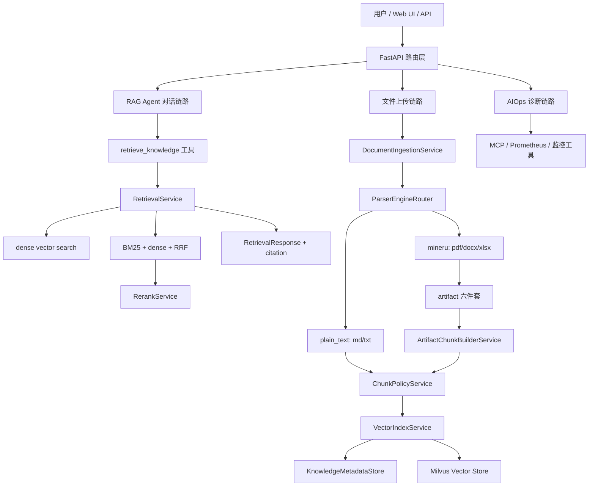
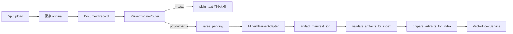
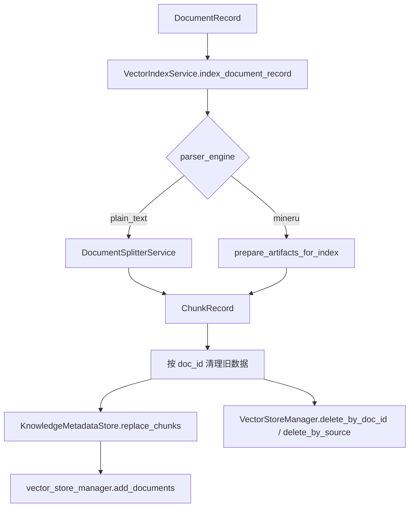
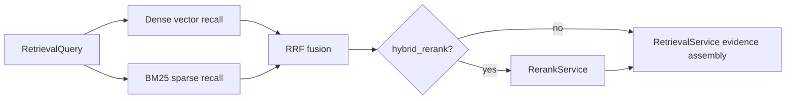

# SuperBizAgent 增强版 RAG 项目教程

日期: 2026-05-21

## 0. 教程定位

这篇教程讲的不是一个最小 RAG demo，而是 `SuperBizAgent` 在原有 oncall agent 源码基础上增强后的 RAG 系统。

基础 RAG 通常只讲:

```text
上传文档 -> 文本分块 -> 向量化 -> 相似度检索 -> 拼上下文回答
```

增强后的项目要多讲四件事:

1. 文档从上传到索引的生命周期是怎么被管住的。
2. MinerU 解析产物如何通过 artifact contract 进入主项目。
3. 检索结果为什么能带稳定 citation，而不是只返回一段文本。
4. BM25 + 向量混合召回、chunk 边界收口、context granularity / doc-level aggregation、rerank、离线评估和门禁如何接在现有架构上。

学习完本教程，读者应该能回答:

- 这个项目的 RAG 主链路在哪里。
- P1/P2/P3 以及后续 P4.5/P5/P6 分别补了什么边界。
- 每个模块的职责是什么，为什么不能混在一个 service 里。
- 如果要继续扩展检索质量，应该从哪个接口进入。

---

## 1. 环境配置与项目架构

### 1.1 一句话总判断

这个项目已经从“能检索文档的应用”增强成了“有文档生命周期、解析 artifact、chunk 边界收口、citation、context granularity / doc-level aggregation、hybrid/rerank 和离线门禁的 RAG 应用系统”。

### 1.2 场景背景

假设 oncall 工程师遇到一个问题:

```text
HighCPUUsage 告警怎么处理?
```

最简单的 RAG demo 会把运维文档切块、向量化，然后从 Milvus 里召回几段文本。

但真实 oncall 系统还需要继续回答:

- 这段文本来自哪个文档?
- 是 Markdown 文档还是 PDF 手册解析出来的?
- 命中的 chunk 是否有稳定 `doc_id/chunk_id`?
- 重复上传同一份文档会不会产生脏数据?
- 引入 BM25 或 rerank 后，citation 会不会断?
- hybrid/rerank 是否真的比 dense-only 好，还是只是看起来更复杂?

所以增强版项目不是单纯加算法，而是先补系统边界，再补检索质量层。

### 1.3 总体架构



### 1.4 代码路径

| 层级 | 主要文件 | 职责 |
|---|---|---|
| 应用入口 | [app/main.py](../app/main.py) | 注册 FastAPI 路由、静态页面和健康检查 |
| 上传入口 | [app/api/file.py](../app/api/file.py) | 校验文件、进入正式接入工作流 |
| 领域模型 | [app/models/knowledge.py](../app/models/knowledge.py) | 定义 `DocumentRecord`、`ChunkRecord`、`SourceRef`、`RetrievalQuery`、`ContextGranularity`、`ResultAggregation` |
| 文档接入 | [app/services/document_ingestion_service.py](../app/services/document_ingestion_service.py) | 保存原件、创建记录、路由 parser、处理延迟解析 |
| 解析路由 | [app/services/parser_engine_router.py](../app/services/parser_engine_router.py) | 固定 `.md/.txt -> plain_text`，`.pdf/.docx/.xlsx -> mineru` |
| Artifact 契约 | [app/services/artifact_manifest_service.py](../app/services/artifact_manifest_service.py) | 写入并校验 `artifact_manifest.json` |
| Chunk 适配 | [app/services/artifact_chunk_builder_service.py](../app/services/artifact_chunk_builder_service.py) | 把 `chunks.json/tables.json` 转成可索引 chunk |
| Chunk 边界 | [app/services/chunk_policy_service.py](../app/services/chunk_policy_service.py) | 统一最终 chunk 边界、parent chunk 和 atomic hardcap |
| 索引写入 | [app/services/vector_index_service.py](../app/services/vector_index_service.py) | md/txt 与 MinerU artifact 的统一入库 |
| 检索证据 | [app/services/retrieval_service.py](../app/services/retrieval_service.py) | 把 raw hit 转成带 citation 的结构化结果，并按 `context_granularity` / `result_aggregation` 组装上下文 |
| 混合召回 | [app/services/sparse_search_service.py](../app/services/sparse_search_service.py)、[app/services/hybrid_search_service.py](../app/services/hybrid_search_service.py) | BM25 sidecar、RRF fusion、dense/sparse/hybrid 模式 |
| Rerank | [app/services/rerank_service.py](../app/services/rerank_service.py) | 独立 rerank 边界、开关、失败回退和 score 记录 |
| 离线评估 | [evals/rag_retrieval/run_retrieval_eval.py](../evals/rag_retrieval/run_retrieval_eval.py) | 对 dense、hybrid、hybrid_rerank 做可重复评估 |

### 1.5 如何运行

最小运行链路需要 DashScope 和 Milvus:

```bash
cd "/Users/cici/oncall agent/super_biz_agent_py-release-2026-03-21"
docker compose -f vector-database.yml up -d
.venv/bin/python -m uvicorn app.main:app --host 0.0.0.0 --port 9900
```

常用验证命令:

```bash
.venv/bin/python -m unittest discover tests -v
.venv/bin/python -m compileall app tests
.venv/bin/python evals/rag_retrieval/run_retrieval_eval.py
```

如果本地 sandbox 里 PyMilvus 连 `localhost` 超时，项目现有记录里已经确认过外部执行时使用 `MILVUS_HOST=127.0.0.1` 更稳定。

### 1.6 和基础教程相比增强了什么

基础教程通常只要求应用能跑起来。

这个项目还把下面几件事固定成架构:

- API 层不直接决定 parser 细节，而是交给 `ParserEngineRouter`。
- 文档不是“文件路径 + 向量库 row”，而是 `DocumentRecord + ChunkRecord + SourceRef`。
- PDF/DOCX/XLSX 不静默退化成普通文本，而是进入 MinerU artifact contract。
- `ChunkPolicyService` 统一最终 chunk 边界，避免上游切分和下游索引各自改口径。
- 检索结果不是裸文本，而是 `RetrievalResult` 和 `RetrievalResponse`，并且可以显式控制 `context_granularity` / `result_aggregation`，默认仍保持旧行为。
- hybrid/rerank 不覆盖默认链路，而是作为显式模式参与评估。

### 1.7 小结

第一层要记住的是: 这个项目的核心价值不是“多接了一个 parser，而是把 RAG 放进了一个有边界、有证据、有门禁的应用系统里。

---

## 2. 数据准备模块: 从上传到 artifact contract

### 2.1 一句话总判断

数据准备层的目标不是把文件读成字符串，而是把不同类型文档统一变成可校验、可索引、可追源的结构化输入。

### 2.2 场景背景

用户可能上传三类文件:

- `md/txt`: 原有知识库文档，必须保持兼容。
- `pdf/docx/xlsx`: 复杂版面或 Office 文档，需要 MinerU-first 解析。
- 后续可能出现图片、多模态、图表增强，但当前主线不提前扩展。

如果上传层直接把所有文件当文本读，会出现三个问题:

1. PDF/DOCX/XLSX 解析失败时可能静默入库，检索效果表面可用但内容是错的。
2. 下游不知道 `chunks.json`、`tables.json`、`cleaned.md` 各自负责什么。
3. citation 没有页码、章节、chunk 身份，只能在回答阶段临时拼。

### 2.3 核心设计



这条链路里，最重要的是每一层只做自己的事:

- `app/api/file.py` 负责 API 校验和响应。
- `DocumentIngestionService` 负责生命周期和目录结构。
- `ParserEngineRouter` 负责文件类型到 parser 的确定性路由。
- `MinerUParserAdapter` 负责把复杂文档解析成六件套 artifact。
- `ArtifactManifestService` 负责声明和校验 artifact 是否完整。
- `ArtifactChunkBuilderService` 负责把 artifact 适配成 index-ready chunk。
- `VectorIndexService` 负责真正写入 metadata store 和 Milvus。

### 2.4 模块实现

#### 2.4.1 上传入口

[app/api/file.py](../app/api/file.py) 做了四件事:

1. 检查上传请求里的文件名和大小。
2. 把原始 `file.filename`、`content` 和显式 `kb_id` 交给 `document_ingestion_service.ingest_upload()`。
3. 由 `DocumentIngestionService` 统一完成文件名清洗、类型判断、parser 路由和必要的 RQ/Redis 投递。
4. 返回 `doc_id/parser_engine/status/artifact_dir/processing_job_id`，让调用方知道文档进入了哪条链。

这比基础 demo 更明确: 上传接口不再只返回“上传成功”，而是返回文档生命周期里的身份。

#### 2.4.2 ParserEngineRouter

[app/services/parser_engine_router.py](../app/services/parser_engine_router.py) 固定了首版规则:

| 文件类型 | parser_engine | 含义 |
|---|---|---|
| `.md`、`.txt` | `plain_text` | 保留旧 Markdown / 文本索引链路 |
| `.pdf`、`.docx`、`.xlsx` | `mineru` | 进入 MinerU-first 解析链路 |

这样设计的好处是:

- API 层不散落扩展名判断。
- 后续如果接入新的 parser，可以在 router 这一层扩展。
- P2/P3 后续测试可以稳定断言某个扩展名命中哪个 parser。

#### 2.4.3 DocumentRecord 与状态流

[app/models/knowledge.py](../app/models/knowledge.py) 里定义了 `DocumentStatus`:

```text
uploaded
upload_failed
parse_pending
parsing
parsed
parse_failed
index_pending
indexing
indexed
index_failed
```

这让系统可以区分:

- 文件是否只是保存了。
- parser 是否已经开始。
- artifact 是否已经准备好。
- 索引是否已经成功。
- 失败发生在解析阶段还是索引阶段。

这一步是架构上的关键增强。没有状态流，后面就无法做重试、门禁、失败恢复和面试里常问的“异常边界”。

#### 2.4.4 MinerU artifact 六件套

MinerU 解析完成后，主项目要求 artifact 目录里至少有:

```text
artifact_manifest.json
cleaned.md
chunks.json
tables.json
blocks.json
quality_report.json
```

各文件职责:

| 文件 | 主职责 |
|---|---|
| `artifact_manifest.json` | 声明本次解析产物、parser、版本、状态和必需文件 |
| `cleaned.md` | 人类可读清洗稿，不作为索引主输入 |
| `chunks.json` | 正文 chunk 入库主输入 |
| `tables.json` | 表格 chunk 入库主输入 |
| `blocks.json` | 调试和 QA 参考 |
| `quality_report.json` | 质量报告、warning、fatal error |

[app/services/artifact_manifest_service.py](../app/services/artifact_manifest_service.py) 的作用是把这套文件从“约定”变成“运行时契约”。缺少文件、manifest 状态不是 `parsed`，都不允许进入索引。

#### 2.4.5 ChunkBuilder / Indexer

[app/services/artifact_chunk_builder_service.py](../app/services/artifact_chunk_builder_service.py) 负责读取 `chunks.json` 和 `tables.json`，输出两类对象:

- `documents`: 给 Milvus / LangChain vector store 写入的文本对象。
- `chunk_records`: 给 `KnowledgeMetadataStore` 保存的结构化 chunk。

每个 chunk 都要带:

```text
kb_id
doc_id
chunk_id
source_ref
page_start/page_end
heading_path
content_type
parser_engine
```

所以后续 retrieval 才能知道命中内容来自哪个文档、哪一页、哪个 chunk。

### 2.5 异常处理边界

`process_deferred_document()` 对 MinerU 解析失败不会吞异常。

这个设计是有意的:

- parser adapter 负责记录 `parse_failed` 和 `error_message`。
- 调用方负责决定是否重试、返回错误、或者停止工作流。
- `prepare_artifacts_for_index()` 在索引准备失败时记录 `index_failed`，然后重新抛出异常。

也就是说，这个项目的异常边界是:

```text
service 记录状态
caller 决定流程
```

这比“所有异常都吞掉然后返回 success=false”更适合后续做重试和审计。

### 2.6 和基础教程相比增强了什么

| 基础教程 | 增强后项目 |
|---|---|
| 直接读取文件 | 先进入 `DocumentRecord` 生命周期 |
| 文件类型判断写在上传逻辑里 | 有独立 `ParserEngineRouter` |
| PDF 可能被当普通文本处理 | PDF/DOCX/XLSX 固定进入 MinerU |
| 解析产物靠目录约定 | 有 `artifact_manifest.json` 和校验器 |
| 只切正文 | 正文和表格分别进入 chunk builder |
| 失败只表现为异常 | 失败会落到 `parse_failed/index_failed` 状态 |

### 2.7 小结

数据准备层的重点不是“能解析 PDF”，而是让复杂文档解析成为一份稳定、可校验、可被索引层消费的 contract。

---

## 3. 索引构建与 citation 检索

### 3.1 一句话总判断

索引层解决“内容怎么进库”，retrieval 层解决“命中内容如何变成可追溯证据”。

### 3.2 场景背景

如果只把 chunk 文本写进 Milvus，检索确实能返回文本，但很难回答:

- 这条命中属于哪个文档?
- 旧版本 chunk 是否被清理?
- 表格 chunk 和正文 chunk 怎么区分?
- 引用里应该显示文件名、页码、章节还是 chunk_id?

所以增强后项目把索引分成两份数据:

- Milvus: 负责向量相似度召回。
- `KnowledgeMetadataStore`: 负责文档和 chunk 的结构化身份。

### 3.3 索引链路



### 3.4 幂等清理

P2-6 的关键增强在 [app/services/vector_index_service.py](../app/services/vector_index_service.py):

```text
_cleanup_existing_document_data()
```

它会在写新数据前清理:

1. `KnowledgeMetadataStore` 里同一 `doc_id` 的旧 chunk。
2. Milvus 里同一 `doc_id` 的旧向量 row。
3. 兼容旧链路的 `_source` 向量 row。

这解决的是重复上传、重复索引后的脏数据问题。

基础 demo 常见问题是“再传一次就多一批向量”。增强后项目把这个行为变成可预期的覆盖更新。

### 3.5 Retrieval citation 基线

P2-7 的关键增强在 [app/services/retrieval_service.py](../app/services/retrieval_service.py) 和 [app/models/knowledge.py](../app/models/knowledge.py)。

检索输入:

```text
RetrievalQuery(query, top_k, retrieval_mode, knowledge_base_ids)
```

检索输出:

```text
RetrievalResponse
  - query
  - results: List[RetrievalResult]
  - context_text
  - empty_message
```

每条 `RetrievalResult` 至少包含:

```text
kb_id
doc_id
chunk_id
content
score
source_ref
citation_text
metadata
```

`citation_text` 的格式由 retrieval 层生成，例如:

```text
[来源: manual.pdf, 页码: 2-3, 章节: 第一章 > 概述, chunk: doc_pdf:c00001]
```

### 3.6 Tool 边界

[app/tools/knowledge_tool.py](../app/tools/knowledge_tool.py) 保留了原来的工具名 `retrieve_knowledge`，但返回结构增强成:

```text
content
artifact
```

其中 artifact 里保留 query、results、source_ref、citation_text 等结构化证据。

这样做有两个好处:

- 老的 Agent 工具调用名不用改。
- 新的 citation / evaluation / UI 展示可以消费结构化结果。

### 3.7 和基础教程相比增强了什么

| 基础教程 | 增强后项目 |
|---|---|
| 向量库是唯一状态 | metadata store + Milvus 双层职责 |
| 只按相似度返回文本 | 返回 `RetrievalResult` 证据对象 |
| citation 在回答阶段拼 | retrieval 层生成 citation |
| 重复索引可能残留旧 row | 按 `doc_id` 和 legacy `_source` 幂等清理 |
| 无命中时行为随意 | 返回统一 `empty_message` 和空 results |

### 3.8 小结

这一层要记住的是: citation 不是 UI 装饰，而是从 artifact、chunk、metadata 到 retrieval result 一路传下来的身份链。

---

## 4. 检索质量增强: BM25 + 向量 + Rerank

### 4.1 一句话总判断

P3 没有重写 RAG 主链路，而是在 P2 的证据模型之上增加 `recall -> fusion -> rerank -> evidence assembly`。

### 4.2 为什么不是直接改 RetrievalService

P2-7 之后，`RetrievalService` 的核心职责已经很清楚:

```text
把 raw hit 转成 RetrievalResult / RetrievalResponse
```

如果把 BM25、RRF、rerank 全塞进 `RetrievalService`，它会同时承担召回、融合、精排和证据组装，边界会变乱。

所以 P3 把职责拆开:



### 4.3 RetrievalMode

[app/models/knowledge.py](../app/models/knowledge.py) 定义了四种模式:

| 模式 | 含义 | 当前定位 |
|---|---|---|
| `dense_only` | 只走向量召回 | 默认模式 |
| `sparse_only` | 只走 BM25 | 评估和门禁使用 |
| `hybrid` | dense + sparse 后 RRF 融合 | 显式启用 |
| `hybrid_rerank` | hybrid 后再 rerank | 显式启用 |

默认仍然是 `dense_only`。这很重要，因为 P3 先完成了能力边界和评估闭环，并没有在小样本报告后直接把线上默认策略切到 hybrid/rerank。

### 4.4 BM25 sidecar

[app/services/sparse_search_service.py](../app/services/sparse_search_service.py) 是一个轻量 BM25 sidecar。

它不新建一套独立 chunk 数据，而是从 `KnowledgeMetadataStore` 里读取已有 chunk。

这样 BM25 命中的结果仍然带:

```text
kb_id
doc_id
chunk_id
source_ref
```

也就是说，BM25 是召回方式的增强，不是另起一个没有 citation 身份的平行索引。

### 4.5 RRF 融合

[app/services/hybrid_search_service.py](../app/services/hybrid_search_service.py) 用 RRF 做 dense 和 sparse 的融合。

RRF 的直觉是:

```text
一个 chunk 在多个召回列表里排名越靠前，融合分越高。
```

项目里还把这些调试信息写回 metadata:

- `dense_rank`
- `dense_score`
- `sparse_rank`
- `sparse_score`
- `recall_score`
- `fusion_score`
- `retrieval_mode`

这些字段让后续排查可以知道问题出在 dense、sparse 还是 fusion。

### 4.6 Rerank 层

[app/services/rerank_service.py](../app/services/rerank_service.py) 的关键不是当前用了多复杂的模型，而是它把 rerank 边界固定了下来。

当前实现有几个明确语义:

- `enabled=false`: 直接返回 candidates，并标记 `rerank_status=disabled`。
- scorer 成功: 只改变排序和 `rerank_score`，不改 `doc_id/chunk_id/source_ref`。
- scorer 异常或超时: 如果允许 fallback，则回退到未 rerank 的 fused candidates。
- rerank metadata 记录 `rerank_model/rerank_latency_ms/rerank_error`。

这使得后续接入真正的外部 rerank 模型时，只需要替换 scorer，不需要重写 retrieval 和 citation。

### 4.7 和基础教程相比增强了什么

| 基础教程 | 增强后项目 |
|---|---|
| 只讲向量检索 | 支持 dense/sparse/hybrid/hybrid_rerank |
| BM25 可能独立建一套数据 | BM25 复用 metadata store 的 chunk 身份 |
| fusion 只是排序技巧 | fusion score 和 rank 信息进入 metadata |
| rerank 混在 prompt 前 | rerank 是独立 service |
| rerank 失败可能影响主链路 | disabled/fallback 语义明确 |
| 默认直接切新策略 | 默认保留 dense_only，hybrid/rerank 显式启用 |

### 4.8 小结

P3 的重点不是“加了 BM25 和 rerank”这句话，而是每个检索质量模块都有独立职责，并且最终仍然回到 P2 的 citation evidence contract。

---

## 5. 离线评估指标和门禁

### 5.1 一句话总判断

检索优化不能靠感觉判断，必须先有固定查询集、dense baseline，再比较 hybrid 和 rerank。

### 5.2 评估集

P3-1 固定了 [evals/rag_retrieval/golden_queries.jsonl](../evals/rag_retrieval/golden_queries.jsonl)。

评估集覆盖:

- Markdown 运维知识，例如 CPU / memory 告警。
- MinerU 正文 chunk。
- MinerU 表格 chunk。
- citation identity 是否和期望来源一致。

这样 dense、hybrid、hybrid_rerank 可以在同一批问题上做对比。

### 5.3 评估脚本

主脚本是 [evals/rag_retrieval/run_retrieval_eval.py](../evals/rag_retrieval/run_retrieval_eval.py)。

它会:

1. 创建临时 Milvus collection。
2. 构造固定 fixture corpus。
3. 对同一批 query 分别跑 `dense_only`、`hybrid`、`hybrid_rerank`。
4. 输出 JSON 和 Markdown 报告。
5. 清理临时 collection。

运行方式:

```bash
cd "/Users/cici/oncall agent/super_biz_agent_py-release-2026-03-21"
MILVUS_HOST=127.0.0.1 .venv/bin/python evals/rag_retrieval/run_retrieval_eval.py
```

### 5.4 指标解释

| 指标 | 含义 |
|---|---|
| `doc_recall@k` | top k 里是否召回到期望文档 |
| `hit@k` | top k 里是否命中任一 gold chunk |
| `mrr@k` | 第一个正确命中的排名倒数 |
| `citation_correctness@k` | 命中结果的 `source_ref` 是否和 gold source ref 对齐 |
| `latency_ms` | 每个 query 的检索耗时 |
| `citation_issues` | 逐条记录 citation 缺失或不匹配字段 |

这里最值得注意的是 `citation_correctness@k`。

很多 RAG demo 只看答案看起来对不对，但这个项目会检查:

```text
kb_id / doc_id / chunk_id / source_file / page / content_type / parser_engine
```

也就是“命中的证据身份是否正确”。

### 5.5 当前评估结果

当前报告在 [evals/rag_retrieval/reports/retrieval_eval_20260517_174438.md](../evals/rag_retrieval/reports/retrieval_eval_20260517_174438.md)。

三种模式在 4 条固定 query 上都达到:

```text
doc_recall@1 = 1.000
doc_recall@3 = 1.000
hit@1 = 1.000
hit@3 = 1.000
citation_correctness@3 = 1.000
mrr@3 = 1.000
```

但这不意味着可以宣布“hybrid/rerank 全面优于 dense-only”。

正确结论是:

- dense-only、hybrid、hybrid_rerank 的链路都能跑通。
- citation evidence contract 在三种模式下没有断。
- 当前样本太小，只能作为 P3 工程门禁和基线，不是大规模效果结论。

### 5.6 门禁测试

P2/P3 通过测试把完成标准固化下来。

| 门禁 | 文件 | 覆盖点 |
|---|---|---|
| P2 端到端门禁 | [tests/test_p2_8_gate.py](../tests/test_p2_8_gate.py) | md/txt 回归、artifact 完整性、MinerU 引用链、非降级、citation |
| Hybrid 检索测试 | [tests/test_p3_hybrid_retrieval.py](../tests/test_p3_hybrid_retrieval.py) | sparse、hybrid、RRF、citation 身份 |
| Rerank 测试 | [tests/test_p3_rerank_service.py](../tests/test_p3_rerank_service.py) | enabled/disabled/fallback、score、identity 保留 |
| P3 门禁 | [tests/test_p3_retrieval_gate.py](../tests/test_p3_retrieval_gate.py) | dense/sparse/hybrid/hybrid_rerank 模式都保持 citation contract |

常用命令:

```bash
.venv/bin/python -m unittest tests.test_p2_8_gate -v
.venv/bin/python -m unittest tests.test_p3_hybrid_retrieval -v
.venv/bin/python -m unittest tests.test_p3_rerank_service -v
.venv/bin/python -m unittest tests.test_p3_retrieval_gate -v
.venv/bin/python -m unittest discover tests -v
```

### 5.7 和基础教程相比增强了什么

| 基础教程 | 增强后项目 |
|---|---|
| 跑几个 query 看答案 | 固定 golden queries |
| 只看召回文本 | 同时看 doc、chunk、citation |
| 没有 baseline | 先固化 dense-only baseline |
| 没有多模式对比 | 同一脚本比较 dense/hybrid/rerank |
| 没有门禁 | P2/P3 都有可重复 unittest gate |

### 5.8 小结

评估层让这个项目能说清“链路跑通”和“效果达标”的区别。当前 P3 可以说工程链路和门禁完成，但不能夸大成大样本效果最优。

---

## 6. 和原始源码相比增强了什么

### 6.1 对照基线

原始源码快照在:

```text
/Users/cici/oncall agent/项目源码/super_biz_agent_py-release-2026-05-17
```

增强后项目在:

```text
/Users/cici/oncall agent/super_biz_agent_py-release-2026-03-21
```

原始源码已经具备:

- FastAPI 应用入口。
- RAG Agent 对话。
- AIOps 诊断。
- Milvus 向量库。
- DashScope embedding。
- MCP / Prometheus 工具接入。
- Web UI。

增强后的工作不是推翻这些，而是在原架构里补 RAG 工程化边界。

### 6.2 增强点总表

| 维度 | 原始源码 | 增强后项目 |
|---|---|---|
| 文档身份 | 主要依赖文件路径和 vector metadata | 增加 `KnowledgeBase/DocumentRecord/ChunkRecord/SourceRef` |
| 文件路由 | 上传和索引里隐含判断 | 独立 `ParserEngineRouter` |
| PDF/DOCX/XLSX | 不具备正式 MinerU artifact 产品化链路 | 固定 `mineru` 路由和六件套 artifact contract |
| 解析产物 | 无统一 manifest 门禁 | `ArtifactManifestService` 写入和校验 manifest |
| Chunk 适配 | 主要面向 md/txt split | `ArtifactChunkBuilderService` 同时适配正文和表格 |
| 状态管理 | 文档生命周期不完整 | `uploaded -> parsed -> indexed / failed` 状态流 |
| 幂等索引 | 重复索引风险更高 | 按 `doc_id` 和 legacy `_source` 清理旧数据 |
| 检索返回 | 偏文本上下文 | `RetrievalResult/RetrievalResponse` 结构化证据 |
| Citation | 回答阶段难以稳定追源 | retrieval 层生成 `citation_text` |
| 混合召回 | dense vector 为主 | BM25 sidecar + dense + RRF |
| Rerank | 无独立层 | 独立 `RerankService`，支持 disabled/fallback |
| 离线评估 | 无固定评估闭环 | golden queries + JSON/MD 报告 |
| 门禁 | 依赖人工判断 | P2/P3 gate 测试固化 |

### 6.3 这不是功能堆砌

这些增强可以按一条主线理解:

```text
文档身份
-> artifact contract
-> chunk/source_ref
-> chunk policy / hardcap
-> 幂等索引
-> citation retrieval
-> context granularity / doc-level aggregation
-> hybrid/rerank
-> offline eval
-> gate
```

每一步都在给下一步提供稳定前提。

如果没有 `doc_id/chunk_id/source_ref`，BM25 和 rerank 就算做出来，也很难证明 citation 没断。

如果没有 dense baseline，hybrid 和 rerank 的收益就只能靠主观判断。

如果没有 P2/P3 gate，后续改 parser、改检索、改评估时就很容易退化。

### 6.4 小结

增强后项目比原始源码强的地方，不是“多了几个文件”，而是 RAG 链路从 demo 能力升级成了工程系统能力。

---

## 7. 面试追问视角

### 追问 1: 为什么先做 artifact contract，而不是先接 BM25 和 rerank?

因为 BM25 和 rerank 都依赖稳定 chunk 身份。如果前面没有 `doc_id/chunk_id/source_ref`，后面检索质量再好，也无法证明命中的证据可追源。P2 先固定 artifact 和 citation contract，P3 才能安全扩召回和精排。

### 追问 2: 为什么默认仍然是 dense_only，不直接切到 hybrid_rerank?

因为即使后面又补了 P4.5 / P5 / long-doc / LLM 侧的 follow-up 评测，hybrid/rerank 仍然是显式 opt-in 扩展，不是默认主链路。保守地把默认值留在 `dense_only`，可以让新能力逐步验证，而不会把实验边界悄悄变成线上默认。

### 追问 3: rerank 失败时为什么不能让整个检索失败?

rerank 是质量增强层，不是主链路硬依赖。系统应该在 rerank 超时或异常时回退到 fused candidates，并记录 `rerank_status=fallback` 和错误原因。这样可以保证可用性，同时保留排查信息。

### 追问 4: citation correctness 为什么要单独做指标?

RAG 的正确性不只是答案像不像，还包括证据是否来自正确文档、正确 chunk 和正确页码。`citation_correctness@k` 能检查 `source_ref` 是否与 gold source ref 对齐，防止“答案看着对，但引用错了”的情况。

### 追问 5: 这个项目和直接接完整 WeKnora 有什么区别?

当前项目保留 Python/FastAPI/oncall agent 主架构，只复用 WeKnora 的成熟边界思想，例如知识库对象、parser routing、chunk/source_ref、artifact contract。它没有直接接完整 WeKnora 服务，因为当前目标是补齐本项目 RAG 主链路，而不是重做整套平台。

---

## 8. 当前边界（2026-05-21 更新）

这个项目现在可以明确声称:

- P1-P5 主线已闭环，`ChunkPolicyService` 已成为最终 chunk 边界的收口层。
- md/txt 兼容路径保留。
- PDF/DOCX/XLSX 已有 MinerU-first artifact 接入边界。
- `RetrievalQuery` 已带上 `context_granularity` 和 `result_aggregation` 两个显式扩展点，默认值仍保持旧行为，不会悄悄改掉原有调用面。
- retrieval citation baseline、BM25 + vector hybrid、RRF、rerank 边界、离线评估脚本和门禁都已完成。
- P6 的 `domain_metadata` / `MetadataEnricher` 已永久关闭，当前产品边界是按 `kb_id` 做知识类隔离，而不是再加一层域元数据。
- WeKnora S1 / S2 已完成，S3 已明确 deferred with restart conditions，release closeout 已收口。

不能过度声称:

- 还不能说大样本真实业务效果已经优于 dense-only。
- 还不能说完整多模态图像检索已经产品化。
- 还不能说外部模型型 rerank 已正式接入。
- 还不能说 sandbox 内 PyMilvus 连接行为完全等同于真实运行环境。
- 还不能把 P6 当成“差一步就该补上的字段设计”，因为它已经被明确关闭。

---

## 9. 继续学习路径

更细的逐文件讲解见 [docs/oncall_agent_rag_source_code_deep_dive.md](./oncall_agent_rag_source_code_deep_dive.md)。

这里的“详细解释”不是逐行翻译代码，而是按工程阅读顺序讲清楚六件事:

1. 这个文件在 RAG 链路里负责什么。
2. 读代码时应该先看哪些类、函数和字段。
3. 它和上一个文件、下一个文件怎么衔接。
4. 关键执行流程怎么走。
5. 设计亮点、边界和风险是什么。
6. 面试或项目复盘时应该怎么解释它。

建议按下面顺序读源码。

### 9.1 [app/models/knowledge.py](../app/models/knowledge.py)

这个文件是增强版 RAG 的领域模型层。先读它，是因为后面所有 service 都围绕这里定义的对象流转。

最先看的是几个枚举:

```text
ParserEngine
RetrievalMode
DocumentStatus
KnowledgeBaseType
```

`ParserEngine` 固定当前支持的 parser 类型，只有 `plain_text` 和 `mineru`。这说明项目没有让每个 service 自己随便写字符串，而是把解析引擎变成了受控枚举。

`RetrievalMode` 是 P3 的入口开关:

```text
dense_only
sparse_only
hybrid
hybrid_rerank
```

这个枚举很关键，因为它让 dense、BM25、hybrid、rerank 变成同一套 retrieval 接口下的不同执行模式，而不是四条互不相干的检索代码。

`DocumentStatus` 是 P2 文档生命周期的核心。它把上传、解析、索引的状态拆成:

```text
uploaded -> parse_pending -> parsing -> parsed -> index_pending -> indexing -> indexed
```

失败也分成:

```text
upload_failed
parse_failed
index_failed
```

读到这里要注意，状态不是为了展示好看，而是为了让失败边界可定位。解析失败不能伪装成索引失败，索引失败也不能回头污染 parser 状态。

接着读 `SourceRef`。它是 citation 的最小来源对象:

```text
kb_id
doc_id
chunk_id
source_file
page_start/page_end
heading_path
content_type
parser_engine
```

这个对象贯穿 artifact、chunk、metadata、retrieval result。后面无论 BM25 还是 rerank，都不能改坏它。

然后读 `DocumentRecord` 和 `ChunkRecord`。

`DocumentRecord` 表示一个上传文档在系统里的稳定身份。它不只是文件名，还包含 `doc_id`、`kb_id`、`original_path`、`artifact_dir`、`parser_engine`、`status`。

`ChunkRecord` 表示可检索的最小知识单元。它不仅有 `content`，还挂着 `source_ref`、页码、标题路径、质量标记和 metadata。

最后读 `RetrievalQuery`、`RetrievalResult`、`RetrievalResponse`。

这三个对象把检索从“输入字符串、返回字符串”升级成:

```text
RetrievalQuery -> RetrievalResponse -> List[RetrievalResult]
```

面试里可以这样讲:

> 我先把 RAG 的核心身份对象固定下来，包括文档、chunk、source_ref 和 retrieval result。后面 parser、indexer、retriever、reranker 都只能围绕这些对象扩展，不能各自创造一套字段。

### 9.2 [app/services/parser_engine_router.py](../app/services/parser_engine_router.py)

这个文件是文件类型到 parser 的路由边界。读完模型后读它，是因为它把 `ParserEngine` 真正用起来。

先看 `ParserEngineRouter.__init__()`。

默认规则只有两组:

```text
md/txt -> plain_text
pdf/docx/xlsx -> mineru
```

这条规则解决的是“入口可预测”。基础 demo 经常在上传接口里写一段 `if suffix == ...`，后续 parser 多了以后会散落到各处。这里把判断集中到 router，API、索引和测试都只依赖这一处。

再看 `resolve()`。

它先规范化扩展名，再按规则查找 parser。如果找不到，就抛 `ValueError`。这意味着不支持的文件类型不会静默走错链路。

然后看 `resolve_path()`。

它是面向文件路径的便捷入口，`VectorIndexService.index_single_file()` 会用它从真实路径判断 parser。

再看 `list_engine_info()` 和 `supported_file_types()`。

这两个方法不是索引主链路必需的，但对目录扫描和未来可用性检查很有用。API 层不再维护允许扩展名，上传入口直接交给 `DocumentIngestionService.ingest_upload()`，由 service 和 router 统一判断文件类型。

最后看 `_iter_rules()`。

它支持 `ChunkingConfig.parser_engine_rules` 覆盖默认规则。也就是说现在默认走固定 P2 规则，但未来可以在知识库配置层做定制。

面试里可以这样讲:

> 我把 parser 选择从上传接口里抽出来，做成一个独立 router。这样文件类型到 parser 的映射有唯一真源，后续加 parser 或做可用性检查时，不需要到 API 和 indexer 里到处改判断。

### 9.3 [app/services/document_ingestion_service.py](../app/services/document_ingestion_service.py)

这个文件是文档接入主编排层。它不负责具体解析，也不负责具体向量写入，而是负责把上传文件推进到正确生命周期。

先读 `ingest_upload()`。

它的顺序很重要:

```text
sanitize filename
-> get file extension
-> parser_engine_router.resolve()
-> build doc_id
-> build original_path / artifact_dir
-> build DocumentRecord
-> write original file
-> upsert document
-> branch by parser_engine
```

`doc_id` 的生成使用 `kb_id + safe_filename + content_hash`。这说明同一知识库、同一文件名、同一内容会得到稳定文档 ID，有利于后续幂等。

如果是 `plain_text`，它会进入 `_ingest_plain_text_document()`，同步完成 parse 状态推进和索引。

如果是 `mineru`，上传请求不会直接解析，而是先把 `doc_id` 投递到 RQ 队列；投递成功后，才把状态推进到带 `processing_job_id` / `processing_queue` / `enqueued_at` 证据的 `parse_pending`。这就是现在的异步解析边界。PDF/DOCX/XLSX 可能很重，不能在普通上传逻辑里假装和 md/txt 一样轻。

再读 `ingest_directory()`。

目录入口也在 `DocumentIngestionService` 里，而不是 `VectorIndexService` 里自己维护一套扫描逻辑。它按 `parser_engine_router.supports_path()` 过滤当前规则支持的文件，然后逐个调用 `ingest_upload()`。这样目录批量、单文件上传和异步解析都会经过同一个“保存原件 -> 建 DocumentRecord -> parser 路由 -> 状态推进”的入口。

再读 `_ingest_plain_text_document()`。

plain text 没有独立 parser 阶段，所以它只保留真实可确认的状态:

```text
parse_pending -> index_document_record() -> index_pending -> indexing -> indexed
```

这里不再写 `parsing/parsed`，避免把“没有发生过的解析完成”伪装成状态。

然后读 `process_deferred_document()`。

这是 MinerU 文档从 `parse_pending` 往后推进的入口。现在它主要由 RQ worker 里的 `process_deferred_document_job(doc_id)` 调用。函数本身仍然是同步业务函数: 取 `DocumentRecord`，根据 `parser_engine` 决定调用 `_ingest_plain_text_document()` 还是 `mineru_parser_adapter.parse_document()`。

这里要特别注意异常边界: `process_deferred_document()` 不吞异常。parser adapter 会记录失败状态，上层调用方决定要不要重试或返回错误。

再读 [app/services/document_processing_queue.py](../app/services/document_processing_queue.py)。

这层只做两件事:

```text
enqueue_deferred_document(doc_id)
-> RQ enqueue process_deferred_document_job(doc_id)

process_deferred_document_job(doc_id)
-> document_ingestion_service.process_deferred_document(doc_id)
-> if status == index_pending: vector_index_service.index_document_record(record)
-> return latest status
```

worker 启动方式:

```bash
python -m app.workers.document_processing_worker
```

默认 Redis 配置来自 `DOCUMENT_PROCESSING_REDIS_URL=redis://localhost:6379/0`，队列名是 `document_processing`；本地 `vector-database.yml` 已包含 Redis 服务。如果 Redis/RQ 投递失败，`DocumentIngestionService.ingest_upload()` 会把已落盘文档写成 `enqueue_failed` 并让上传端返回错误，而不是悄悄把文档留在无人处理的 `parse_pending`。如果任务投递成功，`parse_pending` 的 `status_evidence` 会包含 `processing_job_id`、`processing_queue` 和 `enqueued_at`。如果只是 worker 进程暂时没启动，任务通常会先留在 Redis 队列里，等 worker 启动后再消费。

再看 `validate_artifacts_for_index()`。

它先取 `DocumentRecord`，再检查状态是否允许索引校验，然后调用 `artifact_manifest_service.validate_manifest()`。

最后看 `prepare_artifacts_for_index()`。

它是 P2-5 的关键入口:

```text
validate_artifacts_for_index()
-> artifact_chunk_builder_service.prepare()
```

如果失败，它会把文档标成 `index_failed`，然后重新抛出异常。这体现了项目的异常策略:

```text
service 记录状态，caller 决定流程
```

面试里可以这样讲:

> DocumentIngestionService 是接入编排层，不直接做 parser 或向量库细节。它负责生成文档身份、保存原件、维护状态流，并把 plain_text 和 mineru 都纳入同一套生命周期。

### 9.4 [app/services/artifact_manifest_service.py](../app/services/artifact_manifest_service.py)

这个文件把 MinerU 产物从“目录里应该有这些文件”升级成“运行时必须校验的 contract”。

先看几个常量:

```text
MANIFEST_FILENAME = artifact_manifest.json
SCHEMA_VERSION = artifact_manifest_v1
POSTPROCESS_VERSION = pdf_eval_mineru_postprocess_v1
REQUIRED_FILES
```

`REQUIRED_FILES` 固定六件套中的必需文件:

```text
cleaned.md
chunks.json
tables.json
blocks.json
quality_report.json
```

其中 `artifact_manifest.json` 是 manifest 本身，不在 required_files 里递归声明。

再看 `build_manifest()`。

它从 `DocumentRecord` 里取:

```text
kb_id
doc_id
original_path
artifact_dir
parser_engine
parser_version
created_at
```

然后组装成 `ArtifactManifest`。这说明 manifest 不是手写 JSON，而是由当前文档记录生成。

再看 `write_manifest()`。

它负责创建 artifact 目录，并把 manifest 以 JSON 写到 `artifact_manifest.json`。这里使用 `ensure_ascii=False`，保证中文路径、中文文件名或中文错误信息能保留可读性。

然后看 `load_manifest()`。

它负责从 artifact 目录读取 manifest，如果缺失就抛 `FileNotFoundError`。

最后看 `validate_manifest()`。

它做两层校验:

1. `manifest.status` 必须是 `parsed`。
2. `required_files` 里声明的每个文件都必须真实存在。

这个文件的重点不是复杂，而是把“索引前置条件”变成了硬门禁。

面试里可以这样讲:

> 我没有让 indexer 猜 artifact 目录里有哪些文件，而是先写 manifest，再在进入索引前做严格校验。这样缺 chunks、缺 tables、解析状态异常都会提前失败，而不是静默写入脏索引。

### 9.5 [app/services/artifact_chunk_builder_service.py](../app/services/artifact_chunk_builder_service.py)

这个文件是 artifact contract 到索引输入的适配层。它是 P2-5 的核心。

先看 `PreparedIndexArtifacts`。

它是 `prepare()` 的返回对象，里面包含:

```text
document_record
manifest
documents
chunk_records
quality_report
```

这里的 `documents` 是给向量库写入的 LangChain `Document`，`chunk_records` 是给 metadata store 保存的结构化 chunk。也就是说同一次 artifact 准备，会同时服务 Milvus 和本地 metadata。

再看 `prepare()`。

它严格从 manifest 声明的路径读取:

```text
chunks_json
tables_json
quality_report_json
```

注意它不读取 `cleaned.md` 作为索引主输入。这是一个很重要的边界: `cleaned.md` 是人类可读 fallback，不是正文和表格入库主源。

`prepare()` 还会先调用 `_raise_for_fatal_quality_errors()`。如果 `quality_report.fatal_errors` 非空，直接拒绝入库。

然后看 `_build_text_chunk_record()`。

它支持从 raw chunk 里读取 `chunk_id/id`、`content/text`，并补齐:

```text
page_start/page_end
heading_path
content_type
quality_flags
source_ref
metadata
```

`_normalize_chunk_id()` 会把局部 chunk id 变成带 `doc_id` 前缀的稳定 ID:

```text
doc_pdf:c00001
```

再看 `_build_table_chunk_record()`。

它把 `tables.json` 里的表格变成 table chunk。表格 chunk 的 ID 会被规范成:

```text
doc_id:table:table_id
```

这样正文 chunk 和表格 chunk 不会冲突。

然后看 `_base_metadata()`。

这是 citation 后续能工作的重要地方。它把下面字段都写进 metadata:

```text
kb_id
doc_id
chunk_id
_source
_file_name
_extension
content_type
page_start/page_end
heading_path
parser_engine
source_ref
quality_flags
```

这些字段后来会被 `RetrievalService` 读出来组装 `SourceRef` 和 `citation_text`。

最后看 `_required_str()`、`_load_json_list()`、`_load_json_object()`。

这些辅助函数让 contract 失败尽早暴露。例如 `chunks.json` 不是 list、某条 chunk 没有 content，都会直接失败。

面试里可以这样讲:

> ArtifactChunkBuilderService 是 parser 和 indexer 之间的 adapter。它只消费 `chunks.json` 和 `tables.json`，把正文和表格统一转换成带 source_ref 的 ChunkRecord，同时生成给 Milvus 写入的 Document。

### 9.6 [app/services/vector_index_service.py](../app/services/vector_index_service.py)

这个文件是索引写入层。它负责把 plain_text 或 MinerU prepared artifacts 写入 metadata store 和 Milvus。

目录批量结果现在由 `DirectoryIngestionResult` 表达，真实归属在 ingestion model，不再在 `VectorIndexService` 里保留额外兼容别名。

再看 `VectorIndexService.__init__()`。

它现在不再保存目录接入配置。知识库归属不再靠 service 内部的 `default_kb_id`，而是由上传、目录索引、单文件索引入口显式传入 `kb_id`。eval / 临时隔离集合仍可显式传 `kb_id="default"`。

再看 `index_single_file()`。

它会:

```text
build stable doc_id
-> parser_engine_router.resolve_path()
-> build DocumentRecord
-> index_document_record()
```

这一步让旧的单文件索引也接进新的 `DocumentRecord` 和 parser router，而不是继续走完全独立的旧逻辑。

重点看 `index_document_record()`。

它先检查原文件存在，然后按 parser 分支:

```text
mineru -> _index_mineru_document_record()
plain_text -> read text / split / build chunks / cleanup / write
```

plain_text 分支会调用 `document_splitter_service.split_document()`，再通过 `_build_chunk_records()` 构造带 `SourceRef` 的 `ChunkRecord`。

然后看 `_index_mineru_document_record()`。

它会调用:

```text
DocumentIngestionService().prepare_artifacts_for_index(doc_id)
```

拿到 `documents` 和 `chunk_records` 后，执行同样的清理和写入。

这里看起来有一个点值得注意: 它实例化了一个新的 `DocumentIngestionService()`，不是直接引用全局单例。当前测试通过 patch store 维持了行为，但后续如果要更严谨，可以考虑注入式依赖。它不是当前阻塞点，但读源码时要知道这个边界。

再看 `_cleanup_existing_document_data()`。

它是 P2-6 的关键:

```text
delete_chunks_by_doc_id(doc_id)
delete_by_doc_id(doc_id)
delete_by_source(original_path)
```

这三个清理动作分别处理:

- metadata store 的旧 chunk。
- 新链路 Milvus row。
- 旧链路 `_source` 残留 row。

最后看 `_build_chunk_records()`。

它把 md/txt 切分结果变成 `ChunkRecord`，并把 `source_ref` 写进每个 LangChain `Document.metadata`。这让旧 md/txt 链路也能产出 citation 需要的字段。

面试里可以这样讲:

> VectorIndexService 是统一索引写入层。plain_text 和 mineru 最终都变成 documents + chunk_records，然后先按 doc_id 清理旧数据，再写 Milvus 和 metadata store，保证重复索引不会产生脏数据。

### 9.7 [app/services/retrieval_service.py](../app/services/retrieval_service.py)

这个文件是 citation-aware retrieval 的证据组装层。

先看 `retrieve()`。

它根据 `RetrievalQuery.retrieval_mode` 选择召回路径:

```text
dense_only -> vector_search_service.search_similar_documents()
其他模式 -> hybrid_search_service.search()
```

然后统一调用 `_build_results()` 和 `_format_context()`。

这个设计说明 `RetrievalService` 不关心 BM25 或 rerank 的内部细节。它只关心拿到 raw hits 后如何转成结构化证据。

再看 `_build_results()`。

它遍历 raw hits，做几件事:

1. `_normalize_metadata()` 把 metadata 统一成 dict。
2. `_build_source_ref()` 从 metadata 中恢复 `SourceRef`。
3. 按 `knowledge_base_ids` 做可选过滤。
4. 检查 `kb_id/doc_id/chunk_id/source_file` 是否完整。
5. 生成 `citation_text`。
6. 输出 `RetrievalResult`。

如果命中缺少稳定引用字段，它会跳过。这一点很重要: citation baseline 不允许把身份不完整的 hit 混进结果。

再看 `_build_source_ref()`。

它优先读取 metadata 里的 `source_ref`。如果 `source_ref` 缺字段，则从旧 metadata 字段补:

```text
kb_id
doc_id
chunk_id
_file_name / source_file
page_start/page_end
heading_path
content_type
parser_engine
```

这让新旧链路有兼容空间。

然后看 `_build_citation_text()`。

它把 source ref 变成可展示引用:

```text
[来源: xxx, 页码: x-y, 章节: a > b, chunk: doc:c00001]
```

最后看 `_format_context()`。

它把结构化结果转成 LLM 可读上下文，但不丢掉 `RetrievalResult` 本身。也就是说模型看到的是 context text，工具/评估/UI 仍然能拿到结构化 artifact。

面试里可以这样讲:

> RetrievalService 不做召回算法，而是做 evidence assembly。无论上游是 dense、BM25、hybrid 还是 rerank，它最终都必须输出带 source_ref 和 citation_text 的 RetrievalResult。

### 9.8 [app/services/hybrid_search_service.py](../app/services/hybrid_search_service.py)

这个文件是 P3 的混合召回协调层。严格说它要和 [app/services/sparse_search_service.py](../app/services/sparse_search_service.py) 一起读。

先看 `SparseSearchService`。

它从 `KnowledgeMetadataStore.list_chunks()` 读取已有 chunk，而不是自己维护一套新的 chunk 数据。然后用 `_tokenize()` 做中英文轻量分词，用 `_bm25_score()` 计算 BM25 分数。

这里的设计重点是:

```text
BM25 只是 recall sidecar，不是新的知识库真源。
```

BM25 返回的 `SearchResult.metadata` 仍然保留原来的 `source_ref`、`doc_id`、`chunk_id`。

再看 `RrfFusionService.fuse()`。

它接收多个已经排好序的结果列表，例如:

```text
[("dense", dense_hits), ("sparse", sparse_hits)]
```

然后按 RRF 公式累积分数:

```text
1 / (rank_constant + rank)
```

同一个 `chunk_id` 同时被 dense 和 sparse 命中时，会累加融合分。

它还保留 rank metadata:

```text
dense_rank
dense_score
sparse_rank
sparse_score
fusion_score
```

这些字段对后续排查很重要。否则 hybrid 结果变好或变差时，无法判断是哪一路召回造成的。

再看 `HybridSearchService.search()`。

它按 `retrieval_mode` 分四种情况:

- `DENSE_ONLY`: 直接调用 vector search。
- `SPARSE_ONLY`: 直接调用 sparse search。
- `HYBRID`: dense 和 sparse 都召回，再 RRF。
- `HYBRID_RERANK`: dense 和 sparse 召回、RRF 后，再交给 rerank。

这里还有一个细节:

```text
candidate_k = max(query.top_k * 4, query.top_k)
```

hybrid 会先多召回一些候选，再融合或 rerank。否则 rerank 没有足够候选可排。

面试里可以这样讲:

> HybridSearchService 只负责召回协调和融合，不负责 citation 组装。BM25 复用 metadata store 的 chunk 身份，RRF 只改变候选排序和 fusion score，最后仍交给 RetrievalService 统一生成证据结果。
>
> # 可优化点
>
> 1. RRF 常数 `rank_constant=60` 可放到配置文件，支持动态调参
> 2. 可增加**多路权重**（稠密 / 稀疏加权 RRF）
> 3. 可增加过滤、去重、权限过滤逻辑
> 4. 可对 `candidate_k` 倍率做成可配置，而非硬编码 `*4`

### 9.9 [app/services/rerank_service.py](../app/services/rerank_service.py)

这个文件是 P3 的显式 rerank 边界。

先看 `RerankScorer`。

它是一个协议，规定 scorer 只需要实现:

```text
score(query, candidates) -> list[float]
```

这给未来外部 rerank 模型留下了替换点。现在是本地 lexical scorer，以后可以换成模型 API scorer。

再看 `LexicalRerankScorer`。

它会把 query 和 candidate 文本做轻量 tokenization，然后计算:

```text
coverage
density
phrase_bonus
```

这不是最终理想 reranker，而是一个无外部依赖的本地 baseline。它的价值是把 rerank service boundary 跑通。

然后看 `RerankService.__init__()`。

它从 config 读取:

```text
rerank_enabled
rerank_model
rerank_timeout_ms
rerank_top_k
rerank_fallback_on_error
```

这说明 rerank 是可选增强，不是主链路硬依赖。

重点看 `rerank()`。

它的流程是:

```text
no candidates -> []
limit candidates
enabled=false -> annotate disabled
scorer.score()
check timeout
check score count
sort by score
copy metadata with rerank_score / rerank_status
return top_k
```

如果 scorer 异常或超时，而且允许 fallback，它会返回原候选并标记:

```text
rerank_status=fallback
rerank_error=...
```

最后看 `_copy_with_metadata()`。

它复制 `SearchResult`，只更新 metadata，不改 `id`、`content`、`score` 的基本身份。这是为了保证 rerank 不破坏 citation identity。

面试里可以这样讲:

> rerank 层只做排序增强，不改文档身份。它有 enabled、timeout、fallback 和 metadata 记录，所以外部模型坏了也不会打断主检索链路。
>
> ## 扩展优化方向（后续迭代建议）
>
> 1. 替换打分器：实现新的 `RerankScorer`，接入 BGE、Cohere、LLM 等专业重排模型；
> 2. 分词优化：接入 jieba、THULAC 等专业分词库，替代简易正则分词；
> 3. 规则增强：增加词权重、位置权重（标题词 > 正文词）、距离惩罚；
> 4. 动态参数：覆盖率、短语奖励系数抽离到配置文件，支持调优；
> 5. 异步重排：高并发场景改为异步执行，降低接口耗时；
> 6. 缓存机制：对相同 Query 的重排结果做短时缓存。

### 9.10 [evals/rag_retrieval/run_retrieval_eval.py](../evals/rag_retrieval/run_retrieval_eval.py)

这个文件是 P3 离线评估脚本。读它是为了理解项目怎么证明 dense、hybrid、hybrid_rerank 的结果可对比。

先看文件顶部的全局配置:

```text
EVAL_DIR
REPORT_DIR
RUN_ID
EVAL_COLLECTION
DEFAULT_MODES
```

`EVAL_COLLECTION` 每次带时间戳，说明评估不会混入生产 `biz` collection，而是用临时 collection。

再看 `config.milvus_host = "127.0.0.1"`。

这是根据当前工作站环境做的稳定性处理: Docker Milvus 用 IPv4 更可靠，避免 `localhost` 在某些 sandbox 环境下超时。

然后读 `build_mineru_fixture()`。

它构造一个 synthetic MinerU 文档，包括:

```text
manual.pdf
cleaned.md
chunks.json
tables.json
blocks.json
quality_report.json
artifact_manifest.json
```

这样评估不只测 md/txt，还能测 MinerU 正文 chunk 和表格 chunk 的 citation 形状。

再读 `build_golden_queries()`。

它构造 4 条固定 query:

- CPU 告警。
- Memory 告警。
- MinerU 正文。
- MinerU 表格。

每条 query 都有:

```text
gold_doc_ids
gold_chunk_ids
gold_source_refs
expected_keywords
```

这里最重要的是 `gold_source_refs`。它让评估不只看命中了哪个文本，还看 source_ref 是否准确。

再看 `exact_source_ref_match()`。

它逐字段比较:

```text
kb_id
doc_id
chunk_id
source_file
page_start/page_end
content_type
parser_engine
```

这就是 `citation_correctness@3` 的基础。

然后读 `evaluate_mode()`。

它对某一种 `RetrievalMode` 执行所有 golden queries，并计算:

```text
doc_recall_at_1 / doc_recall_at_3
hit_at_1 / hit_at_3
citation_correctness_at_3
mrr_at_3
latency_ms
citation_issues
```

如果模式是 `HYBRID_RERANK`，它会临时打开 `rerank_service.enabled`，最后再恢复。这说明评估脚本不会永久改变项目默认策略。

再看 `compute_metrics()` 和 `format_markdown()`。

前者生成结构化指标，后者把报告写成人能读的 Markdown。

最后读 `run()`。

它做了一整套隔离:

1. 备份当前 collection name、vector store、metadata store。
2. 创建临时 `KnowledgeMetadataStore`。
3. 把 vector store collection 切到临时 collection。
4. 索引两个真实 `aiops-docs` Markdown 文档。
5. 索引一个 synthetic MinerU fixture。
6. 跑三种模式。
7. 写 JSON / Markdown 报告。
8. 恢复全局对象并删除临时 collection。

这就是一个成熟评估脚本最该有的东西: 固定输入、隔离环境、可复跑输出、清理现场。

面试里可以这样讲:

> 我没有直接在线上 collection 里测 hybrid/rerank，而是用临时 collection 和固定 golden queries 做离线评估。评估同时看 recall、hit、MRR、citation correctness 和 latency，所以能区分召回质量、证据正确性和性能成本。
>
> ### 可扩展优化点
>
> 1. 扩充测试问句集，增加歧义句、长文本、多意图问句；
> 2. 支持批量跑多组参数（RRF 常数、召回倍率）做网格调参；
> 3. 增加并发压测，评估高并发下耗时表现；
> 4. 接入 CI/CD，代码提交后自动执行评测，门禁拦截指标退化版本；
> 5. 增加可视化图表（折线 / 柱状图）对比多版本指标。

## 10. 读完源码后应该形成的主线

读完上面这些文件后，应该能把增强版 RAG 项目讲成下面这条线:

```text
knowledge.py 定义身份和契约
-> parser_engine_router.py 决定文件进入哪条解析链
-> document_ingestion_service.py 管理上传、状态和解析入口
-> artifact_manifest_service.py 把 MinerU 产物声明成 contract
-> artifact_chunk_builder_service.py 把 chunks/tables 转成可索引证据
-> chunk_policy_service.py 统一最终 chunk 边界、parent chunk 和 atomic hardcap
-> vector_index_service.py 写入 metadata store 和 Milvus，并做幂等清理
-> retrieval_service.py 把 raw hits 组装成 citation-aware evidence，并按 context_granularity / result_aggregation 输出
-> hybrid_search_service.py 增加 BM25 + dense + RRF 的召回能力
-> rerank_service.py 增加可开关、可回退的精排边界
-> run_retrieval_eval.py 用固定评估集证明三种模式可对比
```

一句话总结:

```text
这个项目不是把 RAG 算法堆起来，
而是先让文档、chunk、source_ref、artifact、index、retrieval、rerank、eval 每一层都有清楚边界。
```

## 11. 2026-05-21 补充: 当前版本的阅读口径

如果你是按现在这个 release 来读教程，建议再把下面几份边界文档一起看:

- [docs/chunk_refactor_execution_plan.md](./chunk_refactor_execution_plan.md)
- [docs/p5_doc_level_dedup_design.md](./p5_doc_level_dedup_design.md)
- [docs/chunk_policy_atomic_hardcap_design.md](./chunk_policy_atomic_hardcap_design.md)
- [docs/p6_corpus_prep_design.md](./p6_corpus_prep_design.md)
- [PROJECT_STATE.md](../PROJECT_STATE.md)

这几个文档分别对应:

- chunk 边界怎么统一。
- `context_granularity` / `result_aggregation` 为什么是 opt-in。
- atomic hardcap 怎么对齐 Milvus 字节上限。
- 为什么 P6 被永久关闭，而不是顺手补一个 `domain_metadata`。
- 当前 release 的闭环状态到底停在哪。
