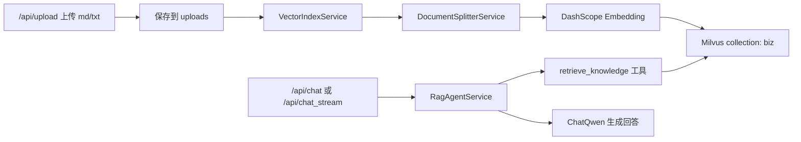
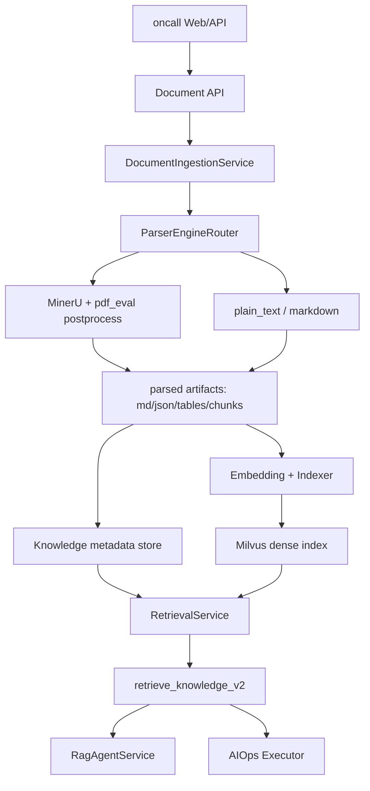

# oncall agent RAG 与 WeKnora 技术模式融合分析计划

日期: 2026-05-13

## 1. 结论先行

我认为把 oncall agent 的 RAG 部分改造成 WeKnora 式技术模式是可行的，而且值得做。但推荐的融合方式不是把 WeKnora 整库直接塞进当前项目，而是把 WeKnora 的知识库产品化分层迁移过来，把当前已经验证过的 MinerU 解析与后处理能力保留下来。

最稳的目标形态是:

```text
oncall agent 继续负责对话、AIOps 诊断、MCP 工具编排
WeKnora-style 知识库层负责文档、知识库、分片、索引、检索、引用、评测
MinerU + pdf_eval 后处理链路继续作为中文 PDF 主解析底座
```

本分析计划的执行优先级、阶段门禁和风险顺序，后续统一以
`docs/technical_fusion_decision_manual.md`
为配套决策参考。也就是说:

- 本文更偏“为什么这样融合、总体分几阶段、每阶段做什么”。
- `technical_fusion_decision_manual.md` 更偏“哪些先做、哪些后做、每一步主要风险是什么、计划清单怎么写”。

后续如果两份文档有新增内容，必须保持口径一致，不允许出现“分析计划一套顺序，决策手册另一套顺序”。

解析器结论也很明确:

- 如果比较 WeKnora 默认 DocReader/MarkItDown 类解析路径和当前本地已验证的 MinerU，MinerU 更适合本项目的中文 PDF、手册、公式、表格场景。
- 如果 WeKnora 配置为调用 MinerU 引擎，那么它不是在解析质量上战胜 MinerU，而是把 MinerU 包进了更完整的知识库流程里。
- 因此本项目不应把问题理解为 “WeKnora parser vs MinerU 二选一”，而应理解为 “WeKnora-style RAG 产品层 + MinerU-first 解析层”。

## 2. 本地 oncall agent 当前架构

### 2.1 项目定位

当前主项目位于:

```text
/Users/cici/oncall agent/super_biz_agent_py-release-2026-03-21
```

README 描述它是企业级智能对话和运维助手，核心能力包括 RAG 知识库问答、AIOps 诊断、Web 界面和 MCP 集成。技术栈是 FastAPI、LangChain、LangGraph、DashScope、Milvus、MCP。对应代码依据:

- `README.md` 的核心特性和技术栈说明。
- `app/main.py` 注册 `chat`、`file`、`aiops`、`health` 路由。
- `app/services/rag_agent_service.py` 用 `ChatQwen`、LangChain agent、MCP 工具和 `retrieve_knowledge` 组成对话 Agent。
- `app/services/aiops_service.py` 用 LangGraph `planner -> executor -> replanner` 图完成 AIOps 诊断流程。

### 2.2 当前 RAG 链路

当前 RAG 是一条较轻的链路:



关键事实:

- `app/api/file.py` 目前只允许上传 `txt` 和 `md`，不直接接受 PDF。
- `app/services/vector_index_service.py` 读取文本文件，删除同源旧数据，调用分割器，然后写入 Milvus。
- `app/services/document_splitter_service.py` 对 Markdown 先按一级和二级标题切分，再用 `RecursiveCharacterTextSplitter` 二次切分。
- `app/core/milvus_client.py` 使用单一 collection `biz`，字段是 `id`、`vector`、`content`、`metadata`。
- `app/tools/knowledge_tool.py` 只做向量检索，默认按 `RAG_TOP_K` 返回上下文，没有混合检索、rerank、稳定 citation id 或 query rewrite。
- AIOps executor 也会把 `retrieve_knowledge` 作为本地工具之一，与 MCP 日志和监控工具一起使用。

### 2.3 当前架构优势

- 链路短，适合教学版和原型版，改动成本低。
- Agent 与 AIOps 已经复用同一个知识库检索工具，有自然的融合入口。
- Milvus、DashScope、LangGraph、MCP 都已经接上，基本工程骨架存在。
- `pdf_eval` 已经验证了独立的 PDF-to-Markdown 解析与后处理资产，可以反向产品化进主项目。

### 2.4 当前架构短板

这些短板正好是 WeKnora 技术模式可以补齐的地方:

- 没有知识库、文档、分片、解析任务、索引任务这些一等领域对象。
- 只有单 collection `biz`，缺少 tenant、knowledge base、document、chunk、version、parser engine 等元数据边界。
- 上传入口只收 `txt/md`，PDF 解析还在 `pdf_eval` 独立实验空间，没有成为主项目服务。
- 当前检索是向量检索一跳，没有 BM25/稀疏检索、混合召回、rerank、metadata filter、引用片段评分。
- 回答侧没有强制 grounded answer 格式，引用只是拼在工具上下文里，不是可追踪证据链。
- 缺少文档处理状态、失败重试、解析产物目录、评测样本、用户反馈和可观测性闭环。

## 3. WeKnora 技术模式拆解

从 WeKnora README 和源码入口看，它更像完整知识库/RAG 产品底座，而不是单纯的 PDF parser。它的可借鉴模式主要包括:

### 3.1 知识库产品层

WeKnora 面向企业知识库，核心能力包括文档上传、知识库问答、Agent 问答、Wiki 模式、GraphRAG、混合检索、多模型接入和私有化部署。对 oncall agent 来说，最值得迁移的是它的产品层抽象:

```text
tenant / user
knowledge base
document
chunk
parser job
embedding job
retrieval result
answer citation
feedback / trace
```

这比当前 `uploads/*.md -> Milvus biz` 的平面模型更适合长期项目。

### 3.2 文档读取和解析层

WeKnora 有独立 `docreader` 服务。源码中 `docreader/parser/pdf_parser.py` 的内置 PDF 解析路径主要依赖 `MarkitdownParser`，同时源码注释说明 MinerU 类引擎由 Go 侧原生处理。`docreader/parser/registry.py` 也注册了 Markdown、DOCX、PPTX、HTML、PDF、XLSX、TXT、CSV、JSON 等解析器。

结合本项目已经完成的 `pdf_eval` Office 验收，更准确的理解应该是: WeKnora 的 “解析器” 不是我们当前要直接采用的一套默认解析质量结论，而是一个可接多引擎的解析服务框架。

对当前 oncall agent 而言，这层的推荐口径应明确为:

- WeKnora 值得借鉴的是任务编排、文档接入、知识库产品化和多解析器注册机制。
- 当前主项目的默认解析底座仍应是 `MinerU-first`，而不是回退到 WeKnora 默认 `MarkItDown` 路径。
- `MarkItDown` 在这次项目结论里不再作为 PDF/Word/Excel 的主路径；如果未来保留，也只应是非常次要的兼容兜底，而不是首版默认链路。
- 因此这里真正值得迁移的是 “WeKnora-style docreader/service boundary”，不是 “把默认解析器换成 MarkItDown”。

### 3.3 Chunking 与检索层

WeKnora 有独立 chunking 文档和知识库 API 文档，说明它把分片策略和知识库 API 当成系统级能力。这个方向适合 oncall agent:

- 分片不只是 `page_content + metadata`，而应包含 `chunk_id`、`doc_id`、`kb_id`、页码、标题层级、表格/公式/图片指针、parser 版本、质量标记。
- 检索不只是向量 topK，而应支持 query rewrite、混合召回、rerank、引用、失败样本记录。
- Agent 工具返回不应只返回文本，也应返回结构化 artifact，供回答层生成可追溯引用。

## 4. 解析器对比: WeKnora parser vs MinerU

### 4.1 本项目已有 MinerU 结论

`pdf_eval` 已经做过同样本评测，样本是:

- `paper_soil_force_suweilin.pdf`: 中文技术论文，公式较多。
- `laser_target_manual.pdf`: 中文技术手册，目录、表格、图片较多，OCR 和版面恢复要求更高。

正式报告结论是:

```text
MinerU > Docling 最佳中文 OCR 配置 > OpenDataLoader PDF
```

其中 MinerU 的优势包括:

- 中文正文可读性强。
- 公式保留最好。
- 技术手册的目录、标题、正文、表格、图片、OCR 流程整体更稳。
- 在论文和手册两类样本上的下限都更高。

`pdf_eval/PROJECT_STATE.md` 也已经把 MinerU 定为当前中文 PDF 默认解析器，并且继续投资 MinerU 后处理，而不是切换解析器。

### 4.2 WeKnora 解析能力判断

基于当前能确认的 WeKnora 源码/文档，以及本项目已经完成的 `pdf_eval` PDF 与 Office 验收，WeKnora 的解析能力更适合按 “产品层能力” 和 “默认解析质量” 分开判断:

| 比较对象 | 判断 |
|---|---|
| WeKnora 默认 DocReader/MarkItDown 路径 vs 当前 MinerU-first 路径 | 对本项目中文 PDF、手册、公式、表格，以及当前已验收的 Word/Excel 入口，MinerU-first 更符合现有证据。 |
| WeKnora + MinerU 引擎 vs 独立 MinerU | 解析质量本质上仍取决于 MinerU；WeKnora 增加的是任务编排、知识库对象、索引流程和问答产品层。 |
| WeKnora 产品层 vs 当前 oncall RAG | WeKnora 模式明显更完整，值得迁移；但迁移重点应放在知识库产品层，而不是默认解析器替换。 |

所以这里最需要避免的误解是:

- 不能说 “WeKnora 的默认解析器比 MinerU 厉害”。
- 也不应再把 `MarkItDown` 写成当前 Office 主路径候选，好像它和 MinerU 仍是并列默认方案。

更准确的说法应该是:

```text
WeKnora 的知识库/RAG 产品模式更强；
MinerU 是当前项目对 PDF + DOCX + XLSX 已验证的默认解析底座；
二者组合比单独替换更适合 oncall agent。
```

### 4.3 推荐解析策略

建议在主项目中设计可插拔解析策略:

```text
ParserEngine = mineru | plain_text | future_weknora_docreader
```

首版策略:

- PDF 默认: `mineru`
- Markdown/TXT: `plain_text`
- DOCX/XLSX: `mineru`
- PPTX/HTML 等普通办公格式: 暂不作为首版主路径，需要时再评估是否补专用解析器
- 解析失败兜底: 记录失败状态，不静默入库

这样既保住中文 PDF 质量，也把当前已验证通过的 Office 解析统一到同一条 MinerU-first 主路径上；未来如果要接 WeKnora DocReader，也应优先作为编排层而不是回退到 `MarkItDown` 主路径。

## 5. 融合方案

### 5.1 不推荐方案: 整体替换

不建议把当前 oncall agent 的 RAG 直接替换成完整 WeKnora 服务，原因是:

- 当前项目的 AIOps、MCP、LangGraph 诊断链路已经成型，直接替换会牵连太大。
- WeKnora 是更重的产品化系统，引入 Go、前端、服务编排、更多数据库或中间件后，短期会掩盖本项目真正要解决的问题。
- 当前最有价值的解析资产在 `pdf_eval`，直接换成 WeKnora 默认解析路径反而可能损失中文 PDF 质量。

### 5.2 推荐方案: 模式迁移 + 解析底座保留

推荐按以下方式融合:



### 5.3 建议新增模块

第一轮不需要大重构，建议新增最小模块:

| 模块 | 责任 | 首版建议 |
|---|---|---|
| `DocumentIngestionService` | 接收上传、创建文档记录、触发解析、触发索引 | `plain_text` 同步索引；MinerU 上传后写 `parse_pending` 并投递 RQ/Redis 任务 |
| `ParserEngineRouter` | 根据文件类型和配置选择解析器 | PDF/DOCX/XLSX 默认 MinerU |
| `MinerUParserAdapter` | 调用 `pdf_eval` 成熟脚本或抽取其核心逻辑 | 保留原始输出和 cleaned artifacts |
| `KnowledgeMetadataStore` | 记录知识库、文档、chunk、解析状态 | 初期可 SQLite，后续再换 Postgres |
| `ChunkBuilder` | 把 parsed blocks/tables/headings 转为可索引 chunk | 复用 `pdf_eval` 的 chunks.json 语义 |
| `RetrievalServiceV2` | 封装 dense search、filter、citation、rerank 扩展点 | 先兼容当前 Milvus |
| `retrieve_knowledge_v2` | 给 RAG Agent 和 AIOps 统一返回结构化证据 | 返回 content + artifact |

### 5.4 数据模型草案

首版需要的最小字段:

```text
KnowledgeBase
- kb_id
- name
- description
- created_at

DocumentRecord
- doc_id
- kb_id
- filename
- source_path
- file_type
- parser_engine
- parser_version
- status: uploaded | upload_failed | parse_pending | parsing | parsed | parse_failed | index_pending | indexing | indexed | index_failed
- artifact_dir
- error_message
- created_at
- updated_at

ChunkRecord
- chunk_id
- doc_id
- kb_id
- text
- heading_path
- page_start
- page_end
- content_type: prose | table | command_table | formula | figure_caption | form_field
- source_ref
- quality_flags
- metadata
```

Milvus metadata 至少要带:

```text
kb_id, doc_id, chunk_id, file_name, heading_path, page_start, page_end, content_type, parser_engine
```

这样后续回答可以稳定引用:

```text
[来源: 文档名, 页码, 章节, chunk_id]
```

### 5.5 WeKnora 本地复用映射计划

后续开发前必须先按本节做代码映射，不允许先在本仓库自造一套平行实现。当前本地 WeKnora clone 路径为:

```text
/Users/cici/oncall agent/WeKnora
```

本节只规定复用边界和开发顺序，不代表现在已经开始实现。

R0 只读复核已完成，复核报告见:

```text
docs/weknora_r0_reuse_review.md
```

本项目后续判断“是否复用”的顺序必须固定为:

1. 先判断能否直接使用 WeKnora 现有代码而不修改。
2. 如果不能直接使用，再判断能否复制到主仓库后做最小修改。
3. 只有以上两条都不成立时，才允许在本仓库新增实现。

这里的“最小修改”指:

- 只改语言/运行时接缝、导入路径、主项目必需字段和 artifact contract 对齐项。
- 不改动 WeKnora 原有算法意图、对象边界和输入输出主语义。
- 不为了“更 Pythonic”或“更适合本项目”而顺手重写成另一套设计。

按这条更严格的复用口径，P1/P2 当前总判定如下:

| 边界 | WeKnora 来源 | 复用判定 | 结论 |
|---|---|---|---|
| `KnowledgeBase / Knowledge / Chunk / SearchResult` 类型 | `internal/types/*.go` | 复制后最小修改 | 不能直接用 Go 类型进 FastAPI Python 主仓库，但字段和状态应尽量按原结构翻译，不应自造新模型语义。 |
| parser registry / parser base | `docreader/parser/registry.py`、`base_parser.py`、`models/document.py` | 复制后最小修改 | 同为 Python，最适合复制后保留类结构；但默认 `MarkItDown` 路由与本项目 `MinerU-first + artifact contract` 不一致，必须小改。 |
| md/txt 简单格式路径 | `internal/infrastructure/docparser/builtin_converter.go` | 不直接采用代码 | Go 实现不能直接接入当前 Python 上传链路，且主仓库已有稳定 md/txt 路径；这里只保留处理原则，不复制这一份代码。 |
| MinerU adapter | `internal/infrastructure/docparser/mineru_converter.go` | 复制后最小修改 | 不能直接用 Go 实现，但其请求字段、超时、响应兼容分支、图片处理流程应尽量原样迁入 Python adapter。 |
| chunker strategy / splitter | `internal/infrastructure/chunker/*.go` | 暂不采用 | P1/P2 以 `pdf_eval` 已产出的 `chunks.json/tables.json` 为准，现在不直接接，也不复制进主仓库。 |
| chunk service / 幂等清理 | `internal/application/service/chunk.go`、`knowledge_process.go` | 复制后最小修改 | 不能直接用 Go service，但删除旧 chunk/旧索引再重建的流程应按原服务形状落地。 |
| retrieval DTO / result assembly | `internal/types/search.go`、`retriever.go`、`knowledgebase_search*.go` | 复制后最小修改 | 不能直接运行，但 query/result DTO 和 “检索后补元数据” 的分层应尽量按原实现搬过来。 |
| agent retrieval tools | `internal/agent/tools/*.go` | 暂不采用 | 当前先保留主仓库已有 `retrieve_knowledge` 工具入口，不复制整套 Agent 工具。 |

#### 5.5.1 领域对象边界

| 本项目需要的边界 | WeKnora 可复用来源 | 可复用内容 | 本项目首版映射 | 不直接照搬的部分 |
|---|---|---|---|---|
| `KnowledgeBase` | `WeKnora/internal/types/knowledgebase.go` | `KnowledgeBase`、`KnowledgeBaseTypeDocument`、`ChunkingConfig`、`ParserEngineRule`、`ResolveParserEngine()` | 建立最小 `KnowledgeBase` / `KnowledgeBaseConfig`，保留 `kb_id/name/chunking_config/parser_engine_rules` 概念 | 多租户、FAQ/Wiki、置顶、共享、存储供应商、VLM/ASR 配置暂不接 |
| `DocumentRecord` | `WeKnora/internal/types/knowledge.go` | `Knowledge` 对象的 `ID`、`KnowledgeBaseID`、`FileName`、`FileType`、`FilePath`、`ParseStatus`、`ErrorMessage`、`Metadata` | 本项目 `DocumentRecord` 对应 WeKnora `Knowledge`，用 `doc_id` 对齐 `knowledge.ID`，用 `status` 对齐 `parse_status` | URL、IM、FAQ、批量迁移、分享权限暂不接 |
| `ChunkRecord` | `WeKnora/internal/types/chunk.go` 与 `WeKnora/internal/types/docparser.go` | `Chunk`、`ParsedChunk`、`ChunkType`、`StartAt/EndAt`、`ChunkIndex`、`ParentChunkID`、`Metadata`、`ContextHeader` | 本项目 chunk 记录保留 `chunk_id/doc_id/kb_id/content/heading_path/page/source_ref/content_type`，其中 `heading_path` 可映射为 WeKnora 的 `ContextHeader` 语义 | `SeqID`、FAQ chunk、graph/entity/relationship chunk、图片多模态 chunk 首版只留扩展位 |
| 处理状态 | `WeKnora/internal/types/knowledge.go` | `pending/processing/completed/failed` 的解析状态流 | 主项目内部仍使用契约里的 `uploaded/parse_pending/parsing/parsed/indexing/indexed/...`，对外可映射为 WeKnora 状态 | 不照搬异步 asynq 状态体系，首版可以同步执行 |

#### 5.5.2 Parser / DocReader 边界

| 本项目需要的边界 | WeKnora 可复用来源 | 可复用内容 | 本项目首版映射 | 不直接照搬的部分 |
|---|---|---|---|---|
| parser 统一接口 | `WeKnora/internal/types/interfaces/document_parser.go` | `DocReader.Read(ctx, *ReadRequest) (*ReadResult, error)` | 复制其输入输出形状到 Python 侧 `ParserAdapter.parse(request) -> ParseResult` | 不引入 Go interface 或 gRPC 生命周期 |
| parser engine registry | `WeKnora/internal/infrastructure/docparser/engine_registry.go`、`docreader/parser/registry.py` | `EngineRegistration`、`ParserEngineInfo`、`ParserEngineRule`、engine fallback 结构 | 优先复制 Python registry 结构，再最小修改为 `plain_text + mineru` 主路径；PDF/DOCX/XLSX 默认 `mineru` | 不接 WeKnoraCloud、MinerU Cloud、远端 docreader discovery |
| md/txt 简单格式 | `WeKnora/internal/infrastructure/docparser/builtin_converter.go` | `SimpleFormatReader` 对 `md/txt/csv/json` 的原生处理思路 | 主仓库先保留现有 md/txt 路径，不单独复制这份 Go 代码 | 图片、音频、CSV/JSON 首版不扩 |
| MinerU adapter | `WeKnora/internal/infrastructure/docparser/mineru_converter.go` | `MinerUReader` 的 endpoint/overrides、`/file_parse` 调用、超时、返回 markdown/images 的边界 | 复制其核心请求/响应处理流程到 Python `MinerUParserAdapter`，只补 artifact contract 所需字段和落盘逻辑 | 不直接把 Go 的 `/file_parse` 响应模型当作最终 artifact，仍要产出 `chunks.json/tables.json/quality_report.json` |

关键约束:

- `ParserEngineRouter` 不从零设计，应先参考 WeKnora `ChunkingConfig.ParserEngineRules` 与 `ResolveParserEngine()`。
- `MinerUParserAdapter` 不应只返回 Markdown，必须产出 `docs/rag_ingestion_artifact_contract.md` 规定的 6 个 artifact。
- PDF/DOCX/XLSX 解析失败时只能失败落状态，不能回退为普通文本入库。

#### 5.5.3 Chunking / Indexing 边界

| 本项目需要的边界 | WeKnora 可复用来源 | 可复用内容 | 本项目首版映射 | 不直接照搬的部分 |
|---|---|---|---|---|
| chunking 配置 | `WeKnora/internal/types/knowledgebase.go` | `ChunkingConfig` 的 `chunk_size/chunk_overlap/separators/strategy/token_limit/languages/enable_parent_child` | 首版保留 `chunk_size/chunk_overlap/separators`，并预留 `strategy` 字段 | 暂不开放完整 UI 配置 |
| chunker 策略 | `WeKnora/internal/infrastructure/chunker/strategy.go`、`splitter.go`、`docs/CHUNKING.md` | `auto/heading/heuristic/legacy` 策略、保护 Markdown 表格/公式/代码块不被切坏、`ContextHeader` | 当前先消费 `pdf_eval` 已产出的 `chunks.json`；后续若主项目内置 chunker，再优先移植 WeKnora strategy/splitter 思路 | 首版不重写 `pdf_eval` chunk 结果，不贸然接 parent-child |
| chunk 存储服务 | `WeKnora/internal/application/service/chunk.go`、`internal/types/interfaces/chunk.go` | `CreateChunks`、`ListChunksByKnowledgeID`、`DeleteChunksByKnowledgeID`、批量更新/删除接口边界 | 复制其 service / repository 分层后做最小 Python 化，`KnowledgeMetadataStore` 至少提供按 `doc_id` 删除旧 chunk、写入新 chunk、按 ID 取 chunk 的能力 | 不复制 WeKnora 全量仓储和权限模型 |
| 幂等索引 | `WeKnora/internal/application/service/knowledge_process.go` | 处理新 chunk 前先删除旧 chunks 和旧索引的思路 | 重新上传同一文档时，按原流程先清理旧 chunk/旧索引，再写新索引 | 不引入知识图谱清理、FAQ 差异同步 |

关键约束:

- 首版不要为了“看起来像 WeKnora”而丢弃 `pdf_eval` 已验证的 `chunks.json/tables.json`。
- WeKnora chunker 是后续内置 chunker 的成熟参考；P1/P2 的首要任务是 artifact contract 和稳定索引，不是重做 chunk 算法。

#### 5.5.4 Retrieval / Citation 边界

| 本项目需要的边界 | WeKnora 可复用来源 | 可复用内容 | 本项目首版映射 | 不直接照搬的部分 |
|---|---|---|---|---|
| 检索参数 | `WeKnora/internal/types/search.go`、`retriever.go` | `SearchParams`、`RetrieveParams`、`KnowledgeBaseIDs`、`KnowledgeIDs`、`TopK`、阈值、过滤字段 | 复制 DTO 结构后做最小 Python 化，至少包含 `query/kb_id/doc_ids/top_k/filters` | 首版不做多 KB 跨租户搜索 |
| 检索结果 | `WeKnora/internal/types/search.go` | `SearchResult` 的 `Content/KnowledgeID/ChunkIndex/Score/MatchType/Metadata/KnowledgeFilename/KnowledgeBaseID` | `retrieve_knowledge_v2` 返回 `content + source_ref + citation_text + score`，字段名可 Python 化，但主语义按 WeKnora `SearchResult` 保留 | 不复制完整 `MatchType` 枚举，首版只保留 `vector` / `metadata_enriched` |
| 检索流程 | `WeKnora/internal/application/service/knowledgebase_search.go` | `HybridSearch` 的 “构造检索参数 -> retrieve -> deduplicate/fusion -> processSearchResults” 分层 | 复制其分层顺序，首版裁成 `dense search -> metadata enrich -> citation format -> tool artifact` | 不立即接 BM25/RRF/rerank |
| 结果补全 | `WeKnora/internal/application/service/knowledgebase_search_results.go`、`knowledgebase_search_shared.go` | 批量取回 knowledge/chunk 元数据、装配最终 SearchResult、补 parent/nearby chunk 的思路 | 检索命中 Milvus 后，按原组装层次用 metadata 或 metadata store 补齐 `file_name/page/heading_path/chunk_id` | 不接共享 KB 权限和 parent/nearby 扩展 |
| Agent 工具引用 | `WeKnora/internal/agent/tools/knowledge_search.go`、`list_knowledge_chunks.go`、`get_document_info.go` | Agent 工具以结构化结果供上层回答使用的形态 | 当前 `retrieve_knowledge` 先增强 artifact；后续再拆 `retrieve_knowledge_v2` | 不改 AIOps Agent 主流程，先保证返回结构化证据 |

关键约束:

- citation 不是 UI 装饰，而是检索 artifact 的必填结构。
- `source_ref` 必须从入库 metadata 延续到检索结果，不能回答时临时拼。
- 没有检索结果时返回空 artifact，不能生成伪来源。

#### 5.5.5 后续开发执行顺序

后续真正开始开发时，按以下顺序推进；每一步都要先对照本节的 WeKnora 来源文件:

```text
R0. 只读复核 WeKnora 边界
    - 目标: 确认要复用的 types / service / parser / retriever 文件没有理解偏差。
    - 验收: 在开发记录中列出采用、裁剪、暂不采用的 WeKnora 源文件。
    - 状态: 已完成，见 docs/weknora_r0_reuse_review.md。

R1. 领域对象最小落地
    - 目标: 用 WeKnora 的 KnowledgeBase / Knowledge / Chunk 语义建立本项目最小模型。
    - 验收: md/txt 旧上传不变，metadata 中新增 kb_id/doc_id/chunk_id。

R2. ParserEngineRouter 与 artifact contract 落地
    - 目标: 参考 WeKnora engine registry 建立文件类型到 parser_engine 的路由。
    - 验收: pdf/docx/xlsx 不再进入普通文本读取路径，解析产物固定落 artifact_dir。

R3. MinerU adapter 最小接入
    - 目标: 借鉴 WeKnora MinerUReader 的 adapter 边界，同时消费 pdf_eval 已验证 postprocess 语义。
    - 验收: 生成 artifact_manifest/cleaned/chunks/tables/blocks/quality_report 六件套。

R4. Chunk 入库与幂等清理
    - 目标: 参考 WeKnora chunk service 的批量创建、按 knowledge/doc 删除旧 chunks 的边界。
    - 验收: 重传同一文档不产生重复索引；缺 artifact 时失败而不是降级。

R5. RetrievalServiceV2 与 citation
    - 目标: 参考 WeKnora SearchParams/SearchResult/processSearchResults，把当前裸文本检索升级成结构化证据返回。
    - 验收: RAG 与 AIOps 工具结果均能携带 doc_id/chunk_id/page/source_ref/citation_text。
```

#### 5.5.6 明确不做的事

后续 P1/P2 开发阶段不做以下事情:

- 不把完整 WeKnora 服务整体嵌入本项目。
- 不照搬 WeKnora 的 Go/GORM/多租户/权限/异步任务全套基础设施。
- 不因为 WeKnora 有 hybrid search 就立刻改 Milvus 检索架构。
- 不因为 WeKnora 有 parent-child chunking 就推翻 `pdf_eval` 当前 `chunks.json`。
- 不把 `MarkItDown` 重新提升为 PDF/DOCX/XLSX 主路径。

## 6. 分阶段实施计划

在阅读本章之前，建议同时参照:

```text
docs/technical_fusion_decision_manual.md
```

本章定义阶段目标与验收方向；
决策手册定义阶段优先级、进入下一阶段前的检查门和当前不该先做的模块。

### 6.0 P1/P2 功能等价保证原则

这里的“接入 Python 体系下时代码功能又一模一样”，在 P1/P2 阶段不应理解为“代码文本一模一样”，而应理解为以下 5 层必须等价:

1. 输入等价
   同一上传文件、同一 parser 配置、同一路由规则，进入同一条处理路径。
2. 状态等价
   同一成功/失败场景下，`DocumentRecord.status`、错误落点、重试前提一致。
3. artifact 等价
   下游真正消费的 `artifact_manifest.json`、`chunks.json`、`tables.json`、`quality_report.json` 字段语义一致。
4. 检索等价
   同一 chunk 入库后，Milvus metadata、`source_ref`、citation 组成方式一致。
5. 失败行为等价
   缺文件、解析失败、索引失败时，系统都必须拒绝降级绕过，不能悄悄换另一条链路。

为保证这 5 层等价，P1/P2 开发时必须遵守以下方法:

| 原则 | 具体要求 | 目的 |
|---|---|---|
| 先复制再接线 | 优先复制 WeKnora 现有实现或结构，再做最小修改接入 Python 主仓库 | 避免“看过源码后自己重写”导致语义漂移 |
| 先保留旧行为 | P1 不改变现有 `md/txt` 上传、切分、索引、检索主行为 | 先稳住兼容路径 |
| 先冻结输入输出 | 在改代码前先冻结 artifact contract、状态机、metadata 字段 | 避免边开发边改协议 |
| 先保留已验收算法 | P2 优先复用 `pdf_eval` 已验证的 MinerU 后处理结果，不重写 chunk/table 语义 | 避免解析质量回退 |
| 先做双轨比对 | 新链路上线前，对同一样本同时跑旧链路或参考链路，比较关键输出 | 尽早发现偏差 |
| 失败优先暴露 | 一旦关键 artifact 缺失，直接失败，不自动 fallback 为普通文本索引 | 防止“看起来成功，实际上脏入库” |

P1/P2 明确禁止的做法:

- 不能因为迁到 Python 就重新发明一套 `DocumentRecord/ChunkRecord/RetrievalQuery` 命名和字段语义。
- 不能因为主仓库已有 `vector_index_service` 就跳过 `artifact_manifest/chunks/tables` 这些固定中间层。
- 不能为了“先跑通”把 PDF/DOCX/XLSX 临时当纯文本读入。
- 不能为了“更符合本项目”而改写 `pdf_eval` 已验收的 chunk/table 语义。
- 不能在没有对照样本验证的情况下替换旧 md/txt 行为。

P1/P2 的等价性验收要按下面两类做:

| 验收类型 | P1 要求 | P2 要求 |
|---|---|---|
| 结构验收 | 字段、状态、artifact 路径和 metadata 键一致 | 六件套文件名、schema、状态转换一致 |
| 行为验收 | 旧 `md/txt` 上传与检索结果不回退 | PDF/DOCX/XLSX 经 MinerU-first 后产物与 `pdf_eval` 参考语义一致 |

### P0: 当前分析文档

目标:

- 明确 oncall agent 现有 RAG 架构。
- 明确 WeKnora 技术模式可迁移点。
- 明确解析器边界: WeKnora-style 产品层 + MinerU-first 解析层。

验收:

- 本文档存在于 `docs/oncall_rag_weknora_fusion_analysis_plan.md`。

### P1: 建立知识库领域对象，不改变现有行为

目标:

- 增加知识库、文档、chunk、解析状态的最小数据模型。
- 当前 `/api/upload` 的 `md/txt` 行为保持可用。
- 写入索引时补齐 `kb_id/doc_id/chunk_id` metadata。

建议改动:

- 新增 `app/models/knowledge.py`。
- 新增 `app/services/knowledge_metadata_store.py`。
- 调整 `vector_index_service` 让它接收结构化 chunk，而不是只接收文件路径。

实现方式约束:

- `KnowledgeBase`、`DocumentRecord`、`ChunkRecord`、`RetrievalQuery` 的字段应先对照 WeKnora 类型逐项复制，再做最小 Python 化，不先自定义字段再去“映射”。
- P1 不替换现有 `document_splitter_service` 的 md/txt 切分算法；只是在它的输入输出外面补 `kb_id/doc_id/chunk_id/source_ref`。
- 旧 `retrieve_knowledge` 工具入口继续保留；P1 只增强其 artifact 和 metadata，不改 Agent 主调用方式。
- 所有新增字段都必须能回填到当前 LangChain `Document.metadata`，避免出现“新模型有字段，Milvus 里没有”的半接入状态。

P1 等价性保障清单:

| 保障点 | 做法 | 验收方式 |
|---|---|---|
| 旧上传行为不变 | 保留 `md/txt` 原入口、原大小限制、原成功响应主结构 | 对同一 `md/txt` 样本，上传成功与可检索结论不变 |
| 旧切分结果不回退 | 不改 `document_splitter_service` 的正文切分主逻辑 | 同一样本 chunk 数量允许新增 metadata，不允许出现大幅缺失 |
| 新字段只增不破 | 在 metadata 中新增 `kb_id/doc_id/chunk_id/source_ref`，不删除 `_source/_file_name` | Milvus metadata 同时能看到旧键和新键 |
| 索引幂等保持 | 延续按 `_source` 删除旧数据的能力，同时预留按 `doc_id` 清理 | 同一 md 文件重复上传后不出现重复脏数据 |
| 检索输出兼容 | `retrieve_knowledge` 仍返回模型可读 context，同时 artifact 更结构化 | Agent 现有知识检索调用不报错，且能看到稳定来源 |

验收:

- 旧的 md/txt 上传仍能入库。
- Milvus metadata 中能看到 `doc_id` 和 `chunk_id`。
- `retrieve_knowledge` 返回的资料能带稳定来源。

### P2: 把 MinerU 解析链路产品化进主项目

目标:

- 主项目支持 PDF 上传。
- PDF 上传后走 MinerU parser adapter。
- 解析产物落到稳定 artifact 目录。
- 使用 `pdf_eval` 已验证的 cleaned Markdown、blocks、chunks、tables 语义进入索引。

建议改动:

- `app/api/file.py` 支持 PDF，但不要直接把 PDF 当文本读。
- 新增 `app/services/parsers/mineru_parser_adapter.py`。
- 新增 `app/services/document_ingestion_service.py`。
- 从 `pdf_eval/scripts/mineru_postprocess.py` 抽取可复用逻辑，或者先通过受控命令调用，避免一开始大搬迁。

实现方式约束:

- `MinerUParserAdapter` 优先复制 WeKnora `MinerUReader` 的请求参数、超时、响应兼容和图片处理结构，再最小修改为本项目的 Python 版本。
- 解析后处理优先直接复用 `pdf_eval` 已验收逻辑或其抽取结果，不允许在 P2 首轮自己重写新的 chunk/table 生成算法。
- `DocumentIngestionService` 必须把“保存原件 -> 选择 parser -> 产出六件套 -> 校验 manifest -> 进入索引”作为固定顺序，不允许跳步。
- `chunks.json`、`tables.json` 是唯一入库主输入；`cleaned.md` 仅作人工审阅和 fallback 展示，不得反向替代主输入。
- PDF/DOCX/XLSX 如果解析失败，状态必须停在 `parse_failed` 或 `index_failed`，不能偷偷回退到 `plain_text`。

P2 等价性保障清单:

| 保障点 | 做法 | 验收方式 |
|---|---|---|
| parser 路由不漂 | 文件类型路由固定为 `md/txt -> plain_text`，`pdf/docx/xlsx -> mineru` | 用 5 类扩展名样本逐个验证命中引擎 |
| MinerU 请求行为一致 | 复制 WeKnora `MinerUReader` 的 endpoint/overrides/timeout/response fallback 逻辑 | 对同一 PDF，能稳定拿到 markdown/images 结果 |
| 后处理语义一致 | 继续采用 `pdf_eval` 的 cleaned/chunks/tables/quality 语义 | 抽样比对 `pdf_eval` 参考产物与主仓库产物的 schema 和关键字段 |
| artifact 集固定 | 强制校验六件套齐全，缺一即失败 | 手工删除某一文件后，索引必须拒绝继续 |
| 入库语义一致 | 只从 `chunks.json` 和 `tables.json` 建 chunk，不从 `cleaned.md` 猜内容 | 表格和正文 chunk 的 `content_type/source_ref` 可稳定区分 |
| 引用语义一致 | `source_ref` 从 artifact 延续到 Milvus metadata 再到检索结果 | 检索结果可稳定展示文档名、页码、章节、chunk ID |

验收:

- `paper_soil_force_suweilin.pdf` 和 `laser_target_manual.pdf` 能从主项目上传到 indexed 状态。
- 生成 artifact 目录，包含原始解析输出、cleaned.md、blocks.json、chunks.json、tables.json、quality_report.json。
- RAG 检索结果能引用 PDF 文档名、页码、章节。
- 旧 md/txt 上传路径不回退。

### P2.5: P1/P2 上线前等价性门禁

P1/P2 在真正合入主链路前，至少要通过以下门禁:

1. `md/txt` 回归门禁
   同一批 md/txt 样本在改造前后都能上传、入库、检索，且不会少 chunk、少来源字段、少结果。
2. artifact 完整性门禁
   `artifact_manifest.json` 声明的文件全部真实存在；删掉任一必需文件后，索引必须失败。
3. MinerU 参考门禁
   `paper_soil_force_suweilin.pdf`、`laser_target_manual.pdf` 的主仓库产物在 schema 和关键字段上与 `pdf_eval` 参考产物一致。
4. 非降级门禁
   PDF/DOCX/XLSX 失败时，状态正确失败，且没有普通文本脏入库。
5. citation 门禁
   至少一条检索结果同时带 `doc_id/chunk_id/page/source_ref/citation_text`。

如果以上 5 条任何一条不通过，P1/P2 都只能视为“链路跑通”，不能视为“功能等价接入完成”。

### P3: 检索层 WeKnora-style 升级

目标:

- 从 “直接调用 Milvus topK” 升级为显式 RetrievalService。
- 支持 metadata filter、citation、chunk artifact。
- 为混合检索和 rerank 预留接口。

首版不必一步到位接 BM25/reranker。建议先做:

```text
query -> dense search -> metadata enrich -> citation format -> tool artifact
```

后续再扩:

```text
query rewrite -> dense + sparse -> RRF -> rerank -> grounded answer
```

验收:

- `retrieve_knowledge_v2` 返回结构化证据列表。
- RAG 回答能显示来源。
- AIOps 报告引用知识库时能保留证据来源。

### P4: 回答层 grounded answer 改造

目标:

- Agent 回答必须基于检索证据。
- 无证据时明确说未检索到，不编造。
- 引用格式固定，方便后续评测。

建议:

- 更新 `RagAgentService` system prompt，让它只基于 `retrieve_knowledge_v2` 的 artifact 回答知识库问题。
- 对 AIOps executor 的工具结果做结构化保留，避免最终诊断报告丢掉证据出处。

验收:

- 同一问题回答中包含明确引用。
- 没有检索结果时不会假装知道。
- 当前 AIOps MCP 工具调用不受影响。

### P5: 评测与观测闭环

目标:

- 建立 RAG 回归样本。
- 每次解析、索引、检索、回答都能留下可检查记录。
- 用 `pdf_eval` 现有中文 PDF 样本和扩展语料作为回归集。

验收:

- 有一组固定问题、期望来源、期望关键词。
- 每次改 parser/chunk/retrieval 后能跑最小评测。
- 记录失败样本和修复策略。

### P6: 决定是否真正接入 WeKnora 服务

只有在以下条件满足后，再考虑把 WeKnora 作为独立知识库服务接入:

- 主项目的文档、chunk、citation、eval 语义已经清楚。
- 确认 WeKnora API 能满足本项目对 AIOps Agent 工具调用的需求。
- 确认解析链路仍能保留 MinerU-first 策略。
- 确认部署复杂度可以接受。

否则继续保持 “借鉴 WeKnora 模式，自建轻量实现” 更稳。

## 7. 扩展内容池

本章是主线任务 `P0-P6` 之后的统一扩展池。

放进本章的内容，含义不是“现在就做”，而是:

```text
这些能力是 WeKnora 式完整知识系统里本应具备、或者后续很可能需要补齐的能力；
但它们当前不进入 P1/P2 主线，
只有在主线任务完成并稳定后，才进入下一轮扩展评估。
```

### 7.1 维护规则

后续项目推进中，如果发现以下类型的能力:

- WeKnora 已经有成熟形态，但当前主仓库还没做；
- 当前主仓库从产品完整性上“本应有”，但为了控制范围暂时没做；
- 主线推进后暴露出明显需要追加的高级能力；

都不要临时混进 `P1/P2` 主线任务里，而应优先追加到本章，作为后续扩展候选。

也就是说，这一章是“延后能力的正式收纳区”，避免主线和扩展线互相污染。

### 7.2 扩展评估前提

只有在以下前提基本满足后，才建议从本章中挑项目进入下一轮扩展:

- `P1-P6` 主线语义已经清楚。
- artifact、索引、citation、评测边界已经稳定。
- 当前新增能力不会破坏 `MinerU-first` 主解析路线。
- 当前新增能力不会把问题重新扩大成“系统迁移”。

### 7.3 图片与多模态扩展

#### 7.3.1 完整图片多模态检索

目标:

- 不只保留图片文件和图片相关文本，而是让图片本体也进入正式检索体系。
- 能处理图片 OCR 文本、图片图注、图片本身的描述信息，并与正文 chunk 建立稳定关联。

建议方向:

- 复用 WeKnora `ImageRef`、`ImageInfo`、`ChunkTypeImageOCR`、`ChunkTypeImageCaption` 的语义。
- 在主项目中为图片相关 chunk 明确 `content_type`、`source_ref`、`parent_chunk_id`。
- 让图片信息从 parser adapter -> artifact -> chunk -> retrieval 形成完整链路。

当前不放进主线的原因:

- P1/P2 目前先解决“图片不丢、图片关系不丢、图片相关文字可被检索”。
- 真正的图片多模态检索会把问题扩展到独立图片语义、图片向量、图文联合召回。

#### 7.3.2 完整图片问答 / VLM 问答

目标:

- 用户能够围绕图片内容本身发问，而不是只问图片附近正文。
- 引入 VLM（视觉语言模型）后，支持对图片、图表、截图、页面元素做直接理解。

建议方向:

- 在 parser / ingestion 后补图片描述、图片摘要或 VLM 推理结果。
- 在 retrieval 结果中区分“正文证据”和“图片证据”。
- 回答层支持基于图片证据生成 grounded answer。

当前不放进主线的原因:

- 这会把当前文本 RAG 扩成真正的多模态 RAG。
- 需要新的模型配置、成本评估和评测集。

### 7.4 更完整的 chunking 扩展

#### 7.4.1 Parent-child chunking

目标:

- 引入 WeKnora 的 parent-child 分块策略。
- 小块负责更精准检索，大块负责给回答提供更完整上下文。

当前不放进主线的原因:

- 当前 `pdf_eval` 的 `chunks.json` 语义需要先稳定接入。
- 过早切到 parent-child，容易把“主链路接入问题”和“高级分块策略问题”混在一起。

#### 7.4.2 更完整的图片/公式/表格 chunk 类型

目标:

- 从当前 `content_type` 预留位，扩成更明确的多类型 chunk 体系。
- 包括 `formula`、`figure_caption`、`image_ocr`、`image_caption`、`table_summary` 等。

当前不放进主线的原因:

- 当前主线先保证 `chunks.json/tables.json` 稳定入库，不先扩枚举面。

### 7.5 更完整的检索扩展

#### 7.5.1 Hybrid search

目标:

- 在 dense 检索之外补 BM25 / 关键词检索 / RRF 等混合召回能力。

#### 7.5.2 Rerank

目标:

- 在初步召回后，用 rerank 模型重新排序，提高最终相关性。

#### 7.5.3 Query rewrite / query understanding

目标:

- 在检索前增加 query 改写、扩写、理解能力，提升复杂问题召回。

当前不放进主线的原因:

- 当前主线先要解决“有没有稳定 evidence object 和 citation chain”。
- 如果过早上混合检索和 rerank，会让问题定位复杂很多。

### 7.6 更完整的知识库产品能力扩展

#### 7.6.1 文档重解析 / 重索引任务

目标:

- 像 WeKnora 一样，把重新解析、重新索引作为正式任务能力，而不是只靠手工重传。

#### 7.6.2 批量文档操作

目标:

- 支持批量上传、批量删除、批量重建索引、批量查看状态。

#### 7.6.3 文档详情与 chunk 浏览

目标:

- 能像 WeKnora 那样查看单文档的状态、元数据、chunk 列表、失败信息和来源关系。

当前不放进主线的原因:

- 当前先补底层对象和索引链路，不先拉出完整管理界面和批处理能力。

### 7.7 更完整的知识库类型扩展

#### 7.7.1 FAQ 模式

目标:

- 支持 FAQ 型知识库，而不是只做 document 型。

#### 7.7.2 Wiki 模式

目标:

- 支持从文档沉淀结构化 Wiki 页面与页面关系。

#### 7.7.3 GraphRAG / 实体关系抽取

目标:

- 支持 entity / relationship chunk 与图谱增强检索。

当前不放进主线的原因:

- 这些都属于“在 document 型知识库主链路稳定后”才值得扩的系统能力。

### 7.8 更完整的数据源与平台能力扩展

#### 7.8.1 外部数据源同步

目标:

- 支持飞书 / Notion / 语雀 / URL 等外部来源的正式接入和同步。

#### 7.8.2 多租户与共享 KB

目标:

- 引入 tenant / organization / shared KB 权限模型。

#### 7.8.3 多存储后端

目标:

- 从本地 artifact 目录扩展到对象存储和更多 provider。

#### 7.8.4 音频 / ASR / 更多普通格式

目标:

- 把 WeKnora 当前已有但本项目尚未承接的 image/audio/csv/json/html/pptx 等能力继续评估接入。

当前不放进主线的原因:

- 当前阶段先稳住本地文档 + PDF/DOCX/XLSX 主链路。

### 7.9 完整 WeKnora 服务接入

目标:

- 在未来某一阶段，把 WeKnora 作为独立知识库服务正式接入，而不是只做模式迁移。

进入条件:

- 当前主仓库知识库语义已稳定。
- 已验证 AIOps / Agent 工具调用能适配 WeKnora API。
- 已明确部署成本和迁移成本可接受。

这项扩展是“最重的一项扩展”，必须放在所有主线和轻量扩展之后评估。

## 8. 风险与边界

| 风险 | 影响 | 缓解 |
|---|---|---|
| 直接整合 WeKnora 服务过重 | 牵连部署、数据迁移、鉴权、前端和运维 | 先做模式迁移，不急着服务级替换 |
| 放弃 MinerU 解析底座 | 中文 PDF、公式、手册质量可能下降 | PDF 默认仍走 MinerU |
| Office 解析再拆回多套主路径 | 文档入口和 artifact 语义会分叉，后续维护和回归成本上升 | DOCX/XLSX 也统一走 MinerU-first，避免 `MarkItDown` 再成为并行主路径 |
| 主项目和 `pdf_eval` 逻辑长期分叉 | 后处理能力难以产品化 | P2 抽取 parser adapter 和 shared artifacts |
| chunk schema 未定就做复杂表格展开 | 后续 RAG 表格检索可能返工 | 先确定表格 schema，再做 row/colspan 归一化 |
| 只做检索不做引用 | 回答不可追溯，难评测 | P3 起强制 `chunk_id/source/page` |
| 过早引入混合检索和 rerank | 改动面大，难判断收益 | 先稳定 dense + citation，再扩 hybrid |

## 9. 推荐的下一步

下一步建议只推进 P1 + P2 的最小闭环:

```text
0. 先按 docs/rag_ingestion_artifact_contract.md 固化 P1/P2 输入输出契约。
1. 先在本地 WeKnora 仓库里找可复用的 Document / Chunk / KnowledgeBase / parser / retrieval 实现。
2. 建立 DocumentRecord / ChunkRecord / KnowledgeBase 最小模型，优先复用现成边界。
3. 保持 md/txt 上传旧路径可用。
4. 增加 PDF/DOCX/XLSX 上传入口，并统一默认调用 MinerU parser adapter。
5. 把 WeKnora 的成熟代码边界映射到本项目，而不是自己再造平行实现。
6. 把 pdf_eval 的 cleaned.md/chunks.json/tables.json/quality_report.json 作为主项目 ingestion artifact。
7. 索引时写入 doc_id/chunk_id/page/content_type/parser_engine。
8. retrieve_knowledge 返回稳定 citation。
```

如果要继续往“可执行计划清单”推进，建议后续按下面两份文档配合使用:

- 本文负责说明总体融合目标、技术边界和 P0-P6 分阶段含义。
- `docs/technical_fusion_decision_manual.md` 负责说明 P1/P2 的推荐顺序、阶段门禁、风险地图和清单写法。

也就是说，后续计划清单不应只从本文摘任务标题，而应先对照决策手册确认:

- 这个任务是不是当前阶段该先做的模块。
- 它会不会违反“先对象、再 artifact、再幂等、再 citation”的顺序。
- 它是不是属于当前明确“不该先做”的方向。

完成这一步后，oncall agent 就会从 “能查 Markdown 的简单 RAG” 变成 “有文档生命周期和证据引用的知识库 RAG”。这才是 WeKnora 模式真正带来的价值。

## 10. 参考依据

本地依据:

- `README.md`
- `app/main.py`
- `app/api/file.py`
- `app/services/rag_agent_service.py`
- `app/services/vector_index_service.py`
- `app/services/document_splitter_service.py`
- `app/services/vector_store_manager.py`
- `app/core/milvus_client.py`
- `app/tools/knowledge_tool.py`
- `/Users/cici/oncall agent/pdf_eval/output/formal_three_way_comparison_report.md`
- `/Users/cici/oncall agent/pdf_eval/PROJECT_STATE.md`
- `/Users/cici/oncall agent/pdf_eval/outputs/postprocessed/mineru/expanded_corpus/generic_rule_candidates.md`
- `/Users/cici/oncall agent/pdf_eval/outputs/office_probe/docx_probe/mineru_postprocess_effect_report/office/mineru_postprocess_effect_report.md`
- `/Users/cici/oncall agent/pdf_eval/outputs/office_probe/xlsx_probe/sample_probe/office/sample_probe.md`
- `/Users/cici/oncall agent/pdf_eval/outputs/office_acceptance/mineru_realistic_xlsx/realistic_business_acceptance/office/realistic_business_acceptance.md`
- `docs/technical_fusion_decision_manual.md`
- `/Users/cici/oncall agent/WeKnora/internal/types/knowledgebase.go`
- `/Users/cici/oncall agent/WeKnora/internal/types/knowledge.go`
- `/Users/cici/oncall agent/WeKnora/internal/types/chunk.go`
- `/Users/cici/oncall agent/WeKnora/internal/types/docparser.go`
- `/Users/cici/oncall agent/WeKnora/internal/types/search.go`
- `/Users/cici/oncall agent/WeKnora/internal/types/retriever.go`
- `/Users/cici/oncall agent/WeKnora/internal/types/interfaces/document_parser.go`
- `/Users/cici/oncall agent/WeKnora/internal/infrastructure/docparser/engine_registry.go`
- `/Users/cici/oncall agent/WeKnora/internal/infrastructure/docparser/builtin_converter.go`
- `/Users/cici/oncall agent/WeKnora/internal/infrastructure/docparser/mineru_converter.go`
- `/Users/cici/oncall agent/WeKnora/internal/infrastructure/chunker/strategy.go`
- `/Users/cici/oncall agent/WeKnora/internal/infrastructure/chunker/splitter.go`
- `/Users/cici/oncall agent/WeKnora/internal/application/service/chunk.go`
- `/Users/cici/oncall agent/WeKnora/internal/application/service/knowledge_process.go`
- `/Users/cici/oncall agent/WeKnora/internal/application/service/knowledgebase_search.go`
- `/Users/cici/oncall agent/WeKnora/internal/application/service/knowledgebase_search_results.go`
- `/Users/cici/oncall agent/WeKnora/internal/application/service/knowledgebase_search_shared.go`
- `/Users/cici/oncall agent/WeKnora/docs/CHUNKING.md`
- `/Users/cici/oncall agent/WeKnora/docs/api/knowledge.md`

外部依据:

- WeKnora README_CN: https://github.com/Tencent/WeKnora/blob/main/README_CN.md
- WeKnora DocReader PDF parser: https://github.com/Tencent/WeKnora/blob/main/docreader/parser/pdf_parser.py
- WeKnora parser registry: https://github.com/Tencent/WeKnora/blob/main/docreader/parser/registry.py
- WeKnora chunking docs: https://github.com/Tencent/WeKnora/blob/main/docs/CHUNKING.md
- WeKnora knowledge API docs: https://github.com/Tencent/WeKnora/blob/main/docs/api/knowledge.md
- MinerU repository: https://github.com/opendatalab/MinerU
