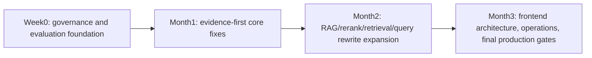

# Plan Timeline Report

Generated: 2026-06-18

This report explains which planning documents are current, which are historical, and what must happen before the next phase starts.

## Current Timeline

| Date | Document | Status | Decision |
|---|---|---|---|
| 2026-06-16 to 2026-06-17 | `历史完成记录.md` and related closeout docs | historical evidence | Completed work can be cited, but it does not change the Week0 -> Month1 -> Month2 -> Month3 order |
| 2026-06-17 | `开发主控文档.md` | active master plan | Controls the production-grade development mainline |
| 2026-06-17 | `Week0_准备清单.md` | completed execution plan | Week0 gate passed on 2026-06-18 with local evidence |
| 2026-06-17 | `Month1_执行清单.md` | active and in progress | Starts from evidence-first retrieval baseline / compare gate |
| 2026-06-17 | `Month2_执行清单.md` | active but not started | Starts only after Month1 evidence gate |
| 2026-06-17 | `Month3_执行清单.md` | active but not started | Starts only after Month2 evidence gate |
| 2026-06-18 | `docs/plan_adoption_report.md` | completed evidence | Brownfield scan showed why automatic bootstrap is unsafe |
| 2026-06-18 | `docs/plan_registry.md` | active governance | Manual registry adopted for current mainline only |
| 2026-06-18 | `docs/milestones/week1_evidence.md` | completed evidence | Month1 Week1 local gate passed; next task is Month1 Week2 Day1 |

## Active Mainline

## Why Old Plans Are Not Auto-Executed

`docs/plan_adoption_report.md` identified 169 possible plan-related Markdown files and 50 likely auto-register candidates. Many are historical RAG, memory, database, enterprise, or closeout documents. Auto-registering all of them would make the current execution line ambiguous.

Decision:

- Use a manual registry for the current production-grade mainline.
- Treat older plans as evidence or reference unless added to `docs/plan_registry.md`.
- Preserve completed work as current-state evidence, especially for database v2, memory operator, ops dashboard, desktop beta, and RAG beta baselines.

## Current Phase Status

| Phase | Status | Reason |
|---|---|---|
| Week0 | completed | Governance/eval/API/fallback/weekly-review evidence is present |
| Month1 | in_progress | Week1 local gate passed on 2026-06-18; next task is Month1 Week2 Day1 AIOps diagnosis visualization |
| Month2 | not_started | Requires Month1 gate |
| Month3 | not_started | Requires Month2 gate |

## Next Required Update

After each work batch:

1. Update checklist status in the active phase file.
2. Update `PROJECT_STATE.md`.
3. Add or refresh scorecard/baseline/compare evidence.
4. Run `scripts/weekly_review.py`.
5. Refresh this report if plan lifecycle changed.
