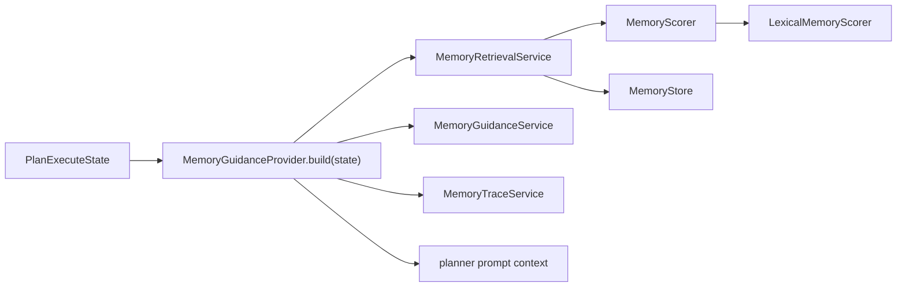

# Reviewed Oncall Pattern Memory V1 实施计划

> **给后续执行 agent 的要求：** 实施本计划时必须使用 `superpowers:subagent-driven-development`（推荐）或 `superpowers:executing-plans`，按任务逐项执行。步骤使用 checkbox（`- [ ]`）跟踪，不要跳步。

**目标：** 把当前 oncall memory 链路拆成可诊断、可替换的模块：检索评分单独成层，planner 的 memory guidance 逻辑单独成 provider，同时不把 V1 扩张成通用 memory 平台。

**架构：** V1 范围保持窄，只做“人工审核过的 oncall pattern 作为 planner sidecar guidance”。`MemoryRetrievalService` 只负责检索编排，`MemoryScorer` 负责评分，`MemoryGuidanceProvider.build(state)` 负责 off/shadow/active 三种模式下的 guidance 行为。新增 retrieval eval 和 injection eval，用确定性评估先定位是哪一层出问题，再决定是否跑 P6 端到端。

**技术栈：** Python、`unittest`、Pydantic models、LangGraph `PlanExecuteState`、SQLite `MemoryStore`、现有 `MemoryGuidanceService` 和 `MemoryTraceService`。

---

## 范围

本计划实现的是 **Reviewed Oncall Pattern Memory V1**，不是 TDAI/OpenViking 风格的通用记忆系统。

V1 中 planner active 使用范围只包括：

- `memory://oncall/alert-patterns` + `alert_pattern`
- `memory://oncall/plan-templates` + `plan_template`

V1 明确不做：

- vector / hybrid memory retrieval
- LM 自动 dedup / merge candidate
- L0/L1/L2/L3 记忆层级
- persona/profile memory
- 超出当前 fixture 规模的 scale 结论
- 在 infra 和分层诊断干净前继续调 P6 质量分

## 目标模块结构



## 计划涉及文件

- 新增：`app/services/memory_scorer.py`
  - 定义 `MemoryScorer` 协议和 `LexicalMemoryScorer`。
  - 把 lexical term expansion、synonym matching、record search text 构造从 `MemoryRetrievalService` 移出。

- 修改：`app/services/memory_retrieval_service.py`
  - 支持注入 scorer。
  - 保留现有 `MemoryRetrievalQuery`、`MemoryRetrievalResult`、`MemoryRetrievalResponse`。
  - 继续负责 filter、rank、build result、record access、metrics。

- 新增：`app/services/memory_guidance_provider.py`
  - 定义：
    ```python
    @dataclass
    class MemoryGuidanceResult:
        guidance_text: str
        observation: dict | None
        mode: MemoryMode
    ```
  - 实现 `MemoryGuidanceProvider.build(state: PlanExecuteState) -> MemoryGuidanceResult`。

- 修改：`app/agent/aiops/planner.py`
  - 用 provider 调用替换当前内联 memory retrieval / trace / injection 逻辑。
  - planner 只读取 `guidance_text` 和 `observation`，不再理解 shadow/active 的内部差异。

- 新增或修改：`tests/test_memory_scorer.py`
  - 覆盖 lexical scorer 行为。

- 修改：`tests/test_memory_retrieval_service.py`
  - 覆盖 scorer 注入和 trace 兼容。

- 新增：`tests/test_memory_guidance_provider.py`
  - 覆盖 off/shadow/active/custom-store 行为。

- 新增：`evals/memory/run_memory_retrieval_eval.py`
  - 确定性 retrieval-layer eval，不调用 LLM，不调用 MCP。

- 新增：`evals/memory/run_memory_injection_eval.py`
  - 确定性 injection-layer eval，围绕 provider/planner guidance 行为，不依赖外部 MCP。

- 修改：`docs/memory_fusion_development_record.md`
  - 只在实际实施后记录真实改动、验证命令和结论。

## 任务 1：拆出 MemoryScorer

**文件：**
- 新增：`app/services/memory_scorer.py`
- 修改：`app/services/memory_retrieval_service.py`
- 测试：`tests/test_memory_scorer.py`
- 测试：`tests/test_memory_retrieval_service.py`

- [x] **步骤 1：先写 scorer 测试**

新增测试，锁住当前 lexical 行为，再移动代码：

```python
import json
import unittest
from pathlib import Path

from app.models.memory import MemoryRecord
from app.services.memory_scorer import LexicalMemoryScorer


FIXTURE_PATH = Path(__file__).parent / "fixtures" / "memory_synthetic" / "p1_memory_records.json"


class MemoryScorerTests(unittest.TestCase):
    def _record_at(self, index: int) -> MemoryRecord:
        payloads = json.loads(FIXTURE_PATH.read_text(encoding="utf-8"))
        return MemoryRecord.model_validate(payloads[index])

    def test_lexical_scorer_matches_synonym_terms(self):
        record = self._record_at(0)
        scorer = LexicalMemoryScorer()

        score, matched_terms = scorer.score(record, "OOM 之后怎么排查")

        self.assertGreater(score, 0)
        self.assertIn("oom", matched_terms)

    def test_lexical_scorer_includes_payload_and_tags(self):
        record = self._record_at(0)
        scorer = LexicalMemoryScorer()

        score, matched_terms = scorer.score(record, "oom_kill gc")

        self.assertGreater(score, 0)
        self.assertTrue(matched_terms)


if __name__ == "__main__":
    unittest.main()
```

- [x] **步骤 1a：给 retrieval service 增加 scorer 注入测试**

在 `tests/test_memory_retrieval_service.py` 里加一个测试，证明 scorer 已经可以替换：

```python
class FixedMemoryScorer:
    retrieval_mode = "fixed-test"

    def score(self, record, query):
        if record.memory_id == "mem_alert_high_memory":
            return 7.0, ["fixed-match"]
        return 0.0, []


def test_uses_injected_scorer_for_ranking(self):
    with tempfile.TemporaryDirectory() as tmpdir:
        service = MemoryRetrievalService(
            self._build_store(tmpdir),
            scorer=FixedMemoryScorer(),
        )

        response = service.retrieve(
            MemoryRetrievalQuery(
                query="query text ignored by fixed scorer",
                namespaces=["memory://oncall/alert-patterns"],
                memory_types=["alert_pattern"],
                top_k=3,
            )
        )

        self.assertEqual([result.memory_id for result in response.memory_results], ["mem_alert_high_memory"])
        self.assertEqual(response.memory_results[0].score, 7.0)
        self.assertEqual(response.memory_results[0].matched_terms, ["fixed-match"])
        self.assertEqual(response.trace["retrieval_mode"], "fixed-test")
```

运行：

```bash
.venv/bin/python -m unittest tests.test_memory_scorer -v
```

预期：实现前失败，原因是 `app.services.memory_scorer` 还不存在。

- [x] **步骤 2：实现 `MemoryScorer` 和 `LexicalMemoryScorer`**

创建 `app/services/memory_scorer.py`：

```python
from __future__ import annotations

import json
import re
from typing import Dict, List, Protocol

from app.models.memory import MemoryRecord


class MemoryScorer(Protocol):
    def score(self, record: MemoryRecord, query: str) -> tuple[float, List[str]]:
        """Return score and matched terms for one memory record."""


class LexicalMemoryScorer:
    retrieval_mode = "lexical"

    _SYNONYMS: Dict[str, List[str]] = {
        "中文": ["chinese"],
        "简洁": ["concise"],
        "证据边界": ["evidence boundary", "evidence boundaries", "evidence from hypotheses"],
        "证据": ["evidence"],
        "边界": ["boundary", "boundaries"],
        "排查": ["diagnosis", "diagnose", "inspect"],
        "告警": ["alert"],
        "内存": ["memory"],
        "oom": ["outofmemoryerror", "oom_kill", "out of memory"],
        "利用率": ["usage"],
        "使用率": ["usage"],
        "处理器": ["cpu"],
        "负载": ["load"],
        "过高": ["high"],
        "飙高": ["spike", "high"],
        "飙升": ["spike", "high"],
        "计算资源打满": ["cpu", "load", "high"],
        "processor": ["cpu"],
        "saturation": ["load", "high"],
        "deploy": ["deployment", "rollout"],
    }

    def score(self, record: MemoryRecord, query: str) -> tuple[float, List[str]]:
        terms = self._expand_terms(query)
        search_text = self._record_search_text(record)
        matched_terms = [term for term in terms if term in search_text]
        return float(len(matched_terms)), matched_terms

    def _expand_terms(self, query_text: str) -> List[str]:
        raw_terms = {
            term.strip().lower()
            for term in re.split(r"[\s,，。！？?;；:/\\|]+", query_text)
            if term.strip()
        }
        compact_query = query_text.strip().lower()
        if compact_query:
            raw_terms.add(compact_query)
        for term in self._SYNONYMS:
            if term in compact_query:
                raw_terms.add(term)

        expanded: list[str] = []
        seen: set[str] = set()
        for term in raw_terms:
            for candidate in [term, *self._SYNONYMS.get(term, [])]:
                candidate = candidate.strip().lower()
                if candidate and candidate not in seen:
                    seen.add(candidate)
                    expanded.append(candidate)
        return expanded

    def _record_search_text(self, record: MemoryRecord) -> str:
        payload_json = json.dumps(record.payload.model_dump(mode="json"), ensure_ascii=False)
        parts = [
            record.memory_id,
            record.namespace,
            record.memory_type.value,
            record.content,
            record.summary,
            " ".join(record.tags),
            payload_json,
        ]
        return "\n".join(parts).lower()
```

- [x] **步骤 3：把 scorer 注入到 retrieval service**

修改 `MemoryRetrievalService.__init__`：

```python
from app.services.memory_scorer import LexicalMemoryScorer, MemoryScorer


class MemoryRetrievalService:
    def __init__(
        self,
        store: MemoryStore = memory_store,
        scorer: MemoryScorer | None = None,
    ):
        self.store = store
        self.scorer = scorer or LexicalMemoryScorer()
```

把内部 scoring loop 替换为：

```python
scored_results = []
for record in candidates:
    score, matched_terms = self.scorer.score(record, query.query)
    if score > 0:
        scored_results.append(self._build_result(record, score, matched_terms))
```

保留 trace 兼容：

```python
"retrieval_mode": getattr(self.scorer, "retrieval_mode", self.scorer.__class__.__name__),
```

从 `MemoryRetrievalService` 删除 `_SYNONYMS`、`_score_record`、`_expand_terms`、`_record_search_text`。

- [x] **步骤 4：验证 scorer 拆分**

运行：

```bash
.venv/bin/python -m unittest tests.test_memory_scorer tests.test_memory_retrieval_service -v
.venv/bin/python -m py_compile app/services/memory_scorer.py app/services/memory_retrieval_service.py
```

预期：测试通过；原有 retrieval response 和 `retrieval_mode="lexical"` trace 兼容不变。

## 任务 2：拆出 MemoryGuidanceProvider

**文件：**
- 新增：`app/services/memory_guidance_provider.py`
- 修改：`app/agent/aiops/planner.py`
- 测试：`tests/test_memory_guidance_provider.py`
- 可能需要修改：`tests/test_p5_shadow_mode.py`
- 可能需要修改：`tests/test_p5_planner_memory_integration.py`
- 可能需要修改：`tests/test_p5_shadow_mode_chain.py`

- [x] **步骤 1：先写 provider 测试**

新增 provider 契约测试：

```python
import tempfile
import unittest
from datetime import datetime, timezone
from pathlib import Path

from app.models.memory import AlertPatternPayload, MemoryRecord
from app.models.memory_mode import MemoryMode
from app.services.memory_guidance_provider import MemoryGuidanceProvider
from app.services.memory_store import MemoryStore
from app.services.memory_trace_service import MemoryTraceService


class MemoryGuidanceProviderTests(unittest.TestCase):
    def _seed_cpu_high_memory(self, store_path: Path) -> None:
        store = MemoryStore(store_path=store_path)
        store.upsert(
            MemoryRecord(
                memory_id="mem_alert_cpu_high",
                schema_version=1,
                owner_id="default",
                namespace="memory://oncall/alert-patterns",
                memory_type="alert_pattern",
                content=(
                    "CPUHigh on service-a usually caused by memory leak in cache layer. "
                    "Check heap usage, GC overhead, recent deploy, and cache eviction config."
                ),
                summary="CPUHigh service-a memory leak cache heap GC",
                payload=AlertPatternPayload(
                    alert_name="CPUHigh",
                    service="service-a",
                    severity="critical",
                    signal_keys=["cpu_usage", "heap_usage", "gc_time"],
                    metric_patterns=["cpu > 85%", "heap > 80%"],
                    log_patterns=["OutOfMemoryError", "GC overhead"],
                    root_cause="memory leak in cache layer",
                    fix="restart service and check cache config",
                    evidence_refs=[{"session_id": "test_session", "diagnosis_id": "test_diag"}],
                ),
                status="active",
                source="unit-test-fixture",
                evidence={"source": "unit-test-fixture"},
                tags=["cpu", "cache", "heap"],
                created_at=datetime.now(timezone.utc),
                updated_at=datetime.now(timezone.utc),
            )
        )

    def _provider(self, trace_dir: Path) -> MemoryGuidanceProvider:
        return MemoryGuidanceProvider(trace_service=MemoryTraceService(trace_dir=str(trace_dir)))

    def test_provider_off_returns_empty_without_observation(self):
        with tempfile.TemporaryDirectory() as tmpdir:
            provider = self._provider(Path(tmpdir) / "traces")

            result = provider.build({"input": "CPUHigh", "memory_mode": "off"})

            self.assertEqual(result.guidance_text, "")
            self.assertIsNone(result.observation)
            self.assertEqual(result.mode, MemoryMode.OFF)

    def test_provider_shadow_with_match_traces_without_guidance(self):
        with tempfile.TemporaryDirectory() as tmpdir:
            store_path = Path(tmpdir) / "memory.sqlite3"
            self._seed_cpu_high_memory(store_path)
            provider = self._provider(Path(tmpdir) / "traces")

            result = provider.build(
                {
                    "input": "service-a CPUHigh alert triggered again",
                    "memory_mode": "shadow",
                    "memory_owner_id": "default",
                    "memory_store_path": str(store_path),
                }
            )

            self.assertEqual(result.guidance_text, "")
            self.assertEqual(result.mode, MemoryMode.SHADOW)
            self.assertIsInstance(result.observation, dict)
            self.assertEqual(result.observation["memory_ids"], ["mem_alert_cpu_high"])

    def test_provider_shadow_without_match_returns_no_observation(self):
        with tempfile.TemporaryDirectory() as tmpdir:
            store_path = Path(tmpdir) / "memory.sqlite3"
            self._seed_cpu_high_memory(store_path)
            provider = self._provider(Path(tmpdir) / "traces")

            result = provider.build(
                {
                    "input": "unrelated DiskHigh alert on service-z",
                    "memory_mode": "shadow",
                    "memory_owner_id": "default",
                    "memory_store_path": str(store_path),
                }
            )

            self.assertEqual(result.guidance_text, "")
            self.assertEqual(result.mode, MemoryMode.SHADOW)
            self.assertIsNone(result.observation)

    def test_provider_active_returns_guidance_when_memory_matches(self):
        with tempfile.TemporaryDirectory() as tmpdir:
            store_path = Path(tmpdir) / "memory.sqlite3"
            self._seed_cpu_high_memory(store_path)
            provider = self._provider(Path(tmpdir) / "traces")

            result = provider.build(
                {
                    "input": "service-a CPUHigh alert triggered again",
                    "memory_mode": "active",
                    "memory_owner_id": "default",
                    "memory_store_path": str(store_path),
                }
            )

            self.assertEqual(result.mode, MemoryMode.ACTIVE)
            self.assertNotEqual(result.guidance_text, "")
            self.assertIn("mem_alert_cpu_high", result.guidance_text)
            self.assertIsInstance(result.observation, dict)
            self.assertEqual(result.observation["memory_ids"], ["mem_alert_cpu_high"])


if __name__ == "__main__":
    unittest.main()
```

这些测试使用项目现有的 `unittest.TestCase` 风格。测试会显式向临时 SQLite store 写入一条 active `alert_pattern` memory，并在 active 匹配场景断言 guidance 非空。shadow 命中和 shadow 未命中拆成两个 case，避免 observation 契约含糊。

运行：

```bash
.venv/bin/python -m unittest tests.test_memory_guidance_provider -v
```

预期：实现前失败，原因是 provider 还不存在。

- [x] **步骤 2：实现 provider 返回类型**

创建 `app/services/memory_guidance_provider.py`：

```python
from __future__ import annotations

from dataclasses import dataclass

from app.agent.aiops.state import PlanExecuteState
from app.models.memory_mode import MemoryMode


@dataclass
class MemoryGuidanceResult:
    guidance_text: str
    observation: dict | None
    mode: MemoryMode
```

- [x] **步骤 3：实现 `MemoryGuidanceProvider.build(state)`**

新增 provider 逻辑：

```python
class MemoryGuidanceProvider:
    ONCALL_NAMESPACES = [
        "memory://oncall/alert-patterns",
        "memory://oncall/plan-templates",
    ]
    ONCALL_MEMORY_TYPES = ["alert_pattern", "plan_template"]

    def __init__(self, trace_service: MemoryTraceService | None = None):
        self._trace_service = trace_service or MemoryTraceService()

    def build(self, state: PlanExecuteState) -> MemoryGuidanceResult:
        memory_mode = MemoryMode.from_state(state)
        if memory_mode == MemoryMode.OFF:
            return MemoryGuidanceResult(guidance_text="", observation=None, mode=memory_mode)

        input_text = state.get("input", "")
        owner_id = state.get("memory_owner_id", "default")
        memory_service = self._build_retrieval_service(state)
        memory_response = memory_service.retrieve(
            MemoryRetrievalQuery(
                query=input_text,
                owner_id=owner_id,
                namespaces=self.ONCALL_NAMESPACES,
                memory_types=self.ONCALL_MEMORY_TYPES,
                top_k=3,
            )
        )

        if not memory_response.memory_results:
            return MemoryGuidanceResult(guidance_text="", observation=None, mode=memory_mode)

        memory_guidance_text = MemoryGuidanceService.format_memory_guidance(
            memory_response,
            include_metadata=True,
        )
        observation = self._trace_service.create_observation(
            mode=memory_mode,
            memory_response=memory_response,
            memory_guidance_text=memory_guidance_text,
            query=input_text,
            owner_id=owner_id,
        )

        if memory_mode == MemoryMode.ACTIVE:
            return MemoryGuidanceResult(
                guidance_text=memory_guidance_text,
                observation=observation,
                mode=memory_mode,
            )

        return MemoryGuidanceResult(guidance_text="", observation=observation, mode=memory_mode)

    def _build_retrieval_service(self, state: PlanExecuteState) -> MemoryRetrievalService:
        custom_store_path = state.get("memory_store_path")
        if custom_store_path:
            return MemoryRetrievalService(store=MemoryStore(store_path=custom_store_path))
        return MemoryRetrievalService()


memory_guidance_provider = MemoryGuidanceProvider()
```

需要的 import：

```python
from app.services.memory_guidance_service import MemoryGuidanceService
from app.services.memory_retrieval_service import MemoryRetrievalQuery, MemoryRetrievalService
from app.services.memory_store import MemoryStore
from app.services.memory_trace_service import MemoryTraceService
```

必须保留模块级单例 `memory_guidance_provider = MemoryGuidanceProvider()`，因为 `planner.py` 会直接 import 它。

- [x] **步骤 4：替换 planner 内联 memory block**

在 `app/agent/aiops/planner.py` 中，先删除原来的 pre-block memory setup：

```python
memory_mode = MemoryMode.from_state(state)
memory_owner_id = state.get("memory_owner_id", "default")
logger.info(f"Memory mode: {memory_mode.value}")
```

然后把原来的内联 memory retrieval block 替换成：

```python
memory_observation = None
memory_guidance_for_prompt = ""

try:
    guidance = memory_guidance_provider.build(state)
    logger.info(f"Memory mode: {guidance.mode.value}")
    memory_observation = guidance.observation
    memory_guidance_for_prompt = guidance.guidance_text
    if memory_observation:
        logger.info(MemoryTraceService.format_log_summary(memory_observation))
    if memory_guidance_for_prompt:
        logger.info("Memory guidance 将注入 prompt")
except Exception as e:
    logger.warning(f"查询 memory guidance 失败 (non-fatal): {e}")
```

使用模块级 provider 单例：

```python
from app.services.memory_guidance_provider import memory_guidance_provider
```

planner import 清理必须明确：

- 删除：`MemoryRetrievalService`
- 删除：`MemoryRetrievalQuery`
- 删除：`MemoryMode`
- 保留：`MemoryGuidanceService`，因为 `combine_memory_and_document_context(...)` 仍然负责合并 active memory guidance 和 RAG document context。
- 保留：`MemoryTraceService`，因为 planner 仍然使用 `MemoryTraceService.format_log_summary(...)` 打日志。

同时删除旧 memory block 内部的内联 import：

```python
from app.services.memory_store import MemoryStore
```

store 构造迁移到 `MemoryGuidanceProvider`。

不要修改 LangGraph node 签名，继续保持：

```python
async def planner(state: PlanExecuteState) -> Dict[str, Any]:
```

provider 拆出后，仍然保留现有 RAG-memory context 合并逻辑：

```python
combined_experience_context = MemoryGuidanceService.combine_memory_and_document_context(
    memory_guidance_for_prompt,
    experience_context,
)
```

provider 只负责 memory sidecar guidance。planner 仍负责把 memory guidance 和 document/RAG `experience_context` 合并，否则 RAG 检索到的经验文档可能被丢掉。

- [x] **步骤 5：验证 provider 拆分**

运行具名测试前，先确认测试文件存在：

```bash
ls tests | sort | rg "test_p5_shadow_mode.py|test_p5_planner_memory_integration.py|test_p5_shadow_mode_chain.py"
```

运行：

```bash
.venv/bin/python -m unittest tests.test_memory_guidance_provider -v
.venv/bin/python -m unittest tests.test_p5_shadow_mode tests.test_p5_planner_memory_integration tests.test_p5_shadow_mode_chain -v
.venv/bin/python -m py_compile app/services/memory_guidance_provider.py app/agent/aiops/planner.py
```

预期：provider 测试通过；P5 planner/shadow 行为不变。

## 任务 3：新增 retrieval-layer eval

**文件：**
- 新增：`evals/memory/run_memory_retrieval_eval.py`
- 复用 fixture：`evals/memory/p6_samples.jsonl`
- 如 eval 暴露纯 metric helper，可增加小单测

- [x] **步骤 1：定义确定性 eval 输出**

retrieval eval 必须写出如下 JSON 结构：

```json
{
  "eval_name": "memory_retrieval_eval",
  "eval_status": "valid",
  "metrics": {
    "total": 12,
    "hit_at_1": 0.0,
    "hit_at_3": 0.0,
    "mrr": 0.0,
    "latency_ms_avg": 0.0
  },
  "results": [
    {
      "sample_id": "p6_repeated_001",
      "category": "repeated_alert",
      "query": "service-a CPUHigh alert triggered again",
      "expected_memory_id": "memory_id_here",
      "returned_memory_ids": [],
      "matched_terms": [],
      "latency_ms": 0.0,
      "passed_hit_at_3": false
    }
  ]
}
```

- [x] **步骤 2：实现 eval 脚本**

脚本职责：

- 创建隔离的临时 `MemoryStore`
- 读取 `evals/memory/p6_samples.jsonl`
- 对每一行，把 `sample["pre_seeded_memory"]` 写入隔离 store
- 把 `sample["pre_seeded_memory"]["memory_id"]` 映射为 `expected_memory_id`
- 使用 `sample["query"]`、`sample["id"]`、`sample["category"]` 作为 eval input/result metadata
- 调用 `MemoryRetrievalService.retrieve`
- 计算 Hit@1、Hit@3、MRR、latency、matched terms
- 保存 JSON 到 `evals/memory/memory_retrieval_eval_<timestamp>.json`

构造 `MemoryRecord` 时，沿用 `evals/memory/run_p6_memory_eval.py` 里的 P6 映射：

- `alert_pattern` -> `AlertPatternPayload(**mem["payload"])`
- `plan_template` -> `PlanTemplatePayload(**mem["payload"])`
- `summary` 可用 `mem["content"][:200]`
- `status` 必须为 `active`
- `source` 使用 `memory_retrieval_eval_fixture`
- `evidence` 要标明 fixture 来源

脚本禁止调用：

- planner
- executor
- replanner
- MCP server
- LLM

- [x] **步骤 3：验证 retrieval eval**

运行：

```bash
.venv/bin/python evals/memory/run_memory_retrieval_eval.py
```

预期：脚本 exit 0，并写出 JSON 报告。报告能把 retrieval 质量问题和 planner/executor infra 问题分开。

## 任务 4：新增 injection-layer eval

**文件：**
- 新增：`evals/memory/run_memory_injection_eval.py`
- 测试：`tests/test_memory_guidance_provider.py`

- [x] **步骤 1：定义 injection 检查项**

eval 必须验证：

- `off`：无 guidance text，无 observation
- `shadow`：有匹配 memory 时可以产生 observation，但 guidance text 仍为空
- `active`：有匹配 active memory 时 guidance text 非空
- `active` 无匹配 memory：guidance text 为空，不发生误注入
- `memory_store_path`：使用自定义 eval store，不误用全局 store

- [x] **步骤 2：实现 eval 脚本**

脚本直接实例化 `MemoryGuidanceProvider`，传入合成的 `PlanExecuteState` dict。不要运行完整 LangGraph workflow。

输出结构：

```json
{
  "eval_name": "memory_injection_eval",
  "eval_status": "valid",
  "metrics": {
    "checks_total": 5,
    "checks_passed": 5
  },
  "results": [
    {
      "case_id": "active_matching_memory",
      "mode": "active",
      "guidance_text_present": true,
      "observation_present": true,
      "passed": true
    }
  ]
}
```

- [x] **步骤 3：验证 injection eval**

运行：

```bash
.venv/bin/python evals/memory/run_memory_injection_eval.py
```

预期：脚本 exit 0，并能清楚区分 injection 行为、retrieval 行为和 P6 infra。

## 任务 5：更新开发记录

**文件：**
- 修改：`docs/memory_fusion_development_record.md`

- [x] **步骤 1：只记录实际发生的实现事实**

实施后追加一节，包含：

- 为什么现在做这个 refactor
- 实际改了哪些文件
- 旧结构 vs 新结构
- 执行过哪些命令
- 命令 pass/fail 结果
- 最新 retrieval eval 报告路径
- 最新 injection eval 报告路径
- 是否重跑 P6
- 如果 P6 仍 invalid，要明确是 infra 还是质量问题

- [x] **步骤 2：验证文档真实性**

最终前，用实际 diff 和命令输出对照开发记录：

```bash
git diff -- app/services/memory_scorer.py app/services/memory_retrieval_service.py app/services/memory_guidance_provider.py app/agent/aiops/planner.py tests evals/memory docs/memory_fusion_development_record.md
```

预期：文档只描述实际存在的改动。

## 任务 6：最终验证

先跑 targeted checks：

```bash
.venv/bin/python -m unittest tests.test_memory_scorer tests.test_memory_retrieval_service tests.test_memory_guidance_provider -v
.venv/bin/python -m unittest tests.test_p5_shadow_mode tests.test_p5_planner_memory_integration tests.test_p5_shadow_mode_chain -v
.venv/bin/python evals/memory/run_memory_retrieval_eval.py
.venv/bin/python evals/memory/run_memory_injection_eval.py
```

再跑语法检查：

```bash
.venv/bin/python -m py_compile app/services/memory_scorer.py app/services/memory_retrieval_service.py app/services/memory_guidance_provider.py app/agent/aiops/planner.py
```

如果以上通过且时间允许，再跑更广的 memory suite：

```bash
.venv/bin/python -m unittest tests.test_memory_guidance_service tests.test_memory_candidate_service tests.test_memory_review_service tests.test_memory_store tests.test_p6_memory_eval_infra -v
```

P6 full eval 不是本次 refactor 的第一验收门槛。只有 deterministic retrieval eval 和 injection eval 通过后，再考虑跑 P6 full eval。

## 验收标准

- `MemoryRetrievalService` 支持注入 scorer，并且不再持有 lexical term expansion。
- `LexicalMemoryScorer` 保持现有 lexical 行为，并保持 `retrieval_mode="lexical"` trace 兼容。
- `MemoryGuidanceProvider.build(state)` 返回 `MemoryGuidanceResult(guidance_text, observation, mode)`。
- planner 不再包含 store 构造、retrieval query 构造、guidance 格式化、shadow/active 分叉逻辑。
- off/shadow/active 行为保持兼容：
  - off：不做 memory retrieval，不注入
  - shadow：retrieval + trace，不注入
  - active：retrieval + trace + prompt guidance
- retrieval eval 能在没有 LLM/MCP 干扰的情况下定位检索质量问题。
- injection eval 能在没有 retrieval 歧义的情况下定位 prompt 注入行为问题。
- `docs/memory_fusion_development_record.md` 只记录真实实现和验证事实。

## 后续单独处理：P6 Infra Policy

本次 refactor 完成后，再单独处理 P6 infra 策略：

- 区分 caught-and-recovered node degradation 和 graph-aborted sample failure。
- 避免 `stop_early=yes` 因一次已恢复的 node timeout 直接终止整轮 eval。
- 考虑把 `executor final llm response` timeout 放宽到 90-120 秒。

除非必须立即重跑 P6，否则不要把这个 policy 改动混进 scorer/provider refactor。
