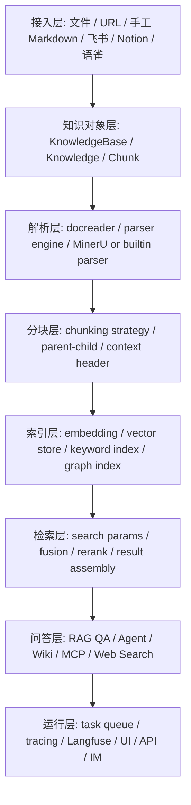
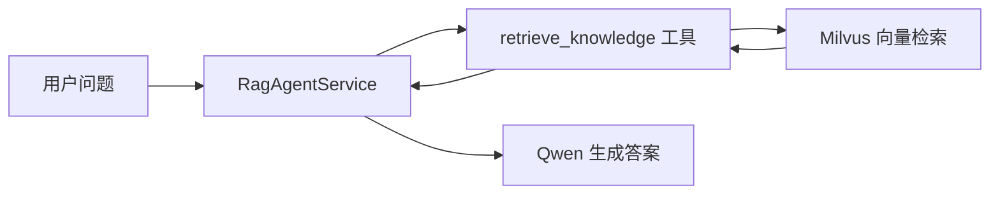
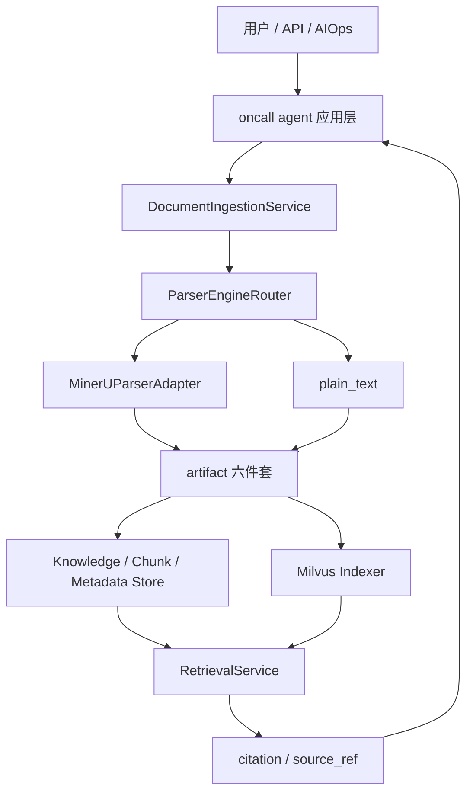

# WeKnora 与 oncall agent 技术融合教材式讲解

日期: 2026-05-13

## 1. 这份文档的目的

这份文档不是实现计划，也不是只给出结论的方案说明，而是尽量用“教材式”的方式，把下面三件事讲清楚:

1. `WeKnora` 到底是一个什么样的技术系统，它解决了哪些问题，它的技术分层是什么。
2. `oncall agent` 当前到底已经做到了什么，它的技术路径、运行方式和边界是什么。
3. 如果要把二者融合，`oncall agent` 还缺哪些技术层，哪些可以直接保留，哪些必须补上。

如果你读完这份文档，理想状态应该是:

- 你能分别说清 `WeKnora` 和 `oncall agent` 各自的技术定位。
- 你能判断为什么当前不能简单把两者混成一套。
- 你能判断接下来应该补“哪一层”，而不是只知道“要接 RAG”。

阅读提醒:

- 这份文档后面会出现不少技术词。为了避免“前面已经看不懂，后面越看越糊”，下面先放一份术语总表。
- 如果正文里某个词一时没记住，不用着急，回到术语总表查一下即可。

---

## 2. 先读懂这些术语

这一节不是实现内容，而是“读这篇教材之前的词典”。

### 2.1 最常见的系统级术语

| 术语 | 人话解释 | 为什么重要 |
|---|---|---|
| `RAG` | 全称是 Retrieval-Augmented Generation，可以理解成“先查资料，再让大模型回答”。 | 它不是让模型硬想答案，而是先去知识库找证据。 |
| `Agent` | 可以理解成“会自己决定下一步做什么的智能助手”。 | 它不仅回答问题，还会决定是否调用工具、是否继续查询。 |
| `AIOps` | AI for Operations，意思是“用 AI 做运维诊断”。 | oncall agent 不是普通聊天机器人，它还要帮忙分析告警和故障。 |
| `知识库` | 专门用来存放文档、FAQ、手册、网页知识的地方。 | RAG 的“资料来源”就在这里。 |
| `FAQ` | Frequently Asked Questions，常见问题集合。 | FAQ 文档通常比较短、结构固定，处理方式和长文档不完全一样。 |
| `Wiki` | 一种可以按页面组织、互相链接的知识体系。 | WeKnora 不只做检索，还想把知识整理成结构化页面网络。 |
| `数据源` | 知识从哪里来，比如本地文件、URL、飞书、Notion。 | 决定知识如何进入系统。 |
| `可观测性` | 看系统内部发生了什么的能力，比如日志、链路、耗时、调用记录。 | 出问题时才能知道卡在哪一层。 |
| `工作流` | 一串有顺序的处理步骤。 | 比如“上传 -> 解析 -> 切分 -> 索引 -> 检索”就是工作流。 |
| `状态机` | 用一组固定状态表示一个对象当前处在什么阶段。 | 比如文档现在是待解析、解析中、解析失败还是已入库。 |
| `生命周期` | 一个对象从创建到结束，中间经历的所有阶段。 | 比如文档从上传到解析、索引、重传、删除，这就是文档生命周期。 |
| `多租户` | 一个系统同时服务多个独立用户组织，而且彼此数据隔离。 | WeKnora 很强调这个能力，而 oncall agent 当前还没有完整接入。 |

### 2.2 文档处理相关术语

| 术语 | 人话解释 | 为什么重要 |
|---|---|---|
| `parser` | 解析器。就是“把原始文件读出来、变成系统能继续处理的内容”的程序。 | PDF、DOCX、XLSX 不能直接拿来检索，先要解析。 |
| `parse` / `parsing` | 解析。就是“把原始文件内容拆出来”。 | 文档进入系统后的第一大步。 |
| `parser engine` | 解析引擎。可以理解成“某一类解析器的名字或方案”。 | 同样是 PDF，不同引擎解析质量可能不同。 |
| `router` | 路由器。这里不是网络设备，而是“决定该走哪条处理路线”的逻辑。 | 比如 `.md` 走文本路线，`.pdf` 走 MinerU 路线。 |
| `fallback` | 兜底方案。主方案不行时，退回备用方案。 | 例如一个解析器失败时，是否换另一个解析器。 |
| `Markdown` | 一种轻量文本格式，用 `#` 表示标题，用列表和表格表示结构。 | 很适合做知识文档的中间表达。 |
| `artifact` | 中间产物文件。就是流程中间明确产出的那些文件。 | 下游读取时不能靠猜，必须知道上游到底产出了什么。 |
| `artifact_manifest` | 产物清单文件。专门列出这次解析到底有哪些产物。 | 像快递清单，避免下游读错文件或漏文件。 |
| `schema` | 数据结构约定。可以理解成“这个 JSON 文件里应该有哪些字段”。 | 这样不同模块才能对同一个文件有统一理解。 |
| `quality_report` | 质量报告。专门记录解析结果质量、告警和失败原因。 | 决定某份文档是否允许继续入库。 |
| `idempotent` / `幂等` | 重复执行多次，结果仍然一致。 | 同一文档重复上传，不应该越传越多脏数据。 |
| `对象化` | 把原本散乱的信息整理成有固定字段的对象。 | 例如把“查询参数”整理成 `SearchParams` 这种对象，而不是到处传字符串。 |

### 2.3 检索与向量相关术语

| 术语 | 人话解释 | 为什么重要 |
|---|---|---|
| `embedding` | 向量化。把一段文字转成一串数字，让机器能比较“语义像不像”。 | 这是向量检索的基础。 |
| `vector` | 向量。这里可以理解成“文字的数字表示”。 | 检索不是直接比字面，而是比数字空间里的相似度。 |
| `向量库` / `vector store` | 专门保存向量并支持相似搜索的数据库。 | 检索时不是在普通表里找，而是在向量库里找相似内容。 |
| `Milvus` | 一个常见的向量数据库名字。 | oncall agent 现在就是用它存知识向量。 |
| `index` / `indexing` | 索引 / 建索引。就是“把内容整理成方便快速搜索的形式”。 | 不建索引就没法高效检索。 |
| `retrieval` | 检索。就是“从知识库里把相关内容找出来”。 | RAG 的第一步就是检索。 |
| `retriever` | 检索器。执行检索动作的那一层程序。 | 它负责把 query 变成真正的搜索。 |
| `topK` | 取前 K 个结果。比如 `topK=3` 就是取最相关的 3 条。 | 决定一次给模型喂多少证据。 |
| `rerank` | 重排序。先粗搜出一批，再用更精细的方法重新排顺序。 | 可以提升结果相关性，但会增加复杂度。 |
| `hybrid search` | 混合检索。把多种检索方式结合起来，比如关键词检索和向量检索一起用。 | 常用于提高召回率。 |
| `recall` / `召回` | 能不能把“本该找到的内容”找回来。 | 找不到正确信息，后面回答再强也没用。 |
| `precision` / `精度` | 找出来的结果里，有多少是真的相关。 | 找到一堆无关内容会干扰回答。 |

### 2.4 文档结果与引用相关术语

| 术语 | 人话解释 | 为什么重要 |
|---|---|---|
| `metadata` | 元数据。不是正文，而是“关于正文的信息”，比如文件名、页码、章节、来源。 | 没有这些信息，就很难追踪来源。 |
| `source_ref` | 来源引用对象。可以理解成“这段内容从哪里来的身份证”。 | 后续 citation 靠它稳定追踪来源。 |
| `citation` | 引用。就是回答里把证据来源明确标出来。 | 让回答不是“凭空说”，而是“有出处”。 |
| `citation_text` | 展示给人看的引用文字。 | 比如“来源: 某文档，第 3 页，第 2 节”。 |
| `grounded answer` | 基于证据的回答。意思是“只根据检索到的资料回答，不瞎编”。 | 这是知识问答能不能可信的关键。 |
| `context` | 上下文。就是“为了理解当前内容，前后还需要知道的信息”。 | 一句话单独看不懂，加上上下文就懂了。 |
| `context window` | 模型一次能看到的内容范围。 | 这会限制你一次能塞多少 chunk 给模型。 |

### 2.5 应用与工程相关术语

| 术语 | 人话解释 | 为什么重要 |
|---|---|---|
| `API` | 系统对外提供的接口。 | 前端或其他系统通过它调用服务。 |
| `FastAPI` | 一个 Python Web 框架。 | oncall agent 的主服务就是它。 |
| `LangChain` | 一个帮助大模型接工具、接检索、接工作流的 Python 框架。 | oncall agent 的 RAG 和工具调用很依赖它。 |
| `LangGraph` | 在 LangChain 基础上更强调“工作流图”的框架。 | oncall agent 的 AIOps 诊断流程就像一张图。 |
| `MCP` | Model Context Protocol，一种让大模型调用外部工具的协议。 | oncall agent 和 WeKnora 都很重视工具调用能力。 |
| `Prompt` | 给大模型的提示词。 | 它决定模型回答时遵循什么规则。 |
| `UI` | 用户界面。 | 就是人看到和操作系统的页面。 |
| `namespace` | 命名空间。可以理解成“同名东西被隔离开的范围”。 | 一个知识库和另一个知识库之间需要隔离。 |
| `DTO` | Data Transfer Object，传输数据用的小对象。 | 用来规范模块之间如何传参、怎么返回。 |
| `主链路` | 系统里最正式、最关键的那条处理路线。 | 比如未来 PDF 的主链路就是 MinerU-first。 |
| `降级` | 正常路线失败后，退到更简单但能力更弱的路线。 | 有些降级是必要的，但有些会悄悄污染数据。 |

### 2.6 这份文档的阅读约定

从这一节开始，后文里凡是再次出现这些词，你都可以按上面的“人话解释”来理解。正文会尽量继续解释，但不再每次都重复展开。

如果后文还有你一眼看过去不懂的词，它应该满足下面两种情况之一:

1. 已经在术语表里出现，可以回到这一节查。
2. 是某个具体代码文件名或类名，这时可以先把它看成“系统里的某个模块名字”，不用先纠结拼写。

---

## 3. 先给一句总判断

最短的总结是:

```text
WeKnora 更像一个完整的知识库/RAG（先查资料再回答）产品底座；
oncall agent 更像一个已经能工作的 Python 对话与 AIOps（AI 运维诊断）应用；
融合的关键，不是替换 oncall agent，而是给它补上一层 WeKnora 风格的知识库产品层。
```

也就是说:

- `WeKnora` 的强项是“知识库系统化”。
- `oncall agent` 的强项是“对话 Agent 与 AIOps 任务流程已经跑起来了”。
- 真正要做的不是“换个 parser”，而是“把 oncall agent 的文档接入、状态管理、artifact、chunk、citation、retrieval 变成一套更完整的系统”。

---

## 3. 什么是 WeKnora

### 3.1 从产品定位理解 WeKnora

从 [README_CN.md](/Users/cici/oncall%20agent/WeKnora/README_CN.md) 看，WeKnora 不是一个单纯的“文档转 Markdown 工具”，也不是一个单纯的“向量检索 demo（演示样例系统）”。它更接近一个完整知识系统平台，目标是把企业里的文档、网页、FAQ、Wiki、外部数据源沉淀为可检索、可推理、可持续维护的知识资产。

如果用一个更生活化的问题来理解 WeKnora，它回答的是:

```text
企业里一堆散乱的文档、网页、FAQ、手册，
怎么才能不只是“存起来”，而是真正变成“以后问得到、找得到、能推理、能持续维护”的知识系统？
```

很多项目其实只解决了中间一小段，比如:

- 只解决“文件能上传”
- 只解决“能向量检索”
- 只解决“能问答”

但 WeKnora 想解决的是整条链:

- 知识怎么进来
- 进来后怎么解析
- 解析后怎么切分
- 切分后怎么索引
- 索引后怎么检索
- 检索后怎么回答
- 回答时怎么带来源
- 后续怎么重跑、追踪、维护

所以看 WeKnora 时，一个很重要的思维转换是:

```text
不要把它当“某个功能很强的工具”，
而要把它当“知识系统的底座”。
```

它的产品关键词可以概括为:

- 知识库管理
- 文档接入与解析
- chunking（文档切段）与索引
- 检索与问答
- Agent（会自己决定下一步动作的智能助手）推理
- Wiki 自动生成
- 多数据源同步
- 可观测性（能看清系统内部发生了什么）与任务管理

这意味着 WeKnora 解决的问题，不只是“怎么问答”，而是“知识如何进入系统、如何被处理、如何被维护、如何被引用、如何被追踪”。

### 3.2 用分层方式理解 WeKnora

可以把 WeKnora 理解成下面这几层:



第一次看这张图时，你可以先不要急着记所有名词，只抓住一个最朴素的理解:

```text
WeKnora 把“知识从进入系统到最后被问答使用”这件事，
拆成了很多层，每一层只负责自己那一段工作。
```

为什么要这么拆?

因为如果不拆层，系统往往会变成这样:

- 上传代码里顺手做了解析
- 解析代码里顺手做了切分
- 切分代码里顺手做了向量化
- 检索结果里顺手拼了引用

一开始这样写很快，但后面会越来越难改。因为你根本说不清:

- 改 parser 会不会影响检索
- 改 chunking 会不会影响引用
- 改索引会不会把旧数据搞乱

这张图非常重要，因为它说明 WeKnora 的核心价值不在单点，而在“层与层之间已经有比较完整的边界”。

这里的“边界”也顺手解释一下:

```text
边界就是“这一层负责什么，不负责什么，它给下一层交付什么”。
```

如果边界清楚，系统就更容易维护；如果边界模糊，后面就容易变成一团混在一起的代码。

### 3.3 WeKnora 的核心技术对象

在 `WeKnora/internal/types` 里，有几个特别关键的对象:

- `KnowledgeBase`
- `Knowledge`
- `Chunk`
- `SearchParams`
- `SearchResult`

它们的作用可以这样理解:

| 对象 | 你可以把它理解成什么 | 它解决什么问题 |
|---|---|---|
| `KnowledgeBase` | 一个知识库容器 | 把一批知识放在同一个命名空间和配置下 |
| `Knowledge` | 一份文档或一条知识 | 表示“这条知识本身”的生命周期 |
| `Chunk` | 文档切出来的可检索片段 | 让长文档变成可向量检索的小单位 |
| `SearchParams` | 检索请求对象 | 把 query、范围、topK、过滤条件结构化 |
| `SearchResult` | 检索结果对象 | 把命中文本、分数、来源、知识元数据结构化返回 |

教材式理解是:

```text
KnowledgeBase 是“库”
Knowledge 是“文档”
Chunk 是“文档里的片段”
SearchParams 是“怎么搜”
SearchResult 是“搜到了什么”
```

如果系统里没有这几个对象，那么系统就很容易退化成下面这种状态:

- 上传时只知道“来了一个文件”
- 切分时只知道“现在有几段文本”
- 检索时只知道“返回了几段内容”

但中间最关键的问题没人能回答:

- 这是哪个知识库里的文档?
- 这份文档现在处理到哪一步?
- 这几个 chunk 属于哪份文档?
- 这条检索结果到底引用的是哪一段原文?

所以这些对象不是“为了代码好看而设计”，而是为了让系统真的能长期维护。

### 3.4 WeKnora 的文档接入技术

WeKnora 的文档接入不是“上传文件 -> 直接读文本 -> 立刻 embedding（向量化）”这么简单。它中间有一层比较明确的解析边界。

这里可以先抓住一个特别关键的思想:

```text
在 WeKnora 里，文件不是“临时素材”，
而是“系统里要被正式管理的一条知识”。
```

这句话看起来抽象，但落到工程上其实非常实际。

如果系统把文件只当临时输入，就会出现这些情况:

- 上传完就不知道这份文件后面发生了什么
- 解析失败也没有清晰状态
- 重传时不知道该替换旧数据还是新建一份
- 检索命中后也很难追溯回原始文档

而 WeKnora 的做法是:

- 先建文档记录
- 再按文档类型选择处理路线
- 再把处理结果继续交给后面的层

这相当于先给每份文档办“入学档案”，之后系统处理它的每一步才都有据可查。

关键来源包括:

- [knowledge.md](/Users/cici/oncall%20agent/WeKnora/docs/api/knowledge.md)
- `internal/types/docparser.go`
- `internal/types/interfaces/document_parser.go`
- `docreader/parser/registry.py`
- `internal/infrastructure/docparser/mineru_converter.go`

这里的技术思想是:

1. 先有一条知识记录 `Knowledge`
2. 再根据文件类型决定走哪个 parser engine
3. parser 输出统一的读取结果
4. 再进入 chunking 和 indexing

也就是说，WeKnora 强调“先把文档变成系统中的一等对象，再进行处理”，而不是“文件只是一个临时输入”。

这一点和很多轻量 RAG 项目的差异非常大。轻量项目通常先关心“能不能搜”，WeKnora 先关心“这个知识在系统里是不是有正式身份”。

### 3.5 WeKnora 的 parser 技术

这里特别容易误解。很多人会自然地想:

```text
既然 WeKnora 很完整，那它默认 parser 应该也一定最强吧?
```

但真实情况更接近:

```text
WeKnora 更强的是“怎么把不同 parser 组织进系统里”，
而不是“它自带的每个默认 parser 都一定是最优答案”。
```

很多人看到 WeKnora 会以为它的核心优势是“默认 parser 很强”。实际上，更准确的说法是:

```text
WeKnora 的 parser 强项主要在“统一接入框架与多引擎边界”，
不一定在“默认解析质量对所有中文 PDF 都最好”。
```

比如:

- Python `docreader/parser/registry.py` 定义了 parser registry 结构。
- `pdf_parser.py` 里有默认 PDF 解析与 fallback 思路。
- Go 侧 `mineru_converter.go` 则提供了 MinerU 的适配边界。

这说明 WeKnora 的设计重点是:

- parser 可插拔（可以替换不同解析器）
- 不同文件类型可以走不同 engine（解析引擎）
- engine 有 availability（当前能不能用）和 fallback（失败时是否退备用方案）概念

而不是把所有解析问题都绑死在一个解析器上。

你可以把它理解成:

```text
WeKnora 更像在建设“机场调度系统”，
它要解决的是“哪种航班走哪条跑道”，
而不是只关心“某一架飞机本身飞得多快”。
```

这也是为什么我们后面讨论融合时，会反复说“要复用 parser 边界”，而不是简单说“换成 WeKnora 的 parser”。

### 3.6 WeKnora 的 chunking 技术

WeKnora 很重要的一层是 chunking。

参考 [CHUNKING.md](/Users/cici/oncall%20agent/WeKnora/docs/CHUNKING.md)，它不是单纯按固定字符数截断，而是把 chunking 当作“检索质量的一部分”。

但是这里的术语如果不解释，会非常难懂。所以这一小节先不急着讲实现，先把这些词翻译成“人话”。

#### 3.6.1 什么叫 chunk

`chunk` 可以直接理解成:

```text
把一篇长文档切成一小段一小段后，其中的每一小段就是一个 chunk。
```

为什么要切?

因为大模型检索知识时，通常不是把整本手册整篇论文一次性塞进去，而是:

1. 先把文档切成很多小段
2. 给每一小段做向量
3. 用户提问时，从这些小段里找最相关的几段

所以 `chunking` 就是:

```text
决定“文档要怎么切段”的技术。
```

你可以把它想成“给一本书贴很多便签”，以后找知识时不是把整本书扔给模型，而是先找到最像答案的那几张便签。

#### 3.6.2 chunk size 是什么

`chunk size` 的意思是:

```text
每一段切出来大概允许有多长。
```

比如:

- 如果一段太短，可能一句话就被切出来，信息不完整。
- 如果一段太长，检索时又会把很多不相干内容一起带进来。

可以类比成:

- 太小: 像把一本书切成一个个词，虽然很细，但上下文丢了。
- 太大: 像一整章都当成一个块，虽然信息全，但检索不精准。

所以 `chunk size` 本质是在平衡两件事:

- 这段要不要足够完整
- 这段要不要足够聚焦

#### 3.6.3 overlap 是什么

`overlap` 的字面意思是“重叠”。

在 chunking 里，它表示:

```text
前一个 chunk 的最后一部分内容，要不要再重复出现在下一个 chunk 开头。
```

举个最简单的例子。

原文是:

```text
第一段讲告警背景。
第二段讲故障原因。
第三段讲处理方案。
```

如果完全不重叠，切法可能是:

- chunk A: 背景 + 原因开头
- chunk B: 原因结尾 + 处理方案

问题在于，有时“故障原因”正好跨在两个 chunk 边界中间，两个 chunk 单独看都不完整。

这时就会用 `overlap`，让一小段内容重复出现，比如:

- chunk A: 背景 + 原因
- chunk B: 原因 + 处理方案

这样做的好处是:

- 即使答案刚好在边界附近，也更不容易被切断。

代价是:

- 会多存一点重复内容。

所以 `overlap` 的本质是:

```text
用少量重复，换更稳的上下文连续性。
```

#### 3.6.4 separator 是什么

`separator` 的意思是“分隔符”。

在 chunking 里，它表示:

```text
系统优先在什么地方下刀去切文档。
```

比如常见的分隔位置有:

- 空行
- 换行
- 句号
- 分号
- 标题

为什么这很重要?

因为如果系统胡乱切，可能会把一句话从中间砍开，或者把表格砍坏。

所以 `separator` 的作用就是:

```text
尽量在自然边界切，而不是在任意字符位置硬切。
```

你可以把它理解成“尽量沿着纸张的折痕剪，而不是乱剪”。

#### 3.6.5 strategy 是什么

`strategy` 的意思是“策略”。

在 WeKnora 里，它表示:

```text
系统决定采用哪一种切分思路。
```

注意，`strategy` 不是一个神秘算法名词，它可以直接理解为:

```text
到底用哪种切文档的方法。
```

比如:

- 有的文档更适合按标题切
- 有的文档更适合按页码或章节编号切
- 有的文档结构很乱，只能退回普通递归切分

所以 `strategy` 就是在不同切法之间做选择。

#### 3.6.6 parent-child chunking 是什么

这是很多人第一次看最容易懵的词。

它的意思不是“亲子关系”这种抽象概念，而是:

```text
同一份文档，同时切出两种大小不同的 chunk:
小 chunk 用来检索，
大 chunk 用来回答。
```

为什么要这么做?

因为检索和回答其实偏好不一样:

- 检索时，希望块更小、更精准，这样更容易命中具体内容。
- 回答时，希望块更大、更完整，这样上下文更充分。

所以会有两层:

- `child chunk`: 小块，专门负责“更容易搜到”
- `parent chunk`: 大块，专门负责“给回答提供完整上下文”

可以把它想成:

```text
先用目录索引找到一小节，
但真正给你看的，是这一小节所在的更大一段正文。
```

#### 3.6.7 context header 是什么

`context header` 可以理解成:

```text
在 chunk 前面额外补上一小段“这段内容属于哪一章哪一节”的标题信息。
```

比如正文原文可能只有一句:

```text
告警恢复时间通常小于 5 分钟。
```

如果单独拿出来，这句话上下文很弱，你不知道它是讲什么的。

但如果前面补上标题上下文:

```text
第二章 > 告警治理 > 恢复指标
告警恢复时间通常小于 5 分钟。
```

检索时，模型就更容易理解这句话属于哪个主题。

所以 `context header` 的核心作用是:

```text
不改正文内容，但给这段正文补上“它在整篇文档中的位置说明”。
```

#### 3.6.8 WeKnora 里的几种 strategy 到底是什么意思

上面解释了 `strategy` 是“选哪种切法”，下面再把 WeKnora 里那几个名字翻译成更直白的话。

##### `heading` 型切分

意思是:

```text
按标题层级切。
```

适合什么文档?

- Markdown 文档
- 章节结构很清楚的说明书
- 有明显一级、二级、三级标题的知识文档

比如:

```text
# 第一章
## 1.1 系统概述
## 1.2 部署方法
```

这种文档最自然的切法就是沿着标题边界切。

##### `heuristic` 型切分

`heuristic` 这个词最容易吓人，但它其实可以直接理解成:

```text
经验规则型切分。
```

也就是系统不是严格靠标题，而是靠一组“经验判断”来猜哪里应该切。

比如它可能看这些信号:

- 页码分隔
- 章节编号，比如 `1.` `1.1` `第 一 章`
- 全大写标题
- 明显的段落分隔
- 多语言章节标志

这种方法适合:

- PDF 导出的文档
- 结构不完全规整，但又有一定格式特征的文档

所以 `heuristic` 不是神秘黑盒，它本质上是:

```text
用很多经验规则，尽量猜出自然分段位置。
```

##### `legacy/recursive` 型切分

这个名字可以理解成:

```text
最通用、最保底的普通切法。
```

它通常不会太依赖标题，也不会强依赖文档结构，而是:

- 先按一组分隔符试着切
- 如果还太长，再继续往下切
- 实在不行再按更小的边界切

之所以叫 `recursive`，是因为它会“一层一层往下递进地切”。

你可以把它理解成:

```text
先试大刀切，不行就换小刀，再不行就更细地切。
```

它的优点是:

- 通用
- 稳
- 什么文档都能处理

它的缺点是:

- 不一定最聪明
- 对结构信息利用不如 `heading` 或 `heuristic`

##### `auto` 自动选择

`auto` 最好理解，它就是:

```text
系统先看文档长什么样，再自动决定用哪种 strategy。
```

比如:

- 如果标题很明显，就更倾向 `heading`
- 如果是 PDF 风格、有页码和章节编号，就更倾向 `heuristic`
- 如果结构不明显，就退回 `legacy/recursive`

所以 `auto` 的本质不是一种新的切法，而是:

```text
自动帮你在几种切法里挑一个最合适的。
```

#### 3.6.9 为什么这些术语这么重要

现在可以把前面那些词浓缩成一句话:

```text
chunking 不是“切一下文本”这么简单，
而是在决定“怎么切，才能既容易搜到，又不把上下文切坏”。
```

所以 WeKnora 重视:

- `chunk size`: 每段多大
- `overlap`: 相邻段要不要重叠一点
- `separator`: 优先在哪些自然边界切
- `strategy`: 用哪种切法
- `parent-child chunking`: 检索和回答是否用两层不同大小的块
- `context header`: 是否给每段补上章节位置说明

这比“随便 split 一下再向量化”的系统更成熟，因为它把“结构保真”和“检索可用性”放到了系统设计里。

### 3.7 WeKnora 的 retrieval 技术

WeKnora 的检索不是一句 `similarity_search(top_k=3)` 就结束了。

如果把“检索”讲得更白一点，它其实至少包含两个问题:

1. 系统怎么去找?
2. 找到以后，怎么把结果整理成后面还能继续用的样子?

很多轻量项目只解决了第一个问题，也就是“能搜出来几段文本”。  
而 WeKnora 更重视第二个问题，也就是“搜出来以后，这些结果是不是还能继续拿去做引用、做问答、做评测”。

从 `knowledgebase_search.go`、`knowledgebase_search_results.go`、`retriever.go`、`search.go` 可以看出，它的检索思想包含:

- 查询参数对象化
- 检索过程分层
- 召回后元数据补全
- 结果对象化
- 支持后续扩展 hybrid search（混合检索）/ rerank（重排序）

可以用下面的流程表示:


这里最关键的不是“能搜”，而是“搜到以后结果仍然保持结构化”。

所谓“结构化”，你可以理解成:

```text
结果不是一坨散文字，
而是带着来源、分数、文档身份、片段身份的一组正式记录。
```

这件事为什么重要?

因为一旦检索结果只是几段裸文本，后面很多事情都做不稳:

- 引用不稳
- 评测不稳
- 重现问题不稳
- Agent 多步推理时也不容易复用

### 3.8 WeKnora 的 citation 思想

WeKnora 的一个成熟点是，它天然倾向于让“知识来源”成为系统的一部分，而不是问答阶段临时拼出来的字符串。

这里再翻成人话一点:

```text
WeKnora 不想等到最后回答时，才临时想办法补一句“来源可能是某某文件”；
它更希望从文档进入系统开始，来源信息就一路被带着走。
```

这会带来两个巨大好处:

1. 回答可追溯
2. 检索可评测

如果系统只有裸文本，没有稳定的 `knowledge_id/chunk_id/file_name/page/metadata`，后续就很难做:

- grounded answer
- citation
- retrieval evaluation
- 失败诊断

### 3.9 WeKnora 的长处与代价

讲到这里，可以把 WeKnora 想成一个“比较重但很完整的知识工厂”。

它的优点，不是某一个按钮特别亮眼，而是整条生产线比较完整。  
它的代价，也正是因为这条生产线完整，所以:

- 组件多
- 配置多
- 运行层更重
- 学习成本也更高

这就是为什么它适合做平台，但不适合现阶段被直接整块塞进 oncall agent。

WeKnora 的长处:

- 边界完整
- 对象清晰
- 文档接入更系统
- 检索结果结构化
- 扩展面大

WeKnora 的代价:

- 系统重
- Go 服务多
- 配套设施多
- 多租户/权限/任务/前端/UI/数据源同步都带来复杂度

所以 WeKnora 适合做“平台底座”，但不适合在当前阶段被整库塞进 `oncall agent`。

---

## 4. 什么是 oncall agent

### 4.1 从产品定位理解 oncall agent

从 [README.md](</Users/cici/oncall agent/super_biz_agent_py-release-2026-03-21/README.md>) 看，`oncall agent` 当前是一个企业级智能对话和运维助手，核心有两大方向:

- RAG 知识库问答
- AIOps 智能诊断

也就是说，它不是一个通用知识库平台，而是一个面向“对话 + 运维场景”的应用。

如果用一句更直白的话说:

```text
oncall agent 现在更像“已经能干活的应用”，
而不是“先把知识系统搭得很全的平台”。
```

这不是缺点，反而是它现在最宝贵的地方。因为应用已经能工作，说明很多业务骨架已经搭好了。

### 4.2 oncall agent 的整体技术栈

当前主栈是:

- FastAPI
- LangChain
- LangGraph
- DashScope / Qwen
- Milvus
- MCP

可以把它理解成:

```text
FastAPI 负责 API（对外接口）
LangChain/LangGraph 负责 Agent 与流程编排
Milvus 负责向量检索
DashScope/Qwen 负责大模型回答
MCP 负责外部工具调用
```

### 4.3 oncall agent 的两条主链路

当前其实有两条重要业务链路:

1. RAG 对话链路
2. AIOps 诊断链路

你可以把这两条链路理解成 oncall agent 的“两条主业务腿”:

- 一条腿负责“回答知识问题”
- 一条腿负责“分析运维问题”

后面我们说“不能大改主框架”，其实就是因为这两条腿现在都已经能走路了。

#### 4.3.1 RAG 对话链路

可用下图理解:



其核心文件包括:

- [rag_agent_service.py](</Users/cici/oncall agent/super_biz_agent_py-release-2026-03-21/app/services/rag_agent_service.py>)
- [knowledge_tool.py](</Users/cici/oncall agent/super_biz_agent_py-release-2026-03-21/app/tools/knowledge_tool.py>)
- [vector_store_manager.py](</Users/cici/oncall agent/super_biz_agent_py-release-2026-03-21/app/services/vector_store_manager.py>)

这条链路的特点是:

- 已经能工作
- 工具调用已经接进 Agent
- RAG 和对话融合完成

但它的问题是，目前“知识库”还比较轻。

这里的“轻”不是说它没用，而是说:

- 能问
- 能搜
- 能回

但中间很多“知识系统该有的正式管理层”还没有补齐。

#### 4.3.2 AIOps 诊断链路

可用下图理解:


其核心文件包括:

- [aiops_service.py](</Users/cici/oncall agent/super_biz_agent_py-release-2026-03-21/app/services/aiops_service.py>)
- `app/agent/aiops/planner.py`
- `app/agent/aiops/executor.py`
- `app/agent/aiops/replanner.py`

这条链路说明 oncall agent 的真正强项是:

- 工作流编排
- 工具驱动诊断
- 多步执行
- 最终报告生成

所以它已经是一个“应用层很强”的系统。

这点非常关键，因为它直接决定了融合思路:

```text
我们不是要把一个空壳系统改造成知识平台，
而是要给一个已经很会干活的应用，补上更成熟的知识层。
```

### 4.4 oncall agent 当前的文档上传和索引技术

当前文档链路非常轻量。

“轻量”可以直接理解成:

```text
步骤短、代码直接、改起来快，
但中间层和状态层比较少。
```

入口在 [file.py](</Users/cici/oncall agent/super_biz_agent_py-release-2026-03-21/app/api/file.py>)，它目前:

- 支持 `parser_engine_router.supported_file_types()` 暴露的 `md/txt/pdf/docx/xlsx`
- 上传时必须显式传 `kb_id`
- 通过 `DocumentIngestionService.ingest_upload(...)` 进入正式文档生命周期

索引逻辑在 [vector_index_service.py](</Users/cici/oncall agent/super_biz_agent_py-release-2026-03-21/app/services/vector_index_service.py>)，它当前的思想是:

1. 统一生成 `DocumentRecord` / `ChunkRecord` / `SourceRef`
2. 先准备 embedding payload
3. 准备成功后清理旧 chunk / vector
4. 写入 Milvus 和 metadata store

这是一个非常直接的路径:


这条路的优点是:

- 简单
- 可维护
- 成本低

但缺点也很明显:

- 没有文档对象层
- 没有解析状态
- 没有 artifact
- 没有 chunk 生命周期
- 没有 citation 主语义

### 4.5 oncall agent 当前的 chunking 技术

在 [document_splitter_service.py](</Users/cici/oncall agent/super_biz_agent_py-release-2026-03-21/app/services/document_splitter_service.py>) 中，当前分割方法是:

- Markdown:
  - 先按 `#` / `##` 分标题
  - 再做 `RecursiveCharacterTextSplitter`
  - 最后把很小的 chunk 合并
- 普通文本:
  - 直接递归字符切分

这是一种很常见、也很实用的轻量方案，但和 WeKnora 相比，它缺少:

- chunk strategy 层
- parser-aware chunking（会参考解析结果或文档类型来决定怎么切）
- table / formula / figure 语义（知道某一段到底是表格、公式还是图片说明）
- parent-child chunk
- context header 结构

换句话说，当前的切分更像“文本工程”，还不是“知识库工程”。

“文本工程”和“知识库工程”的差别可以这样理解:

- 文本工程更关心“这段文字能不能切出来”
- 知识库工程更关心“切出来以后，这段文字在整个系统里有没有稳定身份、稳定来源、稳定用途”

### 4.6 oncall agent 当前的向量存储技术

在 [milvus_client.py](</Users/cici/oncall agent/super_biz_agent_py-release-2026-03-21/app/core/milvus_client.py>) 和 [vector_store_manager.py](</Users/cici/oncall agent/super_biz_agent_py-release-2026-03-21/app/services/vector_store_manager.py>) 中，可以看到当前设计是:

- 单 collection: `biz`
- 主字段:
  - `id`
  - `vector`
  - `content`
  - `metadata`

当前 metadata（关于正文的信息，而不是正文内容本身）主要存:

- `_source`
- `_extension`
- `_file_name`
- Markdown 标题层级

这已经足够支持简单 RAG，但还不够支持成熟知识库，因为还缺少:

- `kb_id`
- `doc_id`
- `chunk_id`
- `page_start/page_end`
- `content_type`
- `parser_engine`
- `source_ref`

### 4.7 oncall agent 当前的 retrieval 技术

当前检索工具在 [knowledge_tool.py](</Users/cici/oncall agent/super_biz_agent_py-release-2026-03-21/app/tools/knowledge_tool.py>)，逻辑很直白:

1. 用 `vector_store.as_retriever(k=top_k)`
2. 检索出 `Document`（LangChain 里的文档对象）
3. 把结果格式化成文本
4. 返回给 Agent

这说明它现在的 retrieval 思路是:

```text
向量召回优先
结构化结果较弱
引用基本靠 metadata 拼装
```

这条路非常适合原型和轻量应用，但对于后续要做:

- 稳定 citation（稳定引用来源）
- grounded answer（只根据证据回答，不凭空编）
- 检索评测（衡量检索到底准不准）
- 文档生命周期追踪（知道文档从上传到入库经历了什么）

就显得不够了。

不是因为这条路“错了”，而是因为它解决的是“先能用”，还没有解决“长期可追溯、可维护、可评测”。

### 4.8 oncall agent 当前的优势

当前系统最值得保留的部分是:

- Python 主栈已经成型
- API 层清楚
- Agent 层已经工作
- AIOps 工作流已经工作
- MCP 工具已经接入
- Milvus 已接入

这意味着:

```text
它不是从零开始的项目；
它缺的不是“智能体”，而是“知识库层次不够完整”。
```

---

## 5. WeKnora 和 oncall agent 的本质差异

### 5.1 一句话对比

```text
WeKnora 强在“知识系统”；
oncall agent 强在“业务应用”。
```

### 5.2 详细对比表

| 维度 | WeKnora | oncall agent |
|---|---|---|
| 系统定位 | 知识库/RAG/Agent 平台 | 对话与 AIOps 应用 |
| 主栈 | Go + Python + 前端 + 多组件 | Python/FastAPI + LangChain/LangGraph |
| 文档对象 | `KnowledgeBase / Knowledge / Chunk` 清晰 | 主要还是文件和 LangChain `Document` |
| 文档接入 | 文件、URL、手工录入、外部数据源同步 | 当前主要是本地上传 `md/txt` |
| parser 体系 | 有 engine registry 和统一解析边界 | 目前没有真正的 parser routing 层 |
| chunking | 有独立策略层 | 只有轻量文本切分 |
| retrieval | 参数、结果、组装分层明显 | 基本是 topK 检索 + 格式化 |
| citation | 更偏结构化来源管理 | 更偏检索后临时拼接 |
| 任务/状态 | 有处理状态、任务体系、重解析 | 当前状态管理很轻 |
| Agent | 完整平台内的一部分 | 已经是主业务强项 |

### 5.3 为什么不能直接“把 WeKnora 接进来”

主要原因不是“它不好”，而是“层级不对齐”。

这里的“层级不对齐”可以直接理解成:

```text
WeKnora 是先把知识库系统拆成很多层，再构建应用；
oncall agent 是先把应用主链路跑起来，再逐步补知识库层。
```

所以两边不是“谁对谁错”，而是“建系统的出发点不同”。

当前 oncall agent 是:

- Python 应用主栈
- 已有 API 与 Agent 链路
- 已有 Milvus 和 MCP

而 WeKnora 是:

- 更重的知识平台
- 包含 Go 服务、更多对象、更多中间件、更多产品能力

所以如果直接整体接入，会遇到几个问题:

1. 主框架会冲突
2. 现有 API 与 Agent 入口要大改
3. 复杂度会瞬间上升
4. 很难判断问题究竟出在知识链路还是系统迁移

因此最稳的融合方式不是“整库替换”，而是“按层抽取成熟实现”。

如果用老师讲课的方式再总结一遍:

```text
现在不是“哪个系统更先进”的问题，
而是“哪种接法最不容易把现有能工作的东西搞坏”。
```

这里的“按层抽取成熟实现”也翻译一下:

```text
不是一整块搬系统，
而是按“对象层、解析层、索引层、检索层”逐层把成熟部分接进来。
```

---

## 6. oncall agent 还缺哪些技术

这一节最重要，因为它直接回答“到底要补什么”。

### 6.1 缺的不是单一 parser，而是知识库产品层

很多讨论会不自觉地把问题缩成:

```text
现在是不是要把 parser 换成 WeKnora 的 parser？
```

这其实是不够准确的。

因为 parser 只是“把文件读出来”的那一层。  
但 oncall agent 现在更大的短板，其实在 parser 之后:

- 文档有没有正式身份
- 产物有没有固定文件
- 索引有没有幂等
- 检索有没有稳定引用

所以如果只盯着 parser，很容易出现一种假进展:

```text
文件解析得更漂亮了，
但系统整体还是没有变成成熟知识库。
```

更准确的说法应该是:

```text
oncall agent 现在缺的，首先不是 parser 本身，
而是一层完整的知识库产品化能力。
```

### 6.2 应补充的技术层

#### 6.2.1 领域模型层

现在需要补:

- `KnowledgeBase`
- `DocumentRecord`
- `ChunkRecord`

为什么要补:

- 否则系统只能记住“文件名”和“向量片段”
- 无法记住“这是哪份文档、它现在处理到哪一步、这些 chunk 属于谁”

#### 6.2.2 文档接入层

现在需要补:

- `DocumentIngestionService`
- `ParserEngineRouter`
- 上传后的状态机

为什么要补:

- 否则 PDF/DOCX/XLSX 无法成为主系统中的一等输入
- 文档处理还是停留在脚本式流程

#### 6.2.3 artifact 层

现在需要补稳定产物:

- `artifact_manifest.json`
- `cleaned.md`
- `chunks.json`
- `tables.json`
- `blocks.json`
- `quality_report.json`

为什么要补:

- 这样下游才能知道“该读什么文件”
- 才能避免“上游没产出，下游却想读”

#### 6.2.4 parser adapter 层

现在需要补:

- `plain_text` 路径
- `mineru` 路径
- 统一 `parse(request) -> result` 接口

为什么要补:

- 否则 parser 仍然是散落在不同脚本和上传分支中的实现

#### 6.2.5 chunk/index 生命周期层

现在需要补:

- 按 `doc_id` 清旧数据
- 重新上传时的幂等处理
- 正文 chunk 与表格 chunk 的结构化入库

为什么要补:

- 否则重复上传会产生脏数据
- 文档替换时无法可靠重建索引

#### 6.2.6 retrieval/citation 层

现在需要补:

- `RetrievalQuery`
- `SearchResult` 等价结构
- `source_ref`
- `citation_text`

为什么要补:

- 否则问答结果无法稳定引用来源
- 后续 grounded answer 和评测都很难做

---

## 7. 哪些技术应该保留，哪些技术应该补齐

### 7.1 应该保留的部分

下面这些是 oncall agent 当前的优势，不应轻易推翻。

这里的判断逻辑不是“旧的都保留”，而是:

```text
凡是已经和业务主链路强绑定、而且已经能稳定工作的部分，
都应该尽量保留。
```

| 保留项 | 原因 |
|---|---|
| FastAPI 主应用 | 现有 API 已稳定 |
| LangChain / LangGraph Agent 体系 | 对话与 AIOps 主能力已成型 |
| MCP 工具接入方式 | 已经与业务流程结合 |
| Milvus 主存储 | 当前已经接通 |
| `md/txt` 旧上传路径 | 兼容已有使用方式 |
| `pdf_eval` 已验证的 MinerU 解析结论 | 这是当前最可靠的中文 PDF/Office 解析依据 |

### 7.2 应该补齐的部分

| 补齐项 | 主要来源 |
|---|---|
| 知识库对象模型 | WeKnora `KnowledgeBase/Knowledge/Chunk` |
| parser routing | WeKnora parser engine registry |
| MinerU adapter 边界 | WeKnora `MinerUReader` |
| artifact contract | 主项目新补充契约 |
| chunk 生命周期 | WeKnora chunk service / knowledge process |
| retrieval result assembly | WeKnora search/result 分层 |
| citation 结构 | WeKnora 风格的结构化来源 |

### 7.3 不应现在做的部分

| 暂不做 | 原因 |
|---|---|
| 整体接入 WeKnora 服务 | 太重 |
| 改主框架为 Go | 会破坏现有 Python 应用体系 |
| 重写 chunker | 当前 `pdf_eval` 产物已经更稳 |
| 一步到位上 hybrid/rerank/GraphRAG | 会让问题面变大 |
| 重新把 `MarkItDown` 变主路径 | 不符合现有证据 |

---

## 8. 技术融合应如何理解

### 8.1 正确的融合方式

正确的融合方式不是:

```text
把 WeKnora 整体搬进来
```

也不是:

```text
只参考一下 WeKnora，然后自己写一套差不多的
```

而应该是:

```text
保留 oncall agent 的 Python 应用主栈，
把 WeKnora 里成熟的知识库层代码与边界复制进来，
再做最小修改，接到当前主链路上。
```

把这三句话翻译得再直一点，就是:

1. 不换掉当前应用骨架
2. 不自己重新发明知识库层
3. 优先把 WeKnora 成熟部分搬进来，再做最小适配

### 8.2 融合后的理想结构



这张图的关键是:

- 应用层还是 `oncall agent`
- 知识库层变成 WeKnora-style
- parser 主路径还是 `MinerU-first`

### 8.3 融合后的收益

如果做对了，会得到:

- 文档有生命周期
- 解析有状态
- 索引有幂等
- 检索有结构化结果
- 回答有稳定引用
- AIOps 和 RAG 可以共用更成熟的知识层

这部分的意义也可以讲得更实际一点:

```text
以后不只是“问答更像样”，
而是“整个系统终于知道自己在处理哪份文档、哪段内容、哪条来源”。
```

---

## 9. 最后用一句话总结三者关系

```text
WeKnora 提供“成熟的知识库/RAG 产品层思想与实现来源”；
oncall agent 提供“已经工作的 Python 对话与 AIOps 应用骨架”；
接下来要补的是“把 WeKnora 风格的知识库层，以 Python 可接入、最小修改、功能等价的方式补到 oncall agent 中”。
```

---

## 10. 建议你读完后重点判断的 5 个问题

如果你要据此判断后续怎么融合，我建议重点看这 5 个问题:

1. 你想保留的是 `oncall agent` 的应用主栈，还是想迁移成新的知识平台主栈？
   当前更稳的答案是“保留应用主栈”。
2. 你现在最缺的是 parser，还是知识库层？
   当前更准确的答案是“最缺知识库层”。
3. 你是否接受 P1/P2 先不做完整 WeKnora 服务接入？
   当前更稳的答案是“接受”。
4. 你是否接受 `pdf_eval` 的 MinerU 产物语义作为主项目运行时标准？
   当前更稳的答案是“接受”。
5. 你是否接受“复制 WeKnora 成熟实现后最小修改”，而不是“从零自己设计一套”？
   当前更稳的答案是“应该接受”。

如果这 5 个问题你的答案基本一致，那么后续技术融合路线就会非常清楚。

---

## 11. 关联阅读

- [docs/oncall_rag_weknora_fusion_analysis_plan.md](</Users/cici/oncall agent/super_biz_agent_py-release-2026-03-21/docs/oncall_rag_weknora_fusion_analysis_plan.md>)
- [docs/weknora_r0_reuse_review.md](</Users/cici/oncall agent/super_biz_agent_py-release-2026-03-21/docs/weknora_r0_reuse_review.md>)
- [docs/rag_ingestion_artifact_contract.md](</Users/cici/oncall agent/super_biz_agent_py-release-2026-03-21/docs/rag_ingestion_artifact_contract.md>)
- [README.md](</Users/cici/oncall agent/super_biz_agent_py-release-2026-03-21/README.md>)
- [WeKnora/README_CN.md](</Users/cici/oncall agent/WeKnora/README_CN.md>)

---

## 12. 和源码相比，这个项目增强了什么

教程里的 Python RAG，核心是 `上传 -> 分片 -> 向量化 -> 检索`。
但当前源码已经把这条链路，扩成了一个可运行的应用系统。

下面的对照以 `/Users/cici/oncall agent/项目源码/super_biz_agent_py-release-2026-05-17` 这份快照为准。

### 12.1 从“单点 RAG”变成“应用壳 + RAG + 运维”

| 增强点 | 源码证据 | 教程里通常怎么讲 |
|---|---|---|
| 应用入口更完整 | [app/main.py](</Users/cici/oncall agent/项目源码/super_biz_agent_py-release-2026-05-17/app/main.py:19>) | 不只讲接口，还要讲启动、路由、静态页、健康检查 |
| RAG 变成多轮会话 | [app/services/rag_agent_service.py](</Users/cici/oncall agent/项目源码/super_biz_agent_py-release-2026-05-17/app/services/rag_agent_service.py:84>) | 不只是一次检索，而是带记忆、可流式输出 |
| 文档索引更工程化 | [app/services/vector_index_service.py](</Users/cici/oncall agent/项目源码/super_biz_agent_py-release-2026-05-17/app/services/vector_index_service.py:131>) | 讲清楚覆盖更新、目录索引、失败不扩散 |
| 分片策略更细 | [app/services/document_splitter_service.py](</Users/cici/oncall agent/项目源码/super_biz_agent_py-release-2026-05-17/app/services/document_splitter_service.py:16>) | 讲 Markdown 标题分割、二次切分、合并小块 |
| 检索输出更结构化 | [app/tools/knowledge_tool.py](</Users/cici/oncall agent/项目源码/super_biz_agent_py-release-2026-05-17/app/tools/knowledge_tool.py:13>) | 讲工具如何把上下文和原始文档一起交给后续链路 |
| 运维能力单独成链 | [app/services/aiops_service.py](</Users/cici/oncall agent/项目源码/super_biz_agent_py-release-2026-05-17/app/services/aiops_service.py:20>) | 不是只有知识问答，还有 Plan-Execute-Replan 诊断 |
| 外部工具接入 | [app/config.py](</Users/cici/oncall agent/项目源码/super_biz_agent_py-release-2026-05-17/app/config.py:45>) 和 [app/tools/query_metrics_alerts.py](</Users/cici/oncall agent/项目源码/super_biz_agent_py-release-2026-05-17/app/tools/query_metrics_alerts.py:157>) | 讲 MCP / Prometheus / 监控工具怎么进入 Agent |

### 12.2 这一版源码真正比教程多出来的能力

1. 不只是“能问”，而是“能多轮问、能流式答、能记住会话”。
2. 不只是“能检索”，而是“检索结果能作为工具产物，继续喂给后续链路”。
3. 不只是“能上传”，而是“上传后还能覆盖更新、批量索引、健康检查”。
4. 不只是“知识库”，而是“知识库 + 运维诊断 + 外部工具 + 前端界面”。

### 12.3 写教程时建议怎么讲

最适合的写法不是继续照着代码一段段念，而是先给一句总判断：

```text
这份源码已经不是单纯的 RAG demo，
而是把 RAG 放进了一个可运行、可对话、可诊断、可观测的应用系统里。
```

然后再按四层去展开:

1. 基础链路: `upload -> split -> embed -> search`
2. 工程增强: 会话、幂等、配置、健康检查
3. 应用增强: 流式对话、UI、MCP、AIOps
4. 教程收口: 为什么这些增强不是“功能堆砌”，而是在补系统边界
