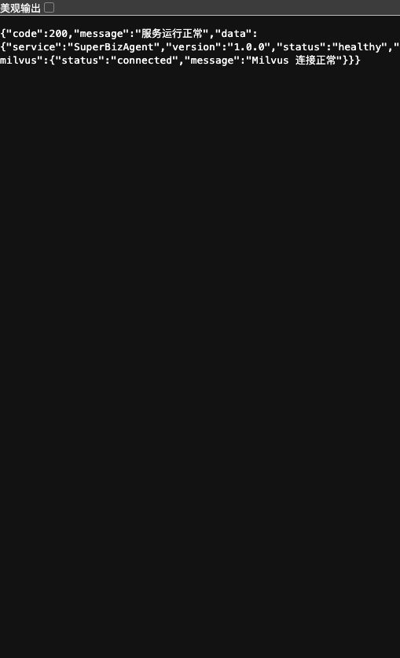
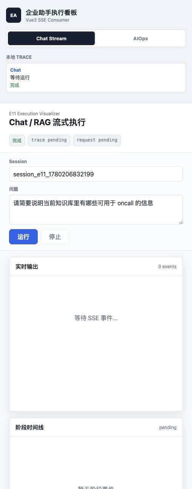
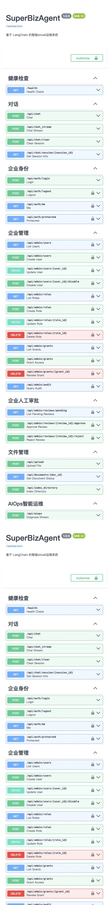

# 企业助手完整功能体验指南

本文面向第一次接触本项目的新用户、测试人员、产品经理和新加入开发者。目标是让你能按步骤体验当前已经落地的企业助手能力，知道每一步应该看到什么、如何验证、遇到问题先查哪里。

项目路径：

```bash
cd "/Users/cici/oncall agent/super_biz_agent_py-release-2026-03-21"
```

## 0. 开始之前

### 0.1 系统架构概览

一句话概览：`E0-E11` 完成企业助手基础闭环，包括身份、RequestGateway、审计、权限、工具/模型网关、RAG、Sandbox DB、Admin API、Observability/Eval 和 Vue3 dashboard；`F1-F8` 是企业开发 2.0 增强，包括任务合同、轨迹评估、自检、统一失败处理、人工审批、策略路由 Shadow，以及 F7/F8 的 evidence-only 触发审计。

当前体验要记住三个边界：

- Chat、Upload、AIOps 主业务接口用 `X-Trace-Id`、`X-Request-Id`、`X-User-Id` 等 header 建立企业上下文，不强制 JWT。
- `/api/admin/*` 和 `/api/admin/reviews/*` 必须使用 admin JWT。
- ToolGateway、ModelGateway、DB provider、Verifier 等能力主要是服务层能力，不都有公开 HTTP API；本文会用 Python snippet 或 targeted test 体验。

### 0.2 测试账号清单

Seed 用户定义在 `app/enterprise/auth/seed.py`。

| 用户名 | 密码 | user_id | 部门 | 角色 | 权限范围 |
|---|---|---|---|---|---|
| `admin` | `Admin123!` | `user_admin` | `system` | `admin` | 可访问 admin API 和人工审批 API；资源访问仍需 grant，不自动绕过 PermissionService。 |
| `demo_user_dept1` | `Demo123!` | `user_demo_dept1` | `dept_1` | `user` | 普通用户；不能访问 admin API；资源默认 deny，需要显式 grant。 |

建议先准备公共变量：

```bash
export BASE_URL="http://localhost:9900"
export TRACE_ID="trace-guide-$(date +%s)"
export REQUEST_ID="request-guide-$(date +%s)"
```

### 0.3 前置准备

#### 步骤 1：启动服务

**操作**：

```bash
make up
make start
```

只启动 FastAPI 时：

```bash
.venv/bin/python -m uvicorn app.main:app --host 127.0.0.1 --port 9900
```

**预期结果**：

- FastAPI 监听 `http://localhost:9900`。
- `/health` 返回 `code=200`。
- 如果使用完整 `make start`，Milvus、MCP CLS、MCP Monitor 也应启动。

**验证方法**：

```bash
curl -i "$BASE_URL/health"
```

应该看到 HTTP `200`，响应里有 `service=SuperBizAgent`、`status=healthy`。

**常见问题**：

- `503`：Milvus 未连接，先跑 `make up`。
- 端口被占用：`lsof -nP -iTCP:9900 -sTCP:LISTEN`。
- 没有虚拟环境：执行 `uv sync --frozen --all-extras`。

#### 步骤 2：准备 admin token

**操作**：

```bash
export ADMIN_TOKEN="$(
  curl -s -X POST "$BASE_URL/api/auth/login" \
    -H "Content-Type: application/json" \
    -d '{"username":"admin","password":"Admin123!"}' \
  | jq -r '.data.access_token'
)"
echo "$ADMIN_TOKEN" | cut -c 1-24
```

**预期结果**：

- 输出一段 JWT 前缀。
- 登录响应结构是 `code/message/data`，token 位于 `data.access_token`。

**验证方法**：

```bash
curl -s "$BASE_URL/api/auth/me" \
  -H "Authorization: Bearer $ADMIN_TOKEN" \
  -H "X-Trace-Id: trace-guide-admin-me" \
| jq '.data.user'
```

应该看到 `user_id=user_admin`、`roles=["admin"]`。

**常见问题**：

- `401`：密码错误、token 为空，或用户已被禁用。
- `500 RequestContext is missing`：检查 `app/enterprise/auth/dependencies.py` 和请求头中间件。

#### 步骤 3：了解审计存储

**操作**：

```bash
sqlite3 logs/enterprise_audit.sqlite ".schema enterprise_audit_events"
tail -n 3 logs/enterprise_audit.jsonl 2>/dev/null
```

**预期结果**：

- SQLite 表名是 `enterprise_audit_events`。
- JSONL 每行是一个 audit event。

**验证方法**：

```bash
sqlite3 logs/enterprise_audit.sqlite \
  "SELECT event_type, route, trace_id, request_id, user_id, decision FROM enterprise_audit_events ORDER BY timestamp DESC LIMIT 5;"
```

**常见问题**：

- 文件不存在：还没有经过 RequestGateway、PermissionService、AdminService 等会写 audit 的路径。
- 查询为空：先执行后文任意业务请求。

## 1. 基础能力体验（E0-E4）

### 1.1 身份认证（E1）

#### 步骤 1：登录获取 token

**操作**：

```bash
curl -s -X POST "$BASE_URL/api/auth/login" \
  -H "Content-Type: application/json" \
  -d '{"username":"admin","password":"Admin123!"}' \
| jq
```

**预期结果**：

```json
{
  "code": 200,
  "message": "success",
  "data": {
    "access_token": "eyJ...",
    "token_type": "bearer",
    "user": {"user_id": "user_admin", "roles": ["admin"]}
  }
}
```

**验证方法**：

```bash
python3 - <<'PY'
import base64, json, os
token = os.environ.get("ADMIN_TOKEN", "")
payload = token.split(".")[1] + "=="
print(json.dumps(json.loads(base64.urlsafe_b64decode(payload)), ensure_ascii=False, indent=2))
PY
```

JWT payload 应包含 `sub=user_admin` 和 `roles=["admin"]`。

**常见问题**：

- 登录成功或失败当前不写默认 RequestGateway audit；这是 E1 本地身份切片，不是 Gateway 包裹路径。
- 如果 `ADMIN_TOKEN` 为空，先检查 `jq` 是否安装，或手工复制 `data.access_token`。

#### 步骤 2：获取个人信息和 RequestContext

**操作**：

```bash
curl -s "$BASE_URL/api/auth/protected" \
  -H "Authorization: Bearer $ADMIN_TOKEN" \
  -H "X-Trace-Id: trace-guide-e1" \
  -H "X-Request-Id: request-guide-e1" \
| jq
```

**预期结果**：

返回 `user_id=user_admin`、`department_id=system`、`roles=["admin"]`、`trace_id=trace-guide-e1`。

**验证方法**：

实际结果应与请求头中的 `X-Trace-Id` 一致；如果不传 `X-Trace-Id`，系统会生成 UUID。

**常见问题**：

- 普通用户也能访问 `/api/auth/protected`；该接口只验证登录，不验证 admin。
- admin 保护只在 `/api/admin/*` 和 `/api/admin/reviews/*` 生效。

#### 步骤 3：登出并验证 token 失效

**操作**：

```bash
curl -s -X POST "$BASE_URL/api/auth/logout" \
  -H "Authorization: Bearer $ADMIN_TOKEN" \
| jq
curl -i "$BASE_URL/api/auth/me" -H "Authorization: Bearer $ADMIN_TOKEN"
```

**预期结果**：

- logout 返回 `{"success": true}`。
- 再访问 `/api/auth/me` 返回 `401`。

**验证方法**：

重新登录后设置新的 `ADMIN_TOKEN`，否则后续 admin API 会失败。

**常见问题**：

- 如果登出后仍可访问，检查 `auth_service.blacklist_token()` 是否被调用。

**预期问题检查点**：

- [ ] token 为空或无法解析。
- [ ] admin token 访问 `/api/admin/users` 返回 403。
- [ ] 文档声称登录写 audit，但实际没有。

### 1.2 请求网关与审计（E2）

#### 步骤 1：发送正常 chat 请求

**操作**：

```bash
curl -s -X POST "$BASE_URL/api/chat" \
  -H "Content-Type: application/json" \
  -H "Authorization: Bearer $ADMIN_TOKEN" \
  -H "X-Trace-Id: trace-guide-chat-001" \
  -H "X-Request-Id: request-guide-chat-001" \
  -H "X-User-Id: user_demo_dept1" \
  -H "X-Username: demo_user_dept1" \
  -H "X-Department-Id: dept_1" \
  -H "X-Roles: user" \
  -d '{"Id":"guide-session","Question":"请简单介绍企业助手"}' \
| jq
```

**预期结果**：

- 成功时返回 `code=200`、`message=success`。
- 如果模型或向量库未配置，可能返回 `code=500`；此时 Gateway 仍应写 `request_started` 和 `request_failed`。

**验证方法**：

```bash
sqlite3 logs/enterprise_audit.sqlite \
  "SELECT event_type, route, trace_id, request_id, user_id, decision, error_class FROM enterprise_audit_events WHERE trace_id='trace-guide-chat-001' ORDER BY timestamp;"
```

应至少看到 `request_started` 和 `request_completed` 或 `request_failed`。

**常见问题**：

- 没有 audit：确认请求是否经过 `/api/chat`，而不是直接调用服务层。
- `trace_id` 不一致：检查是否多个 shell 里复用了不同环境变量。

#### 步骤 2：触发规则 guardrail 阻断

**操作**：

```bash
.venv/bin/python -m pytest \
  tests/test_enterprise_request_gateway.py::EnterpriseRequestGatewayTests::test_rule_guardrail_blocks_request_and_writes_failed_audit \
  -q
```

**预期结果**：

测试通过。该测试使用 `RuleGuardrailProvider.from_keywords(["删除日志"])`，请求被阻断，handler 不会执行。

**验证方法**：

测试断言最后一个 audit event 是：

- `event_type=request_failed`
- `decision=blocked`
- `error_class=guardrail_blocked`
- `reason=禁止删除日志操作`

**常见问题**：

- HTTP 默认配置多为 no-op guardrail；规则阻断体验以 targeted test 或自定义 provider 为准。
- 如果测试找不到，确认当前分支是 `enterprise2`。

**预期问题检查点**：

- [ ] 正常请求没有 terminal audit。
- [ ] blocked 请求仍执行了业务 handler。
- [ ] `request_id` 只在 SSE 有，SQLite audit 没有。

### 1.3 权限管理（E3）

#### 步骤 1：普通用户查看 admin API

**操作**：

```bash
export USER_TOKEN="$(
  curl -s -X POST "$BASE_URL/api/auth/login" \
    -H "Content-Type: application/json" \
    -d '{"username":"demo_user_dept1","password":"Demo123!"}' \
  | jq -r '.data.access_token'
)"
curl -i "$BASE_URL/api/admin/users" -H "Authorization: Bearer $USER_TOKEN"
```

**预期结果**：

HTTP `403`，detail 为 `Admin role required`。

**验证方法**：

同一个接口换 `ADMIN_TOKEN` 应返回 HTTP `200`：

```bash
curl -s "$BASE_URL/api/admin/users" -H "Authorization: Bearer $ADMIN_TOKEN" | jq '.data.users'
```

**常见问题**：

- 如果普通用户能访问 admin API，这是高优先级权限边界问题。

#### 步骤 2：测试默认 deny、显式 allow、deny 优先

**操作**：

```bash
.venv/bin/python -m pytest tests/test_enterprise_permissions.py -q
```

**预期结果**：

测试通过，覆盖：

- 默认 deny。
- user/role/department/public grant。
- deny 优先于 allow。
- grant/revoke 后缓存失效。

**验证方法**：

```bash
sqlite3 logs/enterprise_audit.sqlite \
  "SELECT event_type, decision, reason, json_extract(metadata_json,'$.resource_type'), json_extract(metadata_json,'$.resource_id') FROM enterprise_audit_events WHERE event_type='permission_checked' ORDER BY timestamp DESC LIMIT 10;"
```

应该能看到 `allowed` 或 `denied` 的 `permission_checked`。

**常见问题**：

- PermissionService 的 admin 用户不自动拥有全部资源权限；资源仍需要 grant。
- 修改 grant 后如果仍命中旧决策，检查 `invalidate_cache()` 是否被调用。

**预期问题检查点**：

- [ ] 无 grant 时资源被放行。
- [ ] deny 没有覆盖 role allow。
- [ ] 权限 audit 缺少 reason 或 matched_grant_id。

### 1.4 工具与模型网关（E4）

#### 步骤 1：查看可见工具列表

**操作**：

```bash
.venv/bin/python -m pytest tests/test_enterprise_tool_gateway.py -q
```

**预期结果**：

测试通过，ToolGateway 会按 PermissionService 过滤工具，并写 `tool_visible`、`tool_call`、`tool_blocked` 或 `tool_failure`。

**验证方法**：

```bash
sqlite3 logs/enterprise_audit.sqlite \
  "SELECT event_type, route, decision, reason FROM enterprise_audit_events WHERE route='tool_gateway' ORDER BY timestamp DESC LIMIT 10;"
```

**常见问题**：

- 当前没有公开 `/api/tools` 端点；这是服务层网关。
- 如果工具列表为空，先确认是否已有 `tool` grant。

#### 步骤 2：验证数据库工具默认不可见

**操作**：

```bash
.venv/bin/python -m pytest \
  tests/test_enterprise_database_e6.py::EnterpriseDatabaseE6Tests::test_default_tool_gateway_hides_ungranted_database_demo_tools \
  -q
```

**预期结果**：

测试通过。默认 AIOps/RAG 工具池不暴露 `database_demo.*` 工具。

**验证方法**：

E7 之后数据库工具不再靠静态 `include_database_tools` 暴露，而是靠 tool grant 和 DB 表列权限共同控制。

**常见问题**：

- 如果数据库工具在普通工具池里可见，检查 ToolGateway provider 配置和 tool grant。

#### 步骤 3：测试模型 fallback

**操作**：

```bash
.venv/bin/python -m pytest tests/test_enterprise_model_gateway.py -q
```

**预期结果**：

测试通过，ModelGateway 会：

- 按 `model_endpoint` grant 过滤 endpoint。
- 主 endpoint 失败时尝试下一个允许 endpoint。
- 写 `model_visible` 和 `model_call` audit。

**验证方法**：

查询 `route='model_gateway'` 的 audit，确认 `fallback_used`、`failed_endpoint_ids`、`decision` 字段。

**常见问题**：

- 真实 DashScope 调用需要外部配置；targeted test 使用 fake provider 验证网关行为。

**预期问题检查点**：

- [ ] 未授权工具可见。
- [ ] model failure 没有写 `model_call`。
- [ ] fallback 后没有记录 failed endpoint。

## 2. 领域能力体验（E5-E7）

### 2.1 RAG 知识库问答（E5）

#### 步骤 1：上传测试文档

**操作**：

```bash
cat > /tmp/enterprise_guide_runbook.md <<'EOF'
# Enterprise Guide Runbook
CPU 告警处理：查看进程占用，对比最近发布，检查数据库连接池。
生产重启必须先走人工审批。
EOF

curl -s -X POST "$BASE_URL/api/upload" \
  -H "X-Trace-Id: trace-guide-upload-001" \
  -H "X-Request-Id: request-guide-upload-001" \
  -H "X-User-Id: user_demo_dept1" \
  -H "X-Roles: user" \
  -F "file=@/tmp/enterprise_guide_runbook.md" \
  -F "kb_id=guide" \
| jq
```

**预期结果**：

返回 `code=200`、`data.doc_id`、`data.status`、`data.kb_id=guide`。

**验证方法**：

```bash
sqlite3 logs/enterprise_audit.sqlite \
  "SELECT event_type, route, trace_id, request_id, decision FROM enterprise_audit_events WHERE trace_id='trace-guide-upload-001' ORDER BY timestamp;"
```

应看到 `request_started`、`upload_saved`、`request_completed` 或失败终态。

**常见问题**：

- 缺少 `kb_id` 会返回 422 或 400；当前不再有隐式 default KB。
- 文件超过 10MB 会被上传 adapter 拒绝。

#### 步骤 2：查询知识库

**操作**：

```bash
curl -s -X POST "$BASE_URL/api/chat" \
  -H "Content-Type: application/json" \
  -H "Authorization: Bearer $ADMIN_TOKEN" \
  -H "X-Trace-Id: trace-guide-rag-001" \
  -H "X-Request-Id: request-guide-rag-001" \
  -H "X-User-Id: user_demo_dept1" \
  -H "X-Roles: user" \
  -d '{"Id":"guide-rag-session","Question":"CPU 告警应该怎么处理？"}' \
| jq
```

**预期结果**：

成功时返回答案；如果向量库或模型未配置，返回失败但仍有 Gateway audit。

**验证方法**：

看 `trace-guide-rag-001` 的 audit，并检查响应或 SSE 里是否出现 `search_results`。

**常见问题**：

- 上传完成不代表向量索引已立即可检索；如果异步队列未运行，文档状态可能停留在 pending。

**预期问题检查点**：

- [ ] 上传成功但没有 `upload_saved` audit。
- [ ] 文档状态和实际处理状态不一致。
- [ ] RAG 引用只有展示文本，没有结构化 `source_ref`。

### 2.2 Sandbox 数据库查询（E6-E7）

#### 步骤 1：初始化 sandbox DB 并执行 safe_select

**操作**：

```bash
.venv/bin/python - <<'PY'
from pathlib import Path
from app.enterprise.context import RequestContext
from app.enterprise.database import build_default_sandbox_registry, create_sandbox_database
from app.enterprise.database.safe_sql import SafeSqlKernel

db = create_sandbox_database(Path("/tmp/enterprise_guide_sandbox.sqlite3"))
registry = build_default_sandbox_registry()
kernel = SafeSqlKernel(database_path=db, registry=registry)
ctx = RequestContext(trace_id="trace-guide-db", request_id="request-guide-db", user_id="user_demo_dept1")
print(kernel.safe_select(ctx, "SELECT order_id, total_amount FROM orders LIMIT 2"))
PY
```

**预期结果**：

返回 `status=success`、`safe_sql_verified=True`、`sanitized_sql`、`columns`、`rows`、`row_count`。

**验证方法**：

```bash
sqlite3 logs/enterprise_audit.sqlite \
  "SELECT event_type, decision, reason, json_extract(metadata_json,'$.operation_type'), json_extract(metadata_json,'$.target_tables') FROM enterprise_audit_events WHERE trace_id='trace-guide-db' ORDER BY timestamp;"
```

应看到 `database_query`，decision 为 `allowed`。

**常见问题**：

- `SELECT *` 会被阻断；必须显式列名。
- JOIN、subquery、函数、多语句、DDL/DML 都会被 SafeSqlKernel 阻断。

#### 步骤 2：触发 SQL 阻断

**操作**：

```bash
.venv/bin/python -m pytest \
  tests/test_enterprise_database_e6.py::EnterpriseDatabaseE6Tests::test_safe_select_blocks_dangerous_or_unauthorized_sql_and_audits \
  -q
```

**预期结果**：

测试通过，覆盖 DDL/DML、多语句、未知表列等阻断场景。

**验证方法**：

审计里应有 `database_query`、`decision=denied`、`error_class=sql_blocked`。

**常见问题**：

- 授权通过不代表能写库；写操作仍由 SafeSqlKernel 阻断。

#### 步骤 3：验证表列级权限过滤和 DB audit 查询

**操作**：

```bash
.venv/bin/python -m pytest tests/test_enterprise_database_e7.py -q
```

**预期结果**：

测试通过，覆盖：

- `database_table` / `database_column` 资源类型。
- `sandbox_sales.orders` 和 `sandbox_sales.orders.order_id` 资源 ID。
- list/describe/select 的表列过滤。
- DB audit 按 trace/user/table 查询。

**验证方法**：

```bash
sqlite3 logs/enterprise_audit.sqlite \
  "SELECT trace_id, user_id, decision, reason, metadata_json FROM enterprise_audit_events WHERE event_type='database_query' ORDER BY timestamp DESC LIMIT 3;"
```

**常见问题**：

- 当前没有公开 `/api/database`；DB 体验通过 service/provider/test 完成。

**预期问题检查点**：

- [ ] 未授权表出现在 list_tables。
- [ ] 未授权列出现在 describe_table 或结果 rows。
- [ ] DML 在授权后仍被执行。

### 2.3 AIOps 智能诊断（AIOps / E10 观测链路）

#### 步骤 1：发起 AIOps SSE 诊断请求

**操作**：

```bash
curl -N -X POST "$BASE_URL/api/aiops" \
  -H "Content-Type: application/json" \
  -H "Authorization: Bearer $ADMIN_TOKEN" \
  -H "X-Trace-Id: trace-guide-aiops-001" \
  -H "X-Request-Id: request-guide-aiops-001" \
  -H "X-User-Id: user_demo_dept1" \
  -H "X-Roles: user" \
  -d '{"session_id":"guide-aiops-session","query":"CPU 使用率突然升高到 90%，请给出诊断步骤和结论","memory_mode":"shadow","memory_owner_id":"default"}'
```

**预期结果**：

返回 SSE 流，常见事件包括：

- `plan`：生成诊断计划。
- `step_complete`：某个执行步骤完成。
- `report`：生成诊断报告。
- `complete` 或 `done`：诊断结束。
- `error` / `blocked` / `pending_approval`：失败、治理阻断或人工审批挂起。

每个事件都应包含 `trace_id=trace-guide-aiops-001` 和 `request_id=request-guide-aiops-001`，并经过 `normalize_sse_event()` 补齐 `stage/status/message/data`。

**验证方法**：

```bash
sqlite3 logs/enterprise_audit.sqlite \
  "SELECT event_type, route, decision, reason, error_class FROM enterprise_audit_events WHERE trace_id='trace-guide-aiops-001' ORDER BY timestamp;"
```

应至少看到 `request_started`、`routing_decision`，并以 `request_completed` 或 `request_failed` 收尾。若触发工具或模型网关，还可能看到 `tool_call`、`model_call`、`tool_failure`、`model_visible` 等事件。

**常见问题**：

- `curl` 不持续输出：确认使用 `-N`，不要让客户端缓冲 SSE。
- 诊断失败：通常是模型、MCP 工具或外部依赖未配置；此时仍应有 `request_failed` 和结构化 `error_class`。
- `pending_approval`：说明请求携带高风险 `task_contract` 或风险检测要求人工审批，转到第 4.5 节处理。

#### 步骤 2：验证 E10 MCP metrics 和 recovered fallback 观测

**操作**：

```bash
.venv/bin/python -m pytest tests/test_aiops_mcp_tool_cache.py tests/test_p6_memory_eval_infra.py -q
```

**预期结果**：

测试通过，覆盖：

- MCP tools cache hit/miss、fresh retry、latency metrics。
- structured-output primary 失败但 fallback 成功时，样本不 hard fail，但会记录 degradation evidence。

**验证方法**：

查看测试断言中的 `get_mcp_tools_metrics()`、`structured_output_recovered`、`structured_output_fallback_used`、`has_degradation`。

**常见问题**：

- E10-C 不改变 prompt、timeout、schema 或 replanner 路由逻辑；它只补观测字段。
- recovered fallback 不是 hard failure，但应进入 degradation summary，不能静默消失。

**预期问题检查点**：

- [ ] AIOps SSE 事件缺少 `trace_id` 或 `request_id`。
- [ ] primary structured-output fallback 成功但没有 degradation evidence。
- [ ] MCP 工具获取失败没有 metrics 或 last_error。
- [ ] AIOps 失败没有 terminal audit。

## 3. 管理与可观测（E8-E11）

### 3.1 管理员操作（E8）

#### 步骤 1：创建用户、角色和授权

**操作**：

```bash
curl -s -X POST "$BASE_URL/api/admin/users" \
  -H "Authorization: Bearer $ADMIN_TOKEN" \
  -H "Content-Type: application/json" \
  -H "X-Trace-Id: trace-guide-admin-user" \
  -d '{"user_id":"user_guide","username":"guide_user","password":"Guide123!","department_id":"dept_1","department_name":"Department 1","roles":["user"]}' \
| jq

curl -s -X POST "$BASE_URL/api/admin/roles" \
  -H "Authorization: Bearer $ADMIN_TOKEN" \
  -H "Content-Type: application/json" \
  -d '{"role_id":"role_guide","name":"Guide Role","description":"Guide test role"}' \
| jq

curl -s -X POST "$BASE_URL/api/admin/grants" \
  -H "Authorization: Bearer $ADMIN_TOKEN" \
  -H "Content-Type: application/json" \
  -d '{"resource_type":"tool","resource_id":"retrieve_knowledge","action":"use","principal_type":"user","principal_id":"user_guide","effect":"allow","reason":"guide test"}' \
| jq
```

**预期结果**：

三个接口都返回 `code=200`，`data.user`、`data.role`、`data.grant` 分别存在。`POST /api/admin/grants` 会先跑资源目录和 scope validator，因此 resource 必须在 `/api/admin/resources` 中存在，action 必须受支持。

**验证方法**：

```bash
curl -s "$BASE_URL/api/admin/grants?principal_id=user_guide" \
  -H "Authorization: Bearer $ADMIN_TOKEN" \
| jq '.data.grants'
```

**常见问题**：

- `403`：token 不是 admin / department_admin，或 department_admin 提交了 scope 外 grant。
- `400`：重复创建相同 user_id / role_id，或 grant validator 命中重复授权等非 scope 错误。
- department_admin 越界时，`POST /api/admin/grant-preview` 会返回 `code=200` 但 `scope_allowed` check 为 `failed`；直接提交 `POST /api/admin/grants` 会返回 403。

#### 步骤 2：查询审计并禁用用户

**操作**：

```bash
curl -s "$BASE_URL/api/admin/audit?event_type=admin_operation" \
  -H "Authorization: Bearer $ADMIN_TOKEN" \
| jq '.data.events[-3:]'

curl -s -X POST "$BASE_URL/api/admin/users/user_guide/disable" \
  -H "Authorization: Bearer $ADMIN_TOKEN" \
| jq
```

**预期结果**：

- audit 查询返回 `admin_operation`。
- 禁用后 `data.user.is_active=false`。

**验证方法**：

```bash
curl -i -X POST "$BASE_URL/api/auth/login" \
  -H "Content-Type: application/json" \
  -d '{"username":"guide_user","password":"Guide123!"}'
```

应返回 `401`。

**常见问题**：

- 如果禁用用户仍能登录，检查 `AuthService.authenticate()` 是否验证 `is_active`。

**预期问题检查点**：

- [ ] 非 admin 可访问管理 API。
- [ ] 管理操作没有写 `admin_operation`。
- [ ] 审计查询不能按 trace/user/event_type 过滤。

#### 步骤 3：权限申请流程（Stage 5）

**操作**：

```bash
export DEMO_TOKEN="$(
  curl -s -X POST "$BASE_URL/api/auth/login" \
    -H "Content-Type: application/json" \
    -d '{"username":"demo_user_dept1","password":"Demo123!"}' \
  | jq -r '.data.access_token'
)"

export REQUEST_ID="$(
  curl -s -X POST "$BASE_URL/api/permission-requests" \
    -H "Authorization: Bearer $DEMO_TOKEN" \
    -H "Content-Type: application/json" \
    -d '{"resource_type":"tool","resource_id":"retrieve_knowledge","action":"use","reason":"guide permission request"}' \
  | jq -r '.data.permission_request.request_id'
)"

curl -s "$BASE_URL/api/permission-requests/mine" \
  -H "Authorization: Bearer $DEMO_TOKEN" \
| jq '.data.permission_requests'

curl -s "$BASE_URL/api/admin/permission-requests" \
  -H "Authorization: Bearer $ADMIN_TOKEN" \
| jq '.data'

curl -s -X POST "$BASE_URL/api/admin/permission-requests/$REQUEST_ID/approve" \
  -H "Authorization: Bearer $ADMIN_TOKEN" \
  -H "Content-Type: application/json" \
  -d '{"reason":"guide approved"}' \
| jq '.data.permission_request'
```

**预期结果**：

- 普通用户创建申请后状态为 `pending`，`review_queue` 为 requester department queue。
- 管理员队列返回 `pending_count` 和 `requires_global_review_count`。
- approve 后状态变为 `approved`，响应里有 `grant_id`。
- 跨部门 scope 外申请保持 requester department queue，同时 `requires_global_review=true`；部门管理员可见但不能 approve，global admin 可 approve。

**验证方法**：

```bash
curl -s "$BASE_URL/api/admin/audit?event_type=permission_request_approved" \
  -H "Authorization: Bearer $ADMIN_TOKEN" \
| jq '.data.events[-1]'
```

审批审计应能看到 `approver_user_id`、`grant_id` 和审批原因；拒绝路径的 `reason` 应是审批人填写的拒绝原因，不是申请人原始申请理由。

**常见问题**：

- `400 permission_already_granted`：该用户已有同资源同 action grant，换一个资源或清理测试 grant。
- `400 permission_request_duplicate_pending`：同用户同资源同 action 已有 pending 申请。
- `403 permission_request_requires_global_review`：department admin 正在尝试 approve scope 外申请，应由 global admin 处理。

### 3.2 可观测性（E9）

#### 步骤 1：查看 SSE 事件流

**操作**：

```bash
curl -N -X POST "$BASE_URL/api/chat_stream" \
  -H "Content-Type: application/json" \
  -H "Authorization: Bearer $ADMIN_TOKEN" \
  -H "X-Trace-Id: trace-guide-sse-chat" \
  -H "X-Request-Id: request-guide-sse-chat" \
  -H "X-User-Id: user_demo_dept1" \
  -H "X-Roles: user" \
  -d '{"Id":"guide-sse-session","Question":"用一句话介绍 RequestGateway"}'
```

**预期结果**：

SSE `data:` 中每个事件应符合 E9 baseline contract，包含：

- `type`
- `trace_id`
- `request_id`
- `stage`
- `status`
- `message`
- `data`

**验证方法**：

```bash
.venv/bin/python -m pytest tests/test_enterprise_observability_e9.py -q
```

**常见问题**：

- `curl` 看不到流：加 `-N`，或确认服务端没有被代理缓冲。
- `request_id` 缺失：检查 `normalize_sse_event()` 和 adapter 是否透传。

#### 步骤 2：检查 trace completeness

**操作**：

```bash
sqlite3 logs/enterprise_audit.sqlite \
  "SELECT event_type, route, decision, reason FROM enterprise_audit_events WHERE trace_id='trace-guide-sse-chat' ORDER BY timestamp;"
```

**预期结果**：

每条业务 trace 至少应有 `request_started`，并以 `request_completed` 或 `request_failed` 收尾。

**验证方法**：

E9 helper 会把失败定位到层级：

| 场景 | 层级 |
|---|---|
| auth failed | L1 Auth |
| guardrail blocked | L2 RequestGateway / Guardrail |
| permission denied | L3 Permission |
| tool/model failed | L4 Tool/Model |
| RAG/upload failed | L5 RAG/Domain |
| database_query failed | L6 DB |

**常见问题**：

- 登录失败当前不写默认 RequestGateway audit；E9 helper 可以识别 `auth_failed`，但 E1 route 未接 Gateway。

**预期问题检查点**：

- [ ] SSE envelope 缺 `trace_id` 或 `request_id`。
- [ ] trace 没有 terminal event。
- [ ] 失败无法定位到 L1-L6。

### 3.3 执行可视化（E11）

#### 步骤 1：访问 Vue3 dashboard

**操作**：

打开：

```text
http://localhost:9900/static/enterprise-dashboard.html
```

或命令行检查：

```bash
curl -i "$BASE_URL/static/enterprise-dashboard.html"
curl -i "$BASE_URL/static/enterprise-dashboard.js"
curl -i "$BASE_URL/static/enterprise-dashboard.css"
```

**预期结果**：

三个静态资源均返回 HTTP `200`；HTML 引用 JS 和 CSS。

**验证方法**：

```bash
.venv/bin/python -m pytest tests/test_enterprise_dashboard_e11.py -q
```

**常见问题**：

- 页面空白：先检查 JS/CSS 是否 404，再看浏览器 console。
- Dashboard 展示依赖 SSE 和 audit 数据；后端没有新 trace 时页面可能只有空状态。

#### 步骤 2：观察实时执行过程

**操作**：

在 dashboard 打开后，另一个终端发起 `chat_stream` 或 `/api/aiops` 请求。

**预期结果**：

页面应能展示事件类型、阶段、状态、trace/request 标识和错误信息。

**验证方法**：

与 SQLite 中同一 `trace_id` 的 audit 对照，确认前端展示不是孤立事件。

**常见问题**：

- 页面无法连接：确认 `BASE_URL`、跨域和后端端口。

**预期问题检查点**：

- [ ] dashboard 静态资源 404。
- [ ] SSE 正常但页面不更新。
- [ ] 页面显示的 trace 与 audit 对不上。

## 4. 企业开发 2.0 能力体验（F1-F8）

### 4.1 任务合同化（F1）

#### 步骤 1：创建复杂任务合同

**操作**：

```bash
.venv/bin/python - <<'PY'
from app.enterprise.context import RequestContext
from app.enterprise.tasks.models import TaskContractCreate, TaskScope
from app.enterprise.tasks.service import TaskContractService

ctx = RequestContext(trace_id="trace-guide-f1", request_id="request-guide-f1", user_id="user_demo_dept1")
service = TaskContractService()
result = service.create_contract(ctx, TaskContractCreate(
    user_goal="诊断 CPU 告警并输出报告",
    scope=TaskScope(
        allowed_data_sources=["kb-prod-runbook"],
        allowed_tools=["retrieve_knowledge"],
        forbidden_actions=["restart_service"],
    ),
    success_criteria=["说明现象", "列出证据来源"],
    risk_level="medium",
    expected_outputs=["diagnostic_report"],
))
print(result.model_dump(mode="json"))
PY
```

**预期结果**：

返回 `decision=allowed` 或 `pending_approval`，并生成 `contract.task_id`、`scope`、`success_criteria`。

**验证方法**：

```bash
sqlite3 logs/enterprise_audit.sqlite \
  "SELECT event_type, decision, reason, metadata_json FROM enterprise_audit_events WHERE trace_id='trace-guide-f1';"
sqlite3 logs/enterprise_task_contracts.sqlite \
  "SELECT task_id, user_id, status, json_extract(contract_json,'$.risk_level') AS risk_level FROM enterprise_task_contracts ORDER BY task_id DESC LIMIT 3;"
```

**常见问题**：

- 合同被拒绝：检查 `allowed_data_sources` 或 `allowed_tools` 是否超出权限范围。

**预期问题检查点**：

- [ ] 复杂任务没有 task_id。
- [ ] 合同 audit 缺少 scope 或 success_criteria。

### 4.2 轨迹评估（F2a/F2b）

#### 步骤 1：运行 trace eval

**操作**：

```bash
.venv/bin/python -m evals.enterprise.run_trace_eval \
  --evalset evals/enterprise/evalsets/chat_trace_evalset.jsonl
```

**预期结果**：

输出 `enterprise_trace_eval total=... passed=... failed=... mismatch_count=...`，并写入 `evals/enterprise/reports/`。

**验证方法**：

```bash
ls -lt evals/enterprise/reports/ | head
```

查看最新 `.md` 报告里的 `mismatches`。

**常见问题**：

- eval 失败不一定代表 runtime bug，也可能是当前 audit 样本不足。
- F2b 是 contract-aware eval，会检查合同、权限、工具路径是否符合预期轨迹。

#### 步骤 2：查看 F2b evalset 示例

**操作**：

```bash
head -n 1 evals/enterprise/evalsets/aiops_trace_evalset.jsonl | jq
```

**预期结果**：

一条 F2b 样本通常包含三块：

```json
{
  "eval_id": "aiops_task_contract_completed_001",
  "expected": {
    "required_audit_events": ["request_started", "task_contract_created", "tool_call", "model_call", "request_completed"],
    "expected_contract": {
      "required_scope": {
        "allowed_data_sources": ["kb-prod-runbook"],
        "allowed_tools": ["aiops.search_logs"],
        "forbidden_actions": ["restart_service"]
      },
      "requires_human_approval": false
    }
  },
  "trace_source": {
    "audit_events": [],
    "sse_events": []
  }
}
```

**验证方法**：

`required_audit_events` 用来检查轨迹是否完整；`expected_contract` 用来检查任务合同 scope、success criteria、审批要求是否与实际 audit 一致；`trace_source.audit_events` 和 `trace_source.sse_events` 是对照输入。

**常见问题**：

- evalset 是 JSONL，一行一个样本；手工编辑后先用 `jq` 检查格式。
- `expected_contract.required_scope` 不是权限 grant 本身，而是本次任务声明的允许边界。

**预期问题检查点**：

- [ ] evalset 无法加载。
- [ ] mismatch 报告没有说明缺失事件或顺序问题。

### 4.3 结构化自检（F4）

#### 步骤 1：触发 Plan/Citation/SQL verifier

**操作**：

```bash
.venv/bin/python -m pytest tests/test_enterprise_verifiers.py -q
```

**预期结果**：

测试通过，覆盖：

- `PlanVerifier`：计划不能越权使用工具、数据源或 forbidden action。
- `CitationVerifier`：引用必须依赖结构化 `source_ref`。
- `SqlResultVerifier`：SQL 结果必须来自 SafeSqlKernel，且列在授权范围内。

**验证方法**：

```bash
sqlite3 logs/enterprise_audit.sqlite \
  "SELECT event_type, decision, reason, json_extract(metadata_json,'$.verifier') FROM enterprise_audit_events WHERE event_type='verification_result' ORDER BY timestamp DESC LIMIT 10;"
```

**常见问题**：

- verifier 失败是预期信号，不一定是系统异常；看 `finding_codes` 判断原因。

**预期问题检查点**：

- [ ] Plan 使用 forbidden action 但仍 passed。
- [ ] Citation 只有 citation_text 没有 source_ref。
- [ ] SQL 结果缺 `safe_sql_verified` 仍通过。

### 4.4 统一失败处理（F5）

#### 步骤 1：触发各类错误并验证 error_class

**操作**：

```bash
.venv/bin/python -m pytest tests/test_enterprise_error_recovery.py -q
```

**预期结果**：

测试通过。前端可见错误和 audit 使用统一字段：

- `error_class`
- `decision`
- `status`
- `user_message`
- `recoverable`
- `retryable`
- `fallback_allowed`

**验证方法**：

关注 `auth_failed`、`permission_denied`、`guardrail_blocked`、`model_unavailable`、`tool_failed`、`sql_blocked`、`stream_interrupted`。

**常见问题**：

- 安全阻断类错误不应 retry 或 fallback。
- model unavailable 可以 fallback；无 fallback 时才 hard fail。

**预期问题检查点**：

- [ ] 原始异常 traceback 泄露到用户响应。
- [ ] 安全类错误被标记为可恢复。

### 4.5 Human-in-the-loop（F6）

#### 步骤 1：创建待审批任务

**操作**：

```bash
.venv/bin/python -m pytest \
  tests/test_enterprise_human_review.py::EnterpriseHumanReviewTests::test_high_risk_task_registers_pending_review_without_aiops_execution \
  -q
```

**预期结果**：

测试通过。高风险或显式 `requires_human_approval=true` 的任务进入 pending review，不直接执行 AIOps。

**验证方法**：

```bash
curl -s "$BASE_URL/api/admin/reviews/pending" \
  -H "Authorization: Bearer $ADMIN_TOKEN" \
| jq '.data.reviews'
```

**常见问题**：

- 没有 pending review：先用 targeted test 或高风险 AIOps 合同生成。

#### 步骤 2：管理员审批或拒绝

**操作**：

```bash
export REVIEW_ID="<从 pending 列表复制 review_id>"
curl -s -X POST "$BASE_URL/api/admin/reviews/$REVIEW_ID/approve" \
  -H "Authorization: Bearer $ADMIN_TOKEN" \
  -H "Content-Type: application/json" \
  -d '{"reason":"guide approval"}' \
| jq
```

**预期结果**：

返回 `review.status=approved`、`approver_user_id=user_admin`。

**验证方法**：

```bash
sqlite3 logs/enterprise_audit.sqlite \
  "SELECT event_type, decision, reason FROM enterprise_audit_events WHERE route='human_review' ORDER BY timestamp DESC LIMIT 5;"
```

应看到 `human_review_requested` 和 `human_review_approved` 或 `human_review_rejected`。

**常见问题**：

- 普通用户审批应返回 `403`；如果不是，属于权限边界问题。

**预期问题检查点**：

- [ ] 高风险任务绕过审批。
- [ ] 审批操作没有 admin audit 或 human review audit。

### 4.6 策略路由 Shadow（F3）

#### 步骤 1：查看 routing_decision audit

**操作**：

```bash
curl -s -X POST "$BASE_URL/api/chat" \
  -H "Content-Type: application/json" \
  -H "Authorization: Bearer $ADMIN_TOKEN" \
  -H "X-Trace-Id: trace-guide-f3-route" \
  -H "X-Request-Id: request-guide-f3-route" \
  -H "X-User-Id: user_demo_dept1" \
  -H "X-Roles: user" \
  -d '{"Id":"guide-route","Question":"查询订单表里最近两条订单"}' \
| jq
```

**预期结果**：

真实请求仍走 `/api/chat`；F3 只写 shadow routing 决策，不改变请求路径。

**验证方法**：

```bash
sqlite3 logs/enterprise_audit.sqlite \
  "SELECT event_type, decision, reason, metadata_json FROM enterprise_audit_events WHERE trace_id='trace-guide-f3-route' AND event_type='routing_decision';"
```

`decision` 应为 `shadow`，metadata 中有 `actual_route` 和 `suggested_route`。

**常见问题**：

- F3 不是正式 router，不应因为 suggested_route 是 database 就真的改道。

#### 步骤 2：生成 comparison report

**操作**：

```bash
.venv/bin/python -m pytest \
  tests/test_enterprise_strategy_router.py::EnterpriseStrategyRouterTests::test_shadow_decision_audit_and_comparison_report \
  -q
```

**预期结果**：

测试通过，report 包含 `total_decisions`、`matched_decisions`、`match_rate`、`confusion_cases`、`risk_mistakes`。

**验证方法**：

如果未来要 promote F3，必须先积累足够样本，并确认高风险误判为低风险的比例为 0。

**常见问题**：

- 不要把 shadow audit 当成正式路由行为。

**预期问题检查点**：

- [ ] F3 改变了真实请求路径。
- [ ] routing audit 缺少 actual/suggested 对比。

### 4.7 F7/F8 证据审计

#### 步骤 1：查看 F7 trigger audit

**操作**：

```bash
sed -n '1,220p' docs/enterprise2_f7_guardrail_trigger_audit.md
```

**预期结果**：

文档应说明 F7 触发条件未满足，因此没有实现 PII regex provider、DLP、content-safety API 或 LLM-as-Judge。

**验证方法**：

确认当前运行时代码仍保持 E2 rule/no-op guardrail 行为。

**常见问题**：

- evidence-only 不是“永远不做”，而是“当前没有证据就不改 runtime”。

#### 步骤 2：查看 F8 trigger audit

**操作**：

```bash
sed -n '1,220p' docs/enterprise2_f8_resource_trigger_audit.md
```

**预期结果**：

文档应说明缺少稳定 latency/token/tool/DB 资源基线和明确瓶颈，因此没有实现资源感知路由、预算控制或成本驱动策略切换。

**验证方法**：

检查 audit 中是否已有稳定 `model_call`、`tool_call`、`database_query` 指标；若没有，不应开启 F8 runtime 优化。

**常见问题**：

- 只是成熟项目常有成本控制，不构成本项目立即实现 F8 的证据。

**预期问题检查点**：

- [ ] F7/F8 被误解为已具备 runtime 能力。
- [ ] 没有触发证据却修改默认行为。

## 5. 问题发现清单

### 5.1 功能完整性问题

- [ ] 某功能无法访问。
- [ ] 某 API 返回 500。
- [ ] 某服务层 targeted test 失败。
- [ ] 文档命令和实际 route 不一致。
- [ ] 前端 dashboard 静态资源 404。

### 5.2 权限边界问题

- [ ] 普通用户能访问管理员接口。
- [ ] 数据库工具意外可见。
- [ ] 无 grant 时资源被允许。
- [ ] deny 没有覆盖 allow。
- [ ] 权限缓存失效后仍返回旧结果。

### 5.3 审计完整性问题

- [ ] `trace_id` 缺失。
- [ ] `request_id` 缺失。
- [ ] audit 事件字段不全。
- [ ] SSE envelope 不符合 E9 contract。
- [ ] blocked/failed 事件无法定位到具体层。

### 5.4 用户体验问题

- [ ] 错误信息不清晰。
- [ ] 文档与实际不符。
- [ ] 前端页面无法加载。
- [ ] SSE 流正常但 dashboard 不更新。
- [ ] 管理 API 返回字段不易理解。

### 5.5 问题报告模板

```markdown
## 问题标题

- 发现人：
- 时间：
- 分支/提交：
- 环境：本地 / 测试 / 其他
- 账号：admin / demo_user_dept1 / 其他
- trace_id：
- request_id：

### 复现步骤
1.
2.
3.

### 预期结果

### 实际结果

### 证据
- curl 命令：
- HTTP 状态码：
- 响应片段：
- SQLite audit 查询：
- JSONL 行：
- 前端截图：

### 初步归类
- [ ] 功能完整性
- [ ] 权限边界
- [ ] 审计完整性
- [ ] 用户体验
- [ ] 文档不一致
```

## 6. 附录

### 6.1 所有 API 端点清单

| 方法 | 路径 | 说明 | 认证 |
|---|---|---|---|
| GET | `/` | 根路径欢迎页或静态首页 | 无 |
| GET | `/health` | 健康检查，含 Milvus 状态 | 无 |
| GET | `/static/enterprise-dashboard.html` | E11 dashboard | 无 |
| POST | `/api/auth/login` | 登录获取 JWT | 无 |
| POST | `/api/auth/logout` | 登出并拉黑 token | JWT |
| GET | `/api/auth/me` | 当前用户信息 | JWT |
| GET | `/api/auth/protected` | 验证 RequestContext | JWT |
| POST | `/api/chat` | 非流式 Chat/RAG | JWT / 当前用户 |
| POST | `/api/chat_stream` | 流式 Chat/RAG SSE | JWT / 当前用户 |
| POST | `/api/chat/clear` | 清空 session | JWT / 当前用户 |
| GET | `/api/chat/session/{session_id}` | 查看 session 历史 | JWT / 当前用户 |
| POST | `/api/aiops` | AIOps SSE 诊断 | JWT / 当前用户 |
| POST | `/api/upload` | 上传文档，必须带 `kb_id` | 企业 header，可匿名 |
| GET | `/api/documents/{doc_id}` | 查询文档状态 | 无 |
| POST | `/api/index_directory` | 投递目录索引任务 | 无 |
| GET | `/api/admin/users` | 用户列表 | admin JWT |
| POST | `/api/admin/users` | 创建用户 | admin JWT |
| PATCH | `/api/admin/users/{user_id}` | 更新用户 | admin JWT |
| POST | `/api/admin/users/{user_id}/disable` | 禁用用户 | admin JWT |
| GET | `/api/admin/roles` | 角色列表 | admin JWT |
| POST | `/api/admin/roles` | 创建角色 | admin JWT |
| PATCH | `/api/admin/roles/{role_id}` | 更新角色 | admin JWT |
| DELETE | `/api/admin/roles/{role_id}` | 删除角色 | admin JWT |
| GET | `/api/admin/grants` | grant 查询 | admin / department_admin JWT |
| POST | `/api/admin/grants` | grant 创建 | admin / department_admin JWT |
| DELETE | `/api/admin/grants/{grant_id}` | grant 撤销 | admin JWT |
| GET | `/api/admin/audit` | audit 查询 | admin JWT |
| GET | `/api/admin/reviews/pending` | 待审批列表 | admin JWT |
| POST | `/api/admin/reviews/{review_id}/approve` | 审批通过 | admin JWT |
| POST | `/api/admin/reviews/{review_id}/reject` | 审批拒绝 | admin JWT |
| GET | `/api/shadow-metrics` | Memory shadow metrics | 无 |
| POST | `/api/shadow-metrics/reset` | 重置 shadow metrics | 无 |

### 6.2 测试数据准备脚本

#### 6.2.1 测试文档上传脚本

```bash
cat > /tmp/enterprise_guide_runbook.md <<'EOF'
# Enterprise Guide Runbook
CPU 告警处理：
1. 查看进程占用。
2. 对比最近发布。
3. 检查数据库连接池。
4. 查看错误日志。
生产重启必须先走人工审批。
EOF

curl -s -X POST "$BASE_URL/api/upload" \
  -H "X-Trace-Id: trace-guide-seed-upload" \
  -H "X-Request-Id: request-guide-seed-upload" \
  -H "X-User-Id: user_demo_dept1" \
  -H "X-Roles: user" \
  -F "file=@/tmp/enterprise_guide_runbook.md" \
  -F "kb_id=guide" \
| jq
```

#### 6.2.2 Sandbox DB 初始化 SQL

`create_sandbox_database()` 实际创建核心表：

```sql
CREATE TABLE orders (
  order_id INTEGER PRIMARY KEY,
  customer_name TEXT NOT NULL,
  customer_email TEXT NOT NULL,
  total_amount REAL NOT NULL,
  created_at TEXT NOT NULL,
  internal_note TEXT
);

CREATE TABLE incidents (
  incident_id INTEGER PRIMARY KEY,
  title TEXT NOT NULL,
  severity TEXT NOT NULL,
  created_at TEXT NOT NULL,
  secret_token TEXT
);
```

### 6.3 常见问题排查

#### 服务不可用

**操作**：

```bash
curl -i "$BASE_URL/health"
lsof -nP -iTCP:9900 -sTCP:LISTEN
```

**预期结果**：

`/health` 是根路径，不是 `/api/health`。

**解决方法**：

先 `make up`，再启动 FastAPI；端口冲突时换端口或结束占用进程。

#### audit 查不到

**操作**：

```bash
sqlite3 logs/enterprise_audit.sqlite \
  "SELECT event_type, route, trace_id FROM enterprise_audit_events ORDER BY timestamp DESC LIMIT 10;"
```

**预期结果**：

经过 Gateway、PermissionService、AdminService、DB、Verifier 的路径会写 audit。

**解决方法**：

确认请求是否经过对应治理层。登录 route 当前不写默认 RequestGateway audit。

#### SSE 字段缺失

**操作**：

```bash
curl -N -X POST "$BASE_URL/api/chat_stream" \
  -H "Content-Type: application/json" \
  -H "Authorization: Bearer $ADMIN_TOKEN" \
  -H "X-Trace-Id: trace-debug-sse" \
  -H "X-Request-Id: request-debug-sse" \
  -d '{"Id":"debug-sse","Question":"hello"}'
```

**预期结果**：

每个 `data:` JSON 都有 `type/trace_id/request_id/stage/status/message/data`。

**解决方法**：

检查 `app/enterprise/observability/sse_contract.py` 和 adapter 是否调用 `normalize_sse_event()`。

#### 权限结果不符合预期

**操作**：

```bash
curl -s "$BASE_URL/api/admin/grants" \
  -H "Authorization: Bearer $ADMIN_TOKEN" \
| jq '.data.grants'
```

**预期结果**：

grant 的 `resource_type/resource_id/action/principal_type/principal_id/effect` 与目标资源一致；如果当前 token 是 department_admin，返回结果还会先经过 scope 过滤。

**解决方法**：

确认 deny 是否存在；deny 优先于 allow。修改 grant 后检查缓存失效。若 `scope_allowed` 失败，先检查 `GET /api/admin/scope` 和 `GET /api/admin/resources` 是否真的包含该 `(resource_type, resource_id, action)`。

### 6.4 可选一键验证脚本

下面是建议的 smoke 脚本内容，可作为 `scripts/verify_all_features.sh` 的基础。

```bash
#!/usr/bin/env bash
set -euo pipefail

BASE_URL="${BASE_URL:-http://localhost:9900}"

check() {
  name="$1"
  shift
  if "$@"; then
    echo "✅ $name"
  else
    echo "❌ $name"
    return 1
  fi
}

check "health" curl -fsS "$BASE_URL/health"
check "auth" bash -lc "curl -fsS -X POST '$BASE_URL/api/auth/login' -H 'Content-Type: application/json' -d '{\"username\":\"admin\",\"password\":\"Admin123!\"}' | jq -e '.data.access_token'"
check "permissions" .venv/bin/python -m pytest tests/test_enterprise_permissions.py -q
check "gateway" .venv/bin/python -m pytest tests/test_enterprise_request_gateway.py -q
check "database" .venv/bin/python -m pytest tests/test_enterprise_database_e6.py tests/test_enterprise_database_e7.py -q
check "admin" .venv/bin/python -m pytest tests/test_enterprise_admin_e8.py -q
check "observability" .venv/bin/python -m pytest tests/test_enterprise_observability_e9.py -q
check "dashboard" .venv/bin/python -m pytest tests/test_enterprise_dashboard_e11.py -q
check "enterprise2" .venv/bin/python -m pytest tests/test_enterprise_task_contract.py tests/test_enterprise_verifiers.py tests/test_enterprise_error_recovery.py tests/test_enterprise_human_review.py tests/test_enterprise_strategy_router.py -q
```

### 6.5 已知限制

- F3 策略路由仍是 shadow-only，只记录 `routing_decision`，不正式接管请求路径。
- F7 高级 Guardrail 是 evidence-only 收口，当前没有 PII regex provider、DLP、content-safety API 或 LLM-as-Judge。
- F8 资源感知优化是 evidence-only 收口，当前没有预算驱动模型选择、检索策略切换或成本控制。
- Sandbox DB 仅用于 demo 和安全边界验证，不等于真实企业只读库接入。
- 当前没有公开 `/api/tools`、`/api/models`、`/api/database`；相关能力主要通过服务层、admin grant 和 targeted tests 验证。
- 登录成功和登录失败当前不写默认 RequestGateway audit；业务请求、权限检查、管理操作、DB 查询、Verifier、Human Review 会写 audit。
- RAG 检索依赖 Milvus、文档处理队列、模型配置；本地环境不完整时，Gateway 和 audit 仍可验证，但答案质量不能代表生产效果。
- Vue3 dashboard 是 E11 展示层；它依赖后端 SSE 和 audit，不负责修复 trace 缺失。

## 7. 跑通证据

本节记录 2026-05-31 对本指南的实际跑通结果。证据目录为：

```text
docs/enterprise_guide_run_evidence_20260531_131216/
```

### 7.1 运行环境与服务状态

| 项 | 结果 | 证据 |
|---|---|---|
| 分支 | `enterprise2` | `git status --short --branch` |
| Docker / Milvus | 已启动，Milvus healthy | `logs/make_up_after_docker_open.log`, `logs/docker_ps_milvus.log` |
| FastAPI | `http://localhost:9900/health` 返回 200 | `http/final_health_check.txt` |
| Milvus 连接 | `/health` 中 `milvus.status=connected` | `http/final_health_check.txt` |
| Dashboard 静态资源 | HTML/JS/CSS 都返回 200 | `http/27_dashboard_html.txt`, `http/28_dashboard_js.txt`, `http/29_dashboard_css.txt` |

本次跑通过程中，`make start` 初始阶段遇到过两个环境问题：

- Docker 未启动时 `make up` 无法拉起依赖；Docker 打开后 `make up` 成功。
- FastAPI 首次启动时 Milvus 尚未 ready；Milvus 健康后，前台探针启动 FastAPI 并通过 `/health`。

这些属于本地启动时序问题，不是指南命令或业务功能失败。最终健康检查结果如下：

```text
HTTP/1.1 200 OK
{"code":200,"message":"服务运行正常","data":{"service":"SuperBizAgent","version":"1.0.0","status":"healthy","milvus":{"status":"connected","message":"Milvus 连接正常"}}}
```

### 7.2 浏览器截图证据

| 页面 | 结果 | 截图 |
|---|---|---|
| 健康检查页 | 可访问，返回服务健康 JSON | `screenshots/01_health_page.png` |
| E11 Vue3 dashboard | 可访问，页面标题为“企业助手 Vue3 执行看板” | `screenshots/02_enterprise_dashboard.png` |
| FastAPI Swagger | 可访问，页面标题为“SuperBizAgent - Swagger UI” | `screenshots/03_fastapi_docs.png` |

健康检查页截图：



E11 dashboard 截图：



FastAPI Swagger 截图：



### 7.3 HTTP/API 跑通结果

HTTP 体验步骤的原始汇总见：

```text
docs/enterprise_guide_run_evidence_20260531_131216/logs/http_steps_summary.tsv
```

本次已实际跑通的 HTTP/API 能力：

| 范围 | 结果 | 关键证据 |
|---|---|---|
| E1 身份认证 | 通过 | `http/01_admin_login.json`, `http/02_auth_me.json`, `http/05_logout.json`, `http/06_logout_me_401.txt` |
| E2 请求网关与审计 | 通过 | `http/10_chat.json`, `http/11_chat_audit.txt`, `http/11_chat_audit_recheck` 对应汇总 |
| E5 上传与 RAG | 通过 | `http/12_upload.json`, `http/14_rag_chat.json`, audit recheck 通过 |
| E8 管理 API | 通过 | `http/16_admin_create_user.json` 至 `http/22_disabled_login_401.txt` |
| E9 SSE | 通过 | `http/23_chat_stream_sse.txt`, `http/24_sse_audit.txt`, audit recheck 通过 |
| E10 AIOps SSE | 通过 | `http/32_aiops_sse_full.txt`, `http/33_aiops_full_audit.txt` |
| E11 Dashboard 静态资源 | 通过 | `http/27_dashboard_html.txt`, `http/28_dashboard_js.txt`, `http/29_dashboard_css.txt` |
| F3 shadow routing | 通过 | `http/30_f3_chat.json`, audit recheck 中 `routing_decision` 通过 |

原始 HTTP 汇总中有几项 audit 检查显示 `FAIL`，原因是第一次 SQLite shell 查询的 quoting 写法不稳定；随后用 Python SQLite 重新查询，结果已修正。复查汇总见：

```text
docs/enterprise_guide_run_evidence_20260531_131216/logs/http_audit_recheck_summary.tsv
```

复查结论：

| 项 | 复查结果 |
|---|---|
| chat audit | 通过，存在 `request_started` 和 terminal audit |
| upload audit | 通过，存在 `upload_saved` |
| RAG audit | 通过，存在 gateway audit |
| SSE audit | 通过，存在 terminal audit |
| F3 routing audit | 通过，存在 `routing_decision` |
| AIOps audit | 首次 30s `curl --max-time` 样本未完整；完整重跑通过 |

AIOps 完整重跑使用：

```text
trace_id=trace-guide-aiops-002
request_id=request-guide-aiops-002
```

完整重跑证据：

```text
http/32_aiops_sse_full.txt
http/32_aiops_sse_full.exit
http/33_aiops_full_audit.txt
```

其中 `http/32_aiops_sse_full.exit` 为 `0`，audit 终态包含：

```text
request_started|aiops|allowed||
routing_decision|aiops|shadow|AIOps route or incident-diagnosis intent detected|
rag_retrieval|rag|allowed||
verification_result|verifier|allowed|passed|
request_completed|aiops|allowed||
```

### 7.4 服务层与 targeted tests 跑通结果

服务层验证汇总见：

```text
docs/enterprise_guide_run_evidence_20260531_131216/logs/service_steps_summary.tsv
```

本次服务层验证覆盖：

| 范围 | 结果 | 证据 |
|---|---|---|
| E2 RequestGateway / guardrail | 通过 | `logs/01_gateway_guardrail.log` |
| E3 PermissionService | 通过 | `logs/02_permissions.log` |
| E4 ToolGateway | 通过 | `logs/03_tool_gateway.log` |
| E4 ModelGateway | 通过 | `logs/05_model_gateway.log` |
| E6 Sandbox DB | 通过，修正测试类名后通过 | `logs/04_database_default_hidden_fixed.log`, `logs/06_database_sql_block_fixed.log` |
| E7 DB Gateway 权限 | 通过 | `logs/07_database_e7.log` |
| E8 Admin API | 通过 | `logs/08_admin_e8.log` |
| E9 Observability | 通过 | `logs/09_observability_e9.log` |
| E11 Dashboard | 通过 | `logs/10_dashboard_e11.log` |
| F4 Verifiers | 通过 | `logs/11_verifiers_f4.log` |
| F5 Error Recovery | 通过 | `logs/12_error_recovery_f5.log` |
| F6 Human Review | 通过 | `logs/13_human_review_f6.log` |
| F3 Strategy Router | 通过 | `logs/14_strategy_router_f3.log` |
| E10 MCP metrics / P6 eval infra | 通过 | `logs/15_aiops_mcp_metrics.log`, `logs/16_p6_memory_eval_infra.log` |
| F2 Trace Eval | 通过 | `logs/17_trace_eval_chat.log`, `logs/18_trace_eval_aiops.log` |
| F7/F8 evidence-only 文档检查 | 通过 | `logs/19_f7_audit_doc.log`, `logs/20_f8_audit_doc.log` |

本次跑通发现指南里有两个 E6 pytest 命令引用了旧类名：

```text
EnterpriseDatabaseSandboxE6Tests
```

仓库实际类名是：

```text
EnterpriseDatabaseE6Tests
```

本指南已修正这两个命令。修正后的命令均通过：

```bash
.venv/bin/python -m pytest tests/test_enterprise_database_e6.py::EnterpriseDatabaseE6Tests::test_default_tool_gateway_hides_ungranted_database_demo_tools -q
.venv/bin/python -m pytest tests/test_enterprise_database_e6.py::EnterpriseDatabaseE6Tests::test_safe_select_blocks_dangerous_or_unauthorized_sql_and_audits -q
```

### 7.5 本次跑通的 side effects

本轮按指南真实调用了上传、聊天、RAG、AIOps、admin CRUD、禁用用户等接口，因此会产生正常运行副作用：

- `logs/enterprise_audit.sqlite` 和 `logs/enterprise_audit.jsonl` 写入了新的 audit 事件。
- `uploads/documents/guide/` 写入了测试上传文档。
- pytest coverage 配置生成或更新了 `htmlcov/`。
- admin API 创建或更新了指南中使用的测试用户、角色、授权记录。

这些副作用用于证明指南可跑通；如果要恢复干净演示环境，需要重新初始化对应数据文件或使用新的隔离工作副本。

### 7.6 跑通结论

本指南的主路径已经实际跑通并留证：

- 服务启动、健康检查、Milvus 连接：通过。
- E1-E5、E8-E11 的 HTTP/API 体验步骤：通过。
- E6/E7 数据库能力：通过 targeted tests 和权限/SQL 阻断测试验证。
- F1-F8 企业开发 2.0 能力：通过服务层 targeted tests、trace eval 和 evidence-only 文档检查验证。
- E11 dashboard：HTTP 静态资源和浏览器截图均已留证。

需要注意的边界：

- F3 仍是 shadow-only，只记录路由决策，不改变真实请求路径。
- F7/F8 仍是 evidence-only 收口，本次只验证触发条件审计文档和“未触发不实现”的边界。
- AIOps 首次 30s `curl --max-time` 样本收到事件但未等到完整终态；完整重跑已成功并留存终态 audit。

### 7.7 管理后台优化 2 跑通证据

优化 1 收口后，继续验证优化 2 管理后台 MVP：

| 项 | 结果 | 证据 |
|---|---|---|
| admin 登录后左下角用户菜单显示“管理后台” | 通过 | `docs/assistant_optimization_evidence/admin_entry_left_bottom_20260531.png` |
| 点击“管理后台”进入 `/static/admin-console.html#overview` | 通过 | `docs/assistant_optimization_evidence/admin_console_overview_20260531.png` |
| 管理后台概览能读取 E8 API 数据 | 通过 | 概览显示用户 2、角色 2、Grant 0、待审批 0 |
| 用户管理页能读取 `/api/admin/users` | 通过 | `docs/assistant_optimization_evidence/admin_console_users_20260531.png` |

本轮额外运行：

```bash
node --check static/app.js && node --check static/admin-console.js
.venv/bin/python -m compileall -q app static tests/test_assistant_frontend_optimization.py tests/test_enterprise_admin_e8.py tests/test_enterprise_human_review.py
.venv/bin/pytest -q tests/test_assistant_frontend_optimization.py tests/test_enterprise_admin_e8.py tests/test_enterprise_human_review.py
.venv/bin/ruff check tests/test_assistant_frontend_optimization.py app/api/auth.py app/api/file.py app/enterprise/gateway/models.py app/tools/knowledge_tool.py app/enterprise/profile app/enterprise/documents
```

结果：

- JS 语法检查通过。
- Python compileall 通过。
- targeted tests：20/20 通过。
- ruff 通过，仅有仓库既有 `pyproject.toml` 顶层 linter 配置 deprecation warning。

浏览器验证时唯一 console error 是现有 `/favicon.ico` 404，不影响管理后台功能；管理后台自身未出现运行时错误。

### 7.8 管理后台补充验证和修复

根据优化 2 验收复核，又补跑了三项验证：

| 项 | 结果 | 证据 |
|---|---|---|
| 普通用户看不到管理后台入口 | 通过 | `docs/assistant_optimization_evidence/non_admin_menu_no_admin_entry_20260531.png` |
| 普通用户直达管理后台 URL 显示无权限 | 通过 | `docs/assistant_optimization_evidence/non_admin_admin_console_forbidden_20260531.png` |
| admin 操作写入 `admin_operation` audit | 通过 | `docs/assistant_optimization_evidence/admin_validation_20260531/admin_operation_audit_api.json` |
| 重复创建用户显示后端错误 | 通过 | `docs/assistant_optimization_evidence/admin_console_duplicate_user_error_20260531.png` |
| 后端断开后刷新显示连接错误 | 修复后通过 | `docs/assistant_optimization_evidence/admin_console_backend_down_error_fixed_20260531.png` |

补充验证发现一个前端 bug：

```text
后端断开时点击“刷新”，内部加载请求失败，但 refreshCurrent() 仍会覆盖错误 toast，显示“已刷新”。
```

修复方式：

- `loadRouteData()` 和各 `load*()` 方法返回成功 / 失败布尔值。
- `refreshCurrent()` 只在 `ok=true` 时显示“已刷新”。
- `admin-console.html` 给 `admin-console.js` 增加版本 query，避免浏览器 304 缓存旧 JS 导致修复不生效。

另一个边界也已确认：

```text
当前 MVP 的 Grant 表单不会验证 resource_id 是否真实存在。
例如 document:not-a-real-doc-id 仍能创建 grant。
```

这不是阶段 1-2 的 bug，而是阶段 3“资源目录 + 后端资源校验”的范围。现阶段管理员仍需要手工输入 resource_type / resource_id。

### 7.9 管理后台最终收口验证

在修复“后端断开后刷新仍提示已刷新”的问题后，又重新跑了一轮完整 targeted 验证：

```bash
node --check static/app.js
node --check static/admin-console.js
.venv/bin/python -m compileall -q app static tests/test_assistant_frontend_optimization.py tests/test_enterprise_admin_e8.py tests/test_enterprise_human_review.py
.venv/bin/pytest -q tests/test_assistant_frontend_optimization.py tests/test_enterprise_admin_e8.py tests/test_enterprise_human_review.py
.venv/bin/ruff check tests/test_assistant_frontend_optimization.py app/api/auth.py app/api/file.py app/enterprise/gateway/models.py app/tools/knowledge_tool.py app/enterprise/profile app/enterprise/documents
git diff --check
```

结果：

- `static/app.js` 和 `static/admin-console.js` 语法检查通过。
- `compileall` 无输出。
- targeted tests：22/22 通过。
- ruff 通过，仅有仓库既有 `pyproject.toml` 顶层 linter 配置 deprecation warning。
- `git diff --check` 通过。

### 7.10 管理后台边角问题收口

补充验收发现三个小问题：

- `/api/admin/audit` 会忽略 `limit` 参数。
- 撤销不存在的 Grant 时后端返回 `200 + revoked=false`，前端会误提示“Grant 已撤销”。
- 优化 2 设计文档的创建用户字段表没有包含必填 `user_id`，还保留了当前 API 未实现的 `is_active / created_reason`。

本轮修复：

- `/api/admin/audit` 增加 `limit`，默认 50，范围 1-500；SQLite 和内存 audit 查询都按最近 N 条返回。
- 管理后台审计页增加“最多返回”字段，默认 50。
- `revokeGrant()` 显式判断 `payload.data.revoked`；如果是 `false`，提示“Grant 不存在或已被撤销”，不再显示成功。
- `docs/助手优化 2.md` 的 §6.4 字段表已同步为 `user_id / username / password / department_id / department_name / roles`。
- 阶段 3 grant preview 路由建议改为 `/api/admin/grant-preview`，避免被 `DELETE /api/admin/grants/{grant_id}` 动态路由吃掉。

本轮新增两条回归测试：

- `test_admin_audit_query_honors_limit_parameter`
- `test_admin_console_handles_non_revoked_grant_response`

完整 targeted bundle 重新运行后为 22/22 通过。
