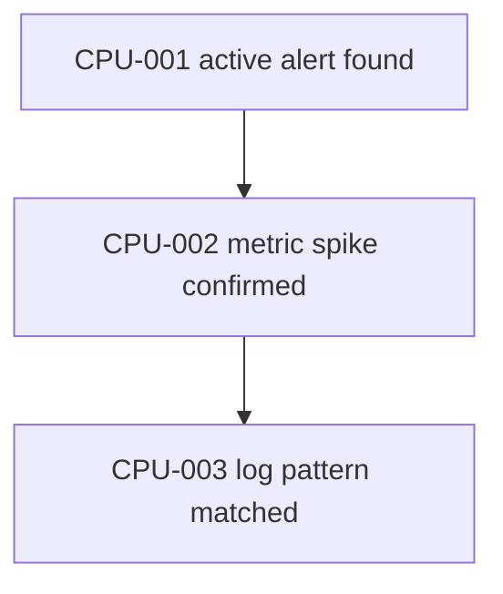

# 记忆系统修改指南

本文给本项目后续修改记忆系统用。核心结论先放前面:

- Redis + TTL 不能单独当作“第二天还能打开的会话记忆”。它适合做热缓存、限流计数、临时运行时标记，不适合当唯一历史来源。
- 本项目已经有一套长期记忆主线: `MemoryRecord` + `MemoryStore` + evidence + candidate/review + hierarchical retrieval。后续不要推倒重来。
- 短期记忆应该先做“可恢复会话存储 + 压缩归档”，再考虑 Redis 热缓存。
- OpenViking 更适合学习会话归档、长期上下文分层、命名空间和可审计检索。
- TencentDB-Agent-Memory 更适合学习工具结果 offload、`node_id/result_ref` 溯源、Mermaid 诊断画布和 token 压力下的压缩策略。

## 1. 先分清三种记忆

小白可以这样理解:

| 类型 | 解决什么问题 | 应该放哪里 | 能不能 TTL 自动删 |
|---|---|---|---|
| 当前会话记忆 | 本轮对话里刚说过什么、AIOps graph 当前走到哪一步 | LangGraph checkpointer + 会话存储 | 不建议只靠 TTL |
| 会话恢复记忆 | 第二天重新打开同一个 session，还能继续昨天的上下文 | 持久化 `SessionMemoryStore` 或文件归档 | 不能只靠短 TTL |
| 长期记忆 | 跨 session 复用的排障经验、成功 plan、偏好、已审核模式 | 当前 `MemoryStore` 长期记忆 sidecar | 只能生命周期归档，不应随便 TTL 删除 active |

Redis + TTL 的正确位置:

- 可以做“热缓存”: 最近几分钟到几小时的 session 摘要、工具结果索引、当前活跃任务状态。
- 可以做“故障自清理”: 进程挂了以后，临时锁、并发请求标记、短期占位自动过期。
- 不应该做“唯一会话历史”: 如果 session 记忆只在 Redis 里，TTL 到期后第二天打开就没了。

所以更合理的方案是:

```text
持久化会话存储是源头
Redis 是加速层

读取 session:
  先读 Redis 热缓存
  没有命中就读 SQLite / 文件归档

写入 session:
  先写持久化源
  再更新 Redis 热缓存
```

## 2. 本项目当前已经有什么

本项目不是空白项目，已经有长期记忆基础。

### 2.1 长期记忆模型

看这里:

- `app/models/memory.py`
- `app/services/memory_store.py`

当前长期记忆表是 `memory_records`，还有 `memory_policy_events`。`MemoryRecord` 里已经有:

- `owner_id`: 这条记忆属于谁。
- `namespace`: 这条记忆属于哪个业务空间。
- `memory_type`: 记忆类型，例如 `alert_pattern`、`plan_template`、`l1_atom`、`l2_scenario`。
- `status`: 生命周期状态，例如 `candidate`、`active`、`conflict`、`stale_suspect`、`superseded`、`deprecated`。
- `evidence`: 证据信息。
- `review`: 人审记录。

这里还有一个很重要的保护: `MemoryRecord` 明确拒绝把 `raw_messages` 或 `raw_memory_saver_history` 直接塞进长期记忆。意思是长期记忆不能保存一坨原始聊天记录，它必须是提炼后的、带证据的经验。

### 2.2 L0 原始证据

看这里:

- `app/services/memory_evidence_store.py`
- `app/models/memory_evidence.py`

`MemoryEvidenceStore` 保存 L0 原始证据和大 payload refs。它的作用不是直接给 prompt 用，而是让长期记忆以后能回查证据。

可以理解成:

```text
L0 evidence: 原始诊断过程、工具结果、final response、key events
L1 atom: 从 L0 提取出来的一条原子经验
L2 scenario: 多条 L1 atom 聚合成一个场景经验
```

### 2.3 候选和审核

看这里:

- `app/services/session_history_accessor.py`
- `app/services/memory_candidate_service.py`
- `app/services/memory_review_service.py`
- `app/cli/memory_operator.py`
- `app/tools/memory_tool.py`

当前项目已经能从 RAG session 或 AIOps graph state 里提取候选记忆，但默认是 `candidate`，不是自动变成 `active`。这点要继续保留，因为 oncall 经验如果错了，会直接误导诊断。

这里要分清两个入口:

- `app/cli/memory_operator.py`: 给本地运营/开发用，负责 `list`、`show`、`approve`、`reject`、`extract-rag-session`、`extract-aiops-session`、owner 级 deprecate 等操作。
- `app/tools/memory_tool.py`: 给 agent tool 体系用，负责 `retrieve_memory` 这种显式 sidecar 检索；它不是默认 RAG 工具，也不生成文档 citation。

### 2.4 检索和注入

看这里:

- `app/services/memory_retrieval_service.py`
- `app/services/hierarchical_retrieval_service.py`
- `app/services/memory_guidance_service.py`
- `app/services/memory_guidance_provider.py`
- `app/models/memory_mode.py`
- `app/agent/aiops/planner.py`
- `app/tools/memory_tool.py`

当前路径是:

```text
MemoryStore
  -> memory retrieval
  -> MemoryGuidanceProvider
  -> planner experience_context
```

`memory_mode` 有三档:

- `off`: 不召回 memory。
- `shadow`: 召回并记录，但不进 prompt。
- `active`: 召回并注入 prompt。

后续短期记忆也要尊重这条边界。不要一加记忆就默认塞进 prompt。

### 2.5 当前缺口

现在还缺这些:

- 没有 Redis + TTL 的 agent 短期记忆。
- 没有持久化 `SessionMemoryStore` 来专门做会话恢复。
- memory 自己还没有 FTS / vector / RRF 混合检索。RAG 文档检索有 hybrid，但 memory 检索目前是 sidecar lexical / hierarchical lexical。
- 还没有 TencentDB-style `node_id/result_ref` 工具结果 offload 和 Mermaid 诊断画布。

开始实现前还要先补一组基线数据:

- 当前 `memory_records` 总共有多少条。
- `candidate` / `active` / `conflict` / `deprecated` 各有多少条。
- 每个 `owner_id + namespace + memory_type` 下各有多少条。
- active memory 数量是否已经大到需要 FTS / vector。只有几十条时，FTS 通常不是 P1。

可以用 SQLite 直接查:

```bash
sqlite3 ./uploads/_metadata/oncall_memory.sqlite3 \
  "select owner_id, namespace, memory_type, status, count(*) from memory_records group by owner_id, namespace, memory_type, status order by owner_id, namespace, memory_type, status;"
```

## 3. OpenViking 去哪里看源码

本地源码:

```text
/Users/cici/oncall agent/OpenViking
commit: 3c876407a20337a9e7f38abe3aea3f621cddb137
license: AGPL-3.0
GitHub: https://github.com/volcengine/OpenViking
```

注意: OpenViking 是 AGPL-3.0。本项目默认只能学习设计思想和架构边界，不要直接复制代码。代码级复用要单独做 license 决策。

重点看这些文件:

| 文件 | 学什么 |
|---|---|
| `/Users/cici/oncall agent/OpenViking/openviking/session/session.py` | 会话如何保留最新 N 条消息、归档旧消息、生成 Working Memory |
| `/Users/cici/oncall agent/OpenViking/openviking/session/compressor.py` | session 压缩、候选记忆合并、摘要和 overview 的处理方式 |
| `/Users/cici/oncall agent/OpenViking/openviking/session/compressor_v2.py` | Working Memory v2 更新、分段摘要、memory diff |
| `/Users/cici/oncall agent/OpenViking/openviking/session/memory_extractor.py` | 从 session 抽取候选记忆，分成 profile/preferences/entities/events/cases/patterns/tools/skills |
| `/Users/cici/oncall agent/OpenViking/openviking/session/memory_archiver.py` | 冷记忆归档，不是 TTL 删除 |

OpenViking 的短期记忆不是 Redis TTL。它更像这样:

```text
live messages.jsonl
  保留最新 keep_recent_count 条
  老消息进入 history/archive_NNN/messages.jsonl
  archive_NNN 里再生成 .overview.md / .abstract.md / .meta.json / .done

下次构造上下文:
  最新 archive overview
  + 当前 live messages
  + 必要时少量历史摘要
```

它的 Working Memory v2 有 7 个部分:

- Session Title
- Current State
- Task & Goals
- Key Facts & Decisions
- Files & Context
- Errors & Corrections
- Open Issues

对本项目最有用的不是这些名字本身，而是这个思想:

```text
短期会话不要无限塞原始消息
也不要到期直接删
而是:
  最新内容原样保留
  旧内容压缩成结构化摘要
  摘要仍然能回查 archive
```

## 4. TencentDB-Agent-Memory 去哪里看源码

本地源码:

```text
/Users/cici/oncall agent/TencentDB-Agent-Memory
commit: dc34ec5283f1a22f151ebec4f2ba1fbce8761817
license: MIT
GitHub: https://github.com/Tencent/TencentDB-Agent-Memory
```

TencentDB-Agent-Memory 是 MIT，代码级参考空间比 OpenViking 大。但它是 TypeScript / OpenClaw / Hermes 插件形态，本项目是 Python + FastAPI + LangGraph，所以也不能整包接入。

重点看这些文件:

| 文件 | 学什么 |
|---|---|
| `/Users/cici/oncall agent/TencentDB-Agent-Memory/README_CN.md` | 短期任务画布、Mermaid、`node_id` 下钻、原文 refs |
| `/Users/cici/oncall agent/TencentDB-Agent-Memory/src/offload/types.ts` | `OffloadEntry`、`PluginState`、压缩阈值配置 |
| `/Users/cici/oncall agent/TencentDB-Agent-Memory/src/offload/storage.ts` | per-agent/per-session 存储目录、refs、mmds、offload JSONL、state.json |
| `/Users/cici/oncall agent/TencentDB-Agent-Memory/src/offload/state-manager.ts` | session 切换、状态恢复、active MMD 管理 |
| `/Users/cici/oncall agent/TencentDB-Agent-Memory/src/offload/index.ts` | L1 工具结果摘要、L2 Mermaid、L3 压缩、失败降级 |
| `/Users/cici/oncall agent/TencentDB-Agent-Memory/src/offload/pipelines/l2-mermaid.ts` | 根据 offload entries 生成 Mermaid 任务图和回填 `node_id` |
| `/Users/cici/oncall agent/TencentDB-Agent-Memory/src/offload/hooks/llm-input-l3.ts` | token 压力下如何注入 MMD、压缩旧工具结果 |

TencentDB-Agent-Memory 的短期记忆也不是 Redis TTL。它更像这样:

```text
refs/*.md
  保存完整工具结果原文

offload-<sessionId>.jsonl
  保存工具调用摘要
  每条有 tool_call_id / result_ref / summary / node_id

mmds/*.mmd
  保存 Mermaid 任务画布
  每个节点有 node_id

prompt 中只放轻量 Mermaid / 摘要
需要细节时通过 node_id -> result_ref 找回原文
```

它的关键工程经验:

- 压缩由 token 压力触发，不是由时间过期触发。
- 工具结果原文不丢，只是从 prompt 里卸载。
- Mermaid 是给 Agent 和人一起看的任务地图。
- `node_id` 和 `result_ref` 是可追溯性的关键。
- 如果 LLM 摘要失败，要有 degraded fallback，不要让记忆系统拖垮主流程。

适配时要把“必须学、可选学、不适合照搬”分开:

| 类别 | 内容 | 本项目处理方式 |
|---|---|---|
| 必须采纳 | `result_ref` 保存原始工具结果、`node_id` 绑定诊断步骤、摘要失败降级 | 翻译成 Python service，原文 refs 优先复用 `MemoryEvidenceStore` 思路 |
| 建议采纳 | `offload-<sessionId>.jsonl` 这种按 session 记录摘要流的思想 | 可以落成 SQLite 表或 JSONL，先选和 `SessionMemoryStore` 最一致的持久化方式 |
| 可选采纳 | Mermaid / MMD 画布 | AIOps 长任务或 token 压力大时再做，不作为 P1 会话恢复的前置条件 |
| 不适合照搬 | OpenClaw / Hermes 插件生命周期、TypeScript 插件目录结构 | 不接入插件运行时，只迁移数据结构和压缩/offload 策略 |

## 5. 本项目推荐目标架构

推荐架构不是“Redis 短期记忆 + 现在长期记忆”这么简单，而是四层:

```text
┌─────────────────────────────────────────────┐
│ Prompt / Planner                            │
│ - memory_mode: off / shadow / active        │
│ - document context 和 memory guidance 分开  │
└─────────────────────────────────────────────┘
                    ▲
                    │
┌─────────────────────────────────────────────┐
│ L3 / Retrieval View                         │
│ - hierarchical lexical 已有                 │
│ - FTS / vector / RRF 未来按需加             │
└─────────────────────────────────────────────┘
                    ▲
                    │
┌─────────────────────────────────────────────┐
│ Long-term Durable Memory                    │
│ - MemoryStore                               │
│ - MemoryRecord                              │
│ - candidate / review / lifecycle            │
│ - L1 atom / L2 scenario                     │
└─────────────────────────────────────────────┘
                    ▲
                    │
┌─────────────────────────────────────────────┐
│ Session Memory / Offload                    │
│ - SessionMemoryStore                        │
│ - archive summary                           │
│ - DiagnosisCanvas                           │
│ - tool result refs                          │
└─────────────────────────────────────────────┘
                    ▲
                    │
┌─────────────────────────────────────────────┐
│ L0 Evidence                                 │
│ - MemoryEvidenceStore 已有                  │
│ - final response / key events / tool refs   │
└─────────────────────────────────────────────┘
```

更具体的数据流向:

```text
写入方向:
  当前 session / AIOps graph
    -> SessionMemoryStore 保存 live tail + latest summary
    -> 长工具结果写入 result_ref / evidence ref
    -> 达到阈值后 archive + overview / abstract
    -> 从 summary / canvas / L0 evidence 抽 L1 atom candidate
    -> review 通过后进入 active long-term memory

读取方向:
  用户继续同一个 session
    -> 先读 SessionMemoryStore 恢复 latest summary + live tail
    -> 需要跨 session 经验时再走 MemoryStore retrieval
    -> memory_mode=active 时才把 memory guidance 注入 planner

回查方向:
  planner / 人看到 node_id 或 memory evidence
    -> node_id -> result_ref
    -> result_ref -> L0 evidence / 原始工具结果
```

注意两个边界:

- Session archive summary 可以作为长期候选的输入证据，但不能自动变成 active memory。
- DiagnosisCanvas 是当前诊断过程的任务图，可以指向长期记忆或证据 refs，但它本身不是长期记忆库。

和现在项目的关系:

- 长期记忆继续走 `MemoryStore`，不要换成 Redis。
- 短期会话恢复新增 `SessionMemoryStore`，不要把 raw chat 塞进 `MemoryRecord`。
- 工具结果 offload 复用 `MemoryEvidenceStore` 的 refs 思路，不要另起一套无法回查的临时文件系统。
- prompt 注入继续由 `MemoryGuidanceProvider` / planner 控制，不要绕过 `memory_mode`。

### 5.1 架构审查: 模块契约和可插拔边界

从架构上看，这个设计符合本项目当前的 sidecar memory 思路: 新记忆能力应该挂在现有稳定接口旁边，而不是改写 RAG、AIOps 或 LangGraph 的主流程。

| 模块 | 主要职责 | 接入位置 | 可插拔要求 | 最小验证 |
|---|---|---|---|---|
| `SessionMemoryStore` | 保存同一 `session_id` 的 live tail、summary、archive 元数据 | `rag_agent_service.py` / `aiops_service.py` 的 session 读写边界 | 这是逻辑模块，不是第二套孤立 session source of truth；失败时返回空摘要，不阻断请求 | 临时 SQLite 单测: 写入、重启 store、按 `session_id` 读回 |
| `SessionArchiveService` | 按消息数/token 阈值归档旧消息并生成 overview / abstract | `SessionMemoryStore` 内部或相邻 service | 可先用 deterministic 摘要，LLM 摘要作为可选 adapter | 超过阈值后只保留最近 N 条，archive 可回查 |
| `ToolResultOffloadService` | 把长工具结果从 prompt 卸载为 `result_ref + summary` | AIOps 工具执行结果进入 graph state 前后 | 只处理长结果；关闭后走原始工具结果路径 | 长结果写 ref，prompt 只出现摘要，ref 能读回原文 |
| `DiagnosisCanvasStore` | 保存 AIOps 当前诊断步骤、`node_id` 和任务图 | AIOps graph 的 observation / past_steps 附近 | Mermaid 只是视图，文本 canvas 也能工作 | `node_id -> result_ref` 可回查，canvas 缺失不影响诊断 |
| `MemoryCandidateService` | 从 session summary / canvas / L0 evidence 生成 candidate | 继续使用现有 candidate/review gate | 只生成 `candidate/conflict`，不能直接 active | 候选默认 candidate，重复不重复插入，冲突可识别 |
| `MemoryRetrievalService` / `HierarchicalRetrievalService` | 召回长期记忆 guidance | `MemoryGuidanceProvider` | `memory_mode=off/shadow/active` 控制召回和注入 | off 不召回，shadow 召回但不注入，active 才注入 |
| Redis hot cache | 加速最近 session / tool ref 读取 | `SessionMemoryStore` 之后 | 只能是 cache adapter，不能成为 source of truth | Redis 不启动或 TTL 过期时，SQLite 仍可恢复 |

小白可以这样理解这张表:

```text
主流程: RAG / AIOps 继续正常跑
旁路模块: SessionMemoryStore / offload / canvas / long-term memory 分别做自己的事
开关: memory_mode 和配置决定是否读取、是否注入、是否启用 cache
验证: 每个模块都能用临时 SQLite 或 fake accessor 单独测
```

这里最重要的架构约束是: 不要让新增模块互相绑死。P1 的 `SessionMemoryStore` 不应该依赖 P4 的 Mermaid；P3 的工具 offload 不应该要求长期记忆已经 active；P6 的 FTS 不应该改变 `MemoryStore` 作为 source of truth 的地位。

## 6. 第一阶段: 先做会话恢复，不做 Redis 短 TTL

第一阶段目标:

```text
同一个 session 第二天打开还能恢复
并且不会把全部历史原文塞进 prompt
```

推荐新增一个 Python 服务:

```text
app/models/session_memory.py
app/services/session_memory_store.py
```

这里的 `SessionMemoryStore` 是逻辑模块，不是要复制一套和 `SessionAccess` 竞争的会话系统。当前项目已经有:

- `SessionAccess`: 负责 session owner guard、读写权限、用户可见会话历史。
- `SQLiteChatSessionRepository`: 负责 `chat_sessions` / `chat_messages` 的持久化。

所以 P1 的存储边界要这样定:

```text
SessionAccess / ChatSessionRepository:
  用户可见会话历史和权限事实

SessionMemoryStore:
  Agent prompt 恢复用的 latest_summary / live tail / archive metadata

两者共享 session_id / owner_id / user_id 约束
但不要把工作记忆伪装成普通聊天消息
```

建议优先复用现有会话 SQLite 同库，新增独立表:

```text
logs/enterprise_chat_sessions.sqlite
  chat_sessions
  chat_messages
  session_memory_snapshots
  session_memory_archives
```

如果为了 eval 或单测需要临时路径，可以通过 `store_path` 注入。但生产设计上不要让 `./uploads/_metadata/session_memory.sqlite3` 变成和 `SQLiteChatSessionRepository` 脱节的第二套 session 真相源。

建议表结构:

| 字段 | 含义 |
|---|---|
| `session_id` | 会话 ID |
| `owner_id` | 用户或租户 |
| `session_type` | `rag_chat` / `aiops_diagnosis` |
| `status` | `active` / `archived` / `closed` |
| `live_messages_json` | 最近 N 条原始消息 |
| `latest_summary` | 最新会话摘要 |
| `archive_count` | 已归档次数 |
| `updated_at` | 最近更新时间 |
| `last_archived_at` | 最近归档时间 |

建议再加 archive 表:

| 字段 | 含义 |
|---|---|
| `archive_id` | `session_id + index` |
| `session_id` | 会话 ID |
| `messages_ref` | 老消息原文 ref |
| `overview` | 结构化会话摘要 |
| `abstract` | 一句话摘要 |
| `created_at` | 归档时间 |
| `expires_at` | 可选过期时间，用于清理 session archive，不影响 L0 evidence |

archive 还要有保留策略，不然长期运行会无限增长:

| 配置 | 初版建议 | 说明 |
|---|---|---|
| `archive_retention_days` | 90 | 超过后可清理 session archive |
| `max_archives_per_session` | 50 | 单个 session 最多保留多少个 archive |
| `l0_evidence_retention_days` | 大于 archive retention | L0 evidence 是长期候选的证据根，保留时间应长于 session archive |

触发归档的条件建议用数量或 token，而不是 TTL:

```text
if live message count > 20:
  保留最近 8 条
  旧消息写 archive
  生成 overview / abstract

if token estimate > budget:
  保留当前任务相关消息
  压缩更早消息
```

初版 token / 数量阈值建议先写成配置，不要散落硬编码。RAG 和 AIOps 要分开配置:

| 项 | RAG 初版建议 | AIOps 初版建议 | 说明 |
|---|---:|---:|---|
| `live_tail_max_messages` | 20 | 50 | AIOps 一次诊断的 planner / executor / replanner 步骤更多 |
| `live_tail_keep_recent` | 8 | 20 | archive 后仍保留最近关键上下文 |
| `session_context_token_budget` | prompt 总预算的 25% 以内 | prompt 总预算的 30% 以内 | 会话摘要 + live tail 不应挤占文档和工具上下文 |
| `memory_guidance_token_budget` | prompt 总预算的 10%-15% 以内 | prompt 总预算的 10%-15% 以内 | 长期记忆是 guidance，不是主上下文 |
| `single_tool_result_inline_limit` | 约 1000 tokens 或 4000 字符 | 约 1000 tokens 或 4000 字符 | 超过就 offload，prompt 只放摘要 |
| `single_tool_summary_limit` | 约 300-500 字 | 约 300-500 字 | 防止工具摘要本身变成长日志 |

这些数字不是最终产品指标，只是 P1/P2/P3 开发时的起步线。上线前要用真实 AIOps / RAG trace 复测并调整。

和现有代码的集成点:

- RAG chat: `app/services/rag_agent_service.py` 当前使用 LangGraph `MemorySaver`。
- AIOps graph: `app/services/aiops_service.py` 当前使用 LangGraph `MemorySaver`。
- 读取历史时不要直接依赖 `MemorySaver` 内部结构，继续走 `SessionHistoryAccessor` 和 `AIOpsGraphStateAccessor` 这种稳定 accessor 思路。

建议流程:

```text
用户发起请求
  -> 读 SessionMemoryStore 的 persistent summary / live tail
  -> 根据 token budget 拼当前 session context
  -> agent 运行
  -> 写 MemorySaver
  -> 从业务层输入/输出、final response、稳定 graph state 写 SessionMemoryStore
  -> 如果超过阈值，archive + summary
```

不要从 `MemorySaver` 内部 checkpoint 反序列化后抽取 summary。`MemorySaver` 是 LangGraph 内部状态，格式可能跟随 LangGraph 版本变化。`SessionMemoryStore` 应该只从这些稳定来源写入:

- 本次用户输入。
- 本次 assistant final answer / AIOps final response。
- RAG runtime 已经拿到的消息内容。
- AIOps 通过 `graph.get_state()` / `AIOpsGraphStateAccessor` 得到的 normalized state。
- `SessionAccess` 中用户可见历史的短窗口 fallback。

### 6.1 P1 运行时落地清单

如果下一步真的开始实现，先不要做 Redis、Mermaid、vector。P1 只做一件事:

```text
同一个 session 的 latest_summary + live tail 能持久化，并能在服务重启后读回来。
```

建议按这个顺序改:

| 顺序 | 文件 | 做什么 | 通过条件 |
|---|---|---|---|
| 1 | `tests/test_session_memory_store.py` | 先写 SQLite store 单测 | 临时 DB 写入 snapshot，重建 store 后按 `session_id` 读回 |
| 2 | `app/models/session_memory.py` | 定义 `SessionMemorySnapshot` / `SessionMemoryArchive` / status / session_type | 模型能校验 `session_id`、`owner_id`、`live_messages`、`latest_summary` |
| 3 | `app/services/session_memory_store.py` | 实现 SQLite 表和读写方法；底层优先复用 `logs/enterprise_chat_sessions.sqlite` 同库新增表 | `upsert_snapshot()`、`get_snapshot()`、`append_live_message()`、`archive_old_messages()` 可单测 |
| 4 | `app/services/rag_agent_service.py` | 在 `query()` / `query_stream()` 构造 prompt 前读 session summary + live tail | 关掉 store 时仍走原 `MemorySaver`；打开后 prompt 能包含短期摘要 |
| 5 | `app/services/aiops_service.py` | 在 `execute()` 初始 state 中加入可选 session summary / live tail | store 失败时 AIOps 不失败，只记录 degraded |
| 6 | `tests/test_session_memory_integration.py` | 补最小集成测试 | 模拟重建 service 后，同一 `session_id` 能拿到 summary + live tail |

P1 建议的最小模型:

```python
class SessionMemorySnapshot(BaseModel):
    session_id: str
    owner_id: str = "default"
    session_type: Literal["rag_chat", "aiops_diagnosis"]
    status: Literal["active", "archived", "closed"] = "active"
    latest_summary: str = ""
    live_messages: list[SessionMemoryMessage] = []
    archive_count: int = 0
    updated_at: datetime
    last_archived_at: datetime | None = None

class SessionMemoryMessage(BaseModel):
    role: Literal["user", "assistant", "system", "tool"]
    content: str
    created_at: datetime
    metadata: dict[str, Any] = {}
```

P1 建议的 store 方法:

```python
class SessionMemoryStore:
    def get_snapshot(self, session_id: str, *, owner_id: str) -> SessionMemorySnapshot | None:
        ...

    def upsert_snapshot(self, snapshot: SessionMemorySnapshot) -> SessionMemorySnapshot:
        ...

    def append_live_message(
        self,
        session_id: str,
        *,
        owner_id: str,
        session_type: str,
        role: str,
        content: str,
        metadata: dict | None = None,
    ) -> SessionMemorySnapshot:
        ...

    def build_prompt_context(
        self,
        session_id: str,
        *,
        owner_id: str,
        max_messages: int = 8,
    ) -> str:
        ...
```

P1 的 Adapter 边界要提前说清楚:

```text
SessionMemoryStore:
  逻辑接口，RAG / AIOps 只依赖它的方法，不关心底层是 SQLite 还是 cache

SQLiteSessionMemoryStore:
  P1 唯一默认持久化 Adapter
  负责建表、读写 session_memory_snapshots / session_memory_archives
  生产默认复用 enterprise_chat_sessions.sqlite 同库

InMemorySessionMemoryStore:
  只用于单测或 fake，不作为生产恢复能力

RedisSessionMemoryCache:
  未来可选 cache Adapter
  只能包在 SQLiteSessionMemoryStore 前面做 read-through / write-through
  TTL 过期只能表示 cache miss，不能表示 session memory 被删除
```

也就是说，`rag_agent_service.py` 和 `aiops_service.py` 不应该直接 import `sqlite3` 或 Redis client。它们只做三件事:

1. 请求开始时调用 `store.build_prompt_context(...)`。
2. 请求结束时调用 `store.append_live_message(...)` / `store.upsert_snapshot(...)`。
3. store 抛错时记录 degraded，然后继续走原主流程。

这样后续替换 Adapter 时影响范围很小:

- 从 SQLite 换成 SQLite + Redis cache，不需要改 RAG / AIOps 主流程。
- Redis 挂了，只影响性能，不影响第二天恢复 session。
- SQLite store 坏了，才会失去 P1 会话恢复能力，但也不应该让主请求失败。

P1 不建议把 `latest_summary` 写成特殊类型的 `ChatMessageRecord`。原因是 `chat_messages` 是用户可见历史；工作记忆是 Agent prompt 恢复材料。两者可以同库、同 owner guard，但最好分表、分模型、分用途。

P1 接入 RAG 时，不要把 SQLite chat history 原样塞进 prompt。更合理的是只塞短摘要:

```text
当前会话短期摘要:
{latest_summary}

最近几轮对话:
- user: ...
- assistant: ...
```

P1 接入 AIOps 时，也不要把所有 `past_steps` 原样塞回 planner。只传:

```text
当前诊断会话摘要:
{latest_summary}

最近关键步骤:
- ...
```

P1 先不要做的事:

- 不做 Redis。
- 不做 Mermaid。
- 不做长期记忆 promotion。
- 不做 vector/RRF。
- 不把 `SessionAccess` 的全量聊天历史直接拼进 prompt。

这样 P1 的改动是可插拔的: `SessionMemoryStore` 坏了，最多少一段短期摘要，RAG / AIOps 主流程仍然能跑。

双写一致性要这样看:

- `MemorySaver` 写成功但 `SessionMemoryStore` 写失败时，不阻断请求，记录 `session_memory_degraded`。
- 如果进程还没重启，下次请求可以用业务层当前状态补写 snapshot。
- 如果服务已经重启，不能指望 `MemorySaver` 还在；只能用 `SessionAccess` 的最近消息或 L0 evidence 做 fallback 摘要。
- 因此 `SessionMemoryStore` 写入失败是可降级问题，但要有指标和日志，不能静默失败。

Redis 在这一阶段只能作为可选优化:

```text
key: session_hot:{owner_id}:{session_id}
value: latest_summary + live tail
ttl: 滑动刷新，例如 24h 或 7d
source of truth: SQLite SessionMemoryStore
```

这样 Redis 过期也不怕，因为 SQLite 还在。

什么时候才需要加 Redis:

- `SessionMemoryStore.get_snapshot()` 的 p95 延迟持续大于 50ms。
- 或 session memory 读写 QPS 超过 100。
- 或 SQLite 写锁等待 / busy error 在压测里频繁出现。
- 或多实例部署后，同一 session 的热摘要频繁跨进程读取。

没达到这些条件前，不要为了“短期记忆”先加 Redis。

## 7. 第二阶段: 工具结果 offload 和 Mermaid 诊断画布

这一阶段只建议用于 AIOps，因为 AIOps 工具结果很容易又长又重复。

目标:

```text
长日志和工具结果不直接塞进 prompt
prompt 里只放任务画布和短摘要
但每个摘要都能回查原始证据
```

推荐新增:

```text
app/models/diagnosis_canvas.py
app/services/diagnosis_canvas_store.py
app/services/tool_result_offload_service.py
```

可以参考 TencentDB 的 `OffloadEntry`，但 Python 里字段建议这样:

| 字段 | 含义 |
|---|---|
| `canvas_id` | 当前 AIOps 诊断画布 ID |
| `session_id` | 会话 ID |
| `node_id` | Mermaid 节点 ID，例如 `CPU-001` |
| `tool_call_id` | LangGraph / tool 调用 ID |
| `tool_name` | 工具名 |
| `summary` | 工具结果摘要 |
| `result_ref` | 原始工具结果 ref |
| `status` | `done` / `doing` / `failed` |
| `created_at` | 创建时间 |

原始工具结果建议放进已有的 `MemoryEvidenceStore` refs，而不是新建没有治理的临时目录。

prompt 里注入的内容应该像这样:

```text
当前诊断画布:
- CPU-001: query_active_alerts 发现 CPUHigh 告警
- CPU-002: query_metric_series 发现 CPU 使用率持续 95%
- CPU-003: search_service_logs 发现同一时段 GC pause 增多

如需回查原文，使用 node_id 对应 result_ref。
```

Mermaid 可以作为可选视图:



注意:

- Mermaid 是任务画布，不是长期记忆。
- `node_id/result_ref` 是证据链，不是 citation。
- 只有 token 压力大或工具结果很长时才 offload，不要每个小工具都复杂化。
- P4 先做文本 canvas，再考虑 Mermaid。只有 AIOps 平均诊断步骤数足够多，或者用户确实需要可视化诊断链路时，Mermaid 才值得做成产品功能。

## 8. 第三阶段: 长期记忆候选和审核继续沿用现有方式

长期记忆不要从 Redis 或 raw messages 直接生成。推荐来源顺序:

```text
L0 evidence
  -> session summary
  -> diagnosis canvas
  -> L1 atom candidate
  -> review
  -> active memory
```

继续用现有模块:

- `app/services/memory_candidate_service.py`
- `app/services/memory_extractor_service.py`
- `app/services/memory_review_service.py`
- `app/services/memory_lifecycle_service.py`
- `app/services/memory_aggregator_service.py`
- `app/services/memory_store.py`

长期记忆的原则:

- 新经验先是 `candidate`。
- 冲突经验进 `conflict` 或让旧经验变 `stale_suspect`。
- 只有人审或明确 gate 通过后，才能变 `active`。
- 不物理删除旧记忆，使用 `deprecated` / `superseded`。
- `candidate_summary` 不能直接升成 active memory。
- candidate 的 `evidence_ref` 应优先指向 `MemoryEvidenceStore` 的 L0 evidence，而不是直接指向 session archive row。session archive 可以按保留策略清理，L0 evidence 才是长期候选的可信证据根。

这套方式更接近 OpenViking 的长期上下文思想，但本项目已经把它改造成 oncall-agent 自己的 sidecar 系统。

## 9. 第四阶段: memory 检索增强，先 FTS 再 vector/RRF

当前 memory 检索还不是 RAG 文档检索那套 hybrid。不要一上来就加向量库。

推荐顺序:

### 9.1 先加 SQLite FTS

FTS 是 Full-Text Search，中文可以理解为“全文检索”。SQLite FTS 可以给 `summary/content/tags` 建一个全文搜索索引。

建议新增:

```text
memory_records_fts
```

索引字段:

- `memory_id`
- `summary`
- `content`
- `tags`
- `namespace`

好处:

- 和当前 SQLite `MemoryStore` 同源。
- 容易测试。
- 不引入新的向量库依赖。
- 可以先解决关键词召回弱的问题。

### 9.2 再考虑 vector

如果 active memory 数量变多，或者语义相似但关键词不同的召回经常失败，再加 vector。

原则:

- vector 是 retrieval view，不是 source of truth。
- source of truth 仍然是 `MemoryStore`。
- vector 里不要保存不能回查的孤立文本。

### 9.3 最后考虑 RRF

RRF 是 Reciprocal Rank Fusion，简单理解就是把多个检索器的排名融合。

例如:

```text
FTS 找到: A, B, C
vector 找到: B, D, A
RRF 融合后: B, A, D, C
```

memory RRF 要保留 trace:

- FTS 命中了哪些 memory。
- vector 命中了哪些 memory。
- RRF 怎么融合。
- 最后返回了哪些 memory。

不要把 memory hit 伪装成 RAG `SourceRef`。memory 是经验指导，不是文档 citation。

## 10. 适配源码时要注意什么

### 10.1 不要替换现有 RAG 主链路

本项目的 RAG 文档检索已经有:

- `RetrievalService`
- Milvus dense retrieval
- BM25 sparse retrieval
- RRF
- rerank
- `SourceRef`
- `citation_text`

记忆系统是 agent guidance，不是知识库文档引用。不要把 memory 混进 `retrieve_knowledge` 的文档 citation。

### 10.2 不要直接复制 OpenViking 代码

OpenViking 是 AGPL-3.0。默认只学习:

- session archive 思路
- Working Memory 结构化摘要思路
- namespace/context level 思路
- 可审计检索 trace 思路

不要直接把 `session.py`、`compressor.py`、`memory_extractor.py` 拷进项目。

### 10.3 不要直接运行 TencentDB 插件

TencentDB-Agent-Memory 是 MIT，但它的运行时是 OpenClaw / Hermes 插件。直接接进本项目会绕过现有:

- FastAPI service 边界
- LangGraph graph state
- `MemoryStore`
- `MemoryEvidenceStore`
- candidate/review gate
- `memory_mode`

正确方式是把它的 offload 数据结构和压缩策略翻译成 Python 服务。

### 10.4 不要把 Redis TTL 当成唯一历史

错误做法:

```text
session:{id} -> Redis
ttl = 1 day
第二天 TTL 到期，session 消失
```

正确做法:

```text
SessionMemoryStore: 持久化源
Redis: 最近活跃 session 的热缓存
TTL: 只影响缓存，不影响恢复能力
```

### 10.5 不要把 raw messages 存成长久 active memory

长期记忆应该是:

```text
这类告警的根因模式是什么
什么检查步骤有效
什么修复动作被验证过
证据来自哪个 session / 哪些 tool refs
```

不是:

```text
用户和 agent 的完整聊天记录
```

### 10.6 保留 memory_mode

任何新记忆能力都要能被关掉:

- 默认 `off` 或 `shadow`。
- 小范围验证后才 `active`。
- 失败时不影响 AIOps 主流程。

### 10.7 失败要降级

记忆系统失败时:

- 不应该让 `/api/chat` 或 AIOps diagnosis 失败。
- trace 里标明 memory degraded。
- 主流程继续使用文档 RAG / 工具证据。

## 11. 推荐落地顺序

建议按这个顺序做，不要跳着做:

1. **P0: 现状确认**
   - 确认 `MemorySaver`、`MemoryStore`、`MemoryEvidenceStore` 的真实边界。
   - 验证 memory 默认 `off/shadow/active` 行为。
   - 统计 `memory_records` 按 owner / namespace / type / status 的数量，判断 FTS / vector 是否真的有必要。
   - 确认当前 prompt 预算和实际 session/tool-result 长度，给 P1-P3 阈值定一个可复测的初值。

2. **P1: SessionMemoryStore**
   - 新增 SQLite 持久化会话存储。
   - 支持按 `session_id` 恢复 latest summary + live tail。
   - 不引入 Redis。

3. **P2: 会话 archive + summary**
   - 超过消息数或 token 阈值时归档。
   - 保留最近 N 条原文。
   - 旧内容生成 overview / abstract。

4. **P3: AIOps tool result offload**
   - 长工具结果写 refs。
   - prompt 只放摘要。
   - 每条摘要能通过 `result_ref` 回查。

5. **P4: DiagnosisCanvas / Mermaid**
   - 给 AIOps 诊断过程生成任务画布。
   - 每个节点绑定 `node_id`。
   - 只在长任务或 token 压力大时注入。

6. **P5: 长期候选抽取**
   - 从 session summary / diagnosis canvas / L0 evidence 抽 L1 atom candidate。
   - 继续使用 review gate。
   - 不自动 promotion。

7. **P6: memory FTS**
   - 如果 lexical retrieval 不够，再给 memory 加 SQLite FTS。
   - 保留 retrieval trace。

8. **P7: vector/RRF**
   - 只有 memory 数量和评估证明需要时才做。
   - 不污染 RAG `SourceRef` 和 citation。

## 12. 和现有长期记忆会不会冲突

按上面的架构做，不冲突。

原因:

- 短期会话存储解决“这个 session 怎么恢复”。
- 长期记忆解决“跨 session 复用什么经验”。
- L0 evidence 解决“长期经验凭什么可信”。
- Redis 只做热缓存，不做源头。

会冲突的情况是这些:

- 把 raw messages 直接写成 `MemoryRecord(status=active)`。
- Redis TTL 到期导致唯一 session 历史消失。
- 把 memory guidance 当成 RAG citation 展示。
- 跳过 `candidate/review`，自动把新经验变 active。
- 新增短期记忆时绕过 `memory_mode`，默认强塞 prompt。

## 13. 面试和汇报口径

可以这样解释:

> 我们的长期记忆主线更接近 OpenViking 的思想: 不是把聊天记录原样存下来，而是把 agent 运行中的证据、经验、状态做成分层、命名空间化、可审核的长期上下文。本项目已经落成了 `MemoryRecord`、`MemoryStore`、L0 evidence、L1 atom、L2 scenario、candidate/review 和 hierarchical retrieval。

再补一句 TencentDB:

> TencentDB-Agent-Memory 对我们更像工程补充，尤其是短期任务里的工具结果 offload、`node_id/result_ref` 可追溯、Mermaid 诊断画布和 token 压力下压缩。它解决的是当前 session 里工具日志太长、上下文爆掉的问题，不是替代长期记忆。

再解释 Redis:

> Redis + TTL 适合做热缓存，但不能当唯一短期记忆。因为用户第二天打开同一个 session 时，TTL 到期就会丢上下文。我们的方案是 SQLite / 文件归档作为持久化源，Redis 只做加速层。

## 14. 验收清单

每个阶段都要有可验证结果。

架构上建议按这张验证矩阵推进。先测新模块自己的接口，再测和现有主流程的集成，最后测关闭/降级路径。

| 阶段 | 模块接口验证 | 集成验证 | 降级/开关验证 |
|---|---|---|---|
| P1 `SessionMemoryStore` | 临时 SQLite 写入 session、关闭并重建 store、按 `session_id` 读回 latest summary + live tail | RAG / AIOps 请求结束后能写入 session snapshot | store 抛错时 `/api/chat` / AIOps 不失败，只记录 degraded |
| P2 archive + summary | 超过 `live_tail_max_messages` 后生成 archive，live tail 只保留最近 N 条 | 构造 prompt 时使用 summary + live tail，不无限拼原始消息 | 摘要失败时保留原始 archive ref 和 fallback abstract |
| P3 offload | 长工具结果写入 ref，`result_ref` 能读回原文 | AIOps graph / planner 只看到短摘要，不直接塞长日志 | offload 关闭时仍走原始工具结果路径 |
| P4 DiagnosisCanvas | `node_id` 唯一，`node_id -> result_ref` 可回查 | AIOps 诊断过程能生成文本 canvas；Mermaid 只是展示层 | canvas 缺失或生成失败时诊断继续 |
| P5 candidate/review | 从 summary / canvas / evidence 生成 `candidate` 或 `conflict` | operator CLI 能 list/show/approve/reject | 不允许绕过 review 自动 active |
| P6 FTS | FTS 表可重建，查询结果能映射回 `memory_id` | `MemoryRetrievalService` trace 标出 FTS 命中 | FTS 不可用时回退 lexical/hierarchical lexical |
| P7 vector/RRF | vector/RRF 只保存 retrieval view，不保存唯一文本 | trace 标出 lexical/vector/RRF 各自排名 | vector 服务不可用时不影响 `MemoryStore` 和 lexical retrieval |

建议测试文件命名:

```text
tests/test_session_memory_store.py
tests/test_session_archive_service.py
tests/test_tool_result_offload_service.py
tests/test_diagnosis_canvas_store.py
tests/test_memory_candidate_service.py
tests/test_memory_fts_retrieval.py
tests/test_memory_mode_integration.py
```

这些测试不要求一次写完。每进入一个阶段，先补对应测试，再做实现。

### P1 会话恢复

- 重启服务后，同一个 `session_id` 能恢复 latest summary + live tail。
- Redis 不启动时仍能恢复。
- `MemorySaver` 为空时，能从 `SessionMemoryStore` 找到可用摘要。

### P2 归档压缩

- 超过阈值后只保留最近 N 条原文。
- 旧消息进入 archive。
- archive 有 overview / abstract。
- prompt 不无限增长。

### P3 工具结果 offload

- 长工具结果写入 ref。
- prompt 中只出现短摘要。
- `result_ref` 能读回原文。

### P4 DiagnosisCanvas

- AIOps 每个关键工具步骤有 `node_id`。
- Mermaid 或文本画布能描述任务进展。
- `node_id -> result_ref` 可回查。

### P5 长期候选

- 候选来自 session summary / evidence refs，而不是 raw messages。
- 新候选默认 `candidate`。
- 冲突进入 `conflict` 或让旧记忆进入 `stale_suspect`。
- 不自动 promotion。

### P6 / P7 检索增强

- FTS / vector / RRF 命中都有 trace。
- memory hit 不生成 RAG `SourceRef`。
- memory guidance 不污染 `citation_text`。

### 全局回归

- `memory_mode=off` 时不注入 memory。
- `memory_mode=shadow` 时召回但不进 prompt。
- `memory_mode=active` 时才注入。
- memory 失败时 AIOps / RAG 主流程不失败。
