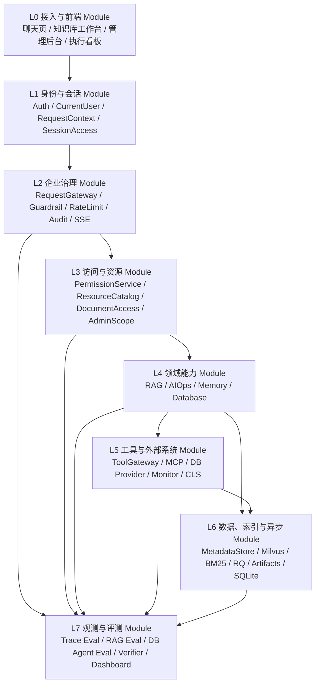

# 项目完整架构

日期：2026-06-04

状态：长期架构基线。

适用范围：本文件约束 `SuperBizAgent` 后续所有企业助手、RAG、AIOps、Memory、数据库、权限、前端工作台、文档处理、评测与观测相关开发。

变更规则：普通功能开发不得修改本文件。确需改变本架构时，必须先由用户明确提出“修改项目完整架构”，再新增或更新架构决策记录，并同步更新 `AGENTS.md`、`PROJECT_STATE.md` 和相关 development record。

## 1. 架构结论

本项目不是简单五层应用，也不是一个单一 Agent。它是一个本地企业助手平台，用统一治理层包住多个领域能力 Module：

```text
接入与会话 Module
  -> 企业治理 Adapter / Request Seam
  -> 访问与资源 Module
  -> 领域能力 Module: RAG / AIOps / Memory / Database
  -> 工具与外部系统 Module: ToolGateway / MCP / DB / Monitor / Logs
  -> 数据、索引与异步 Module: document lifecycle / metadata / vector / sparse / RQ
  -> 观测、评测与看板横切 Module: audit / trace / verifier / SSE / eval / dashboard
```

后续开发的核心原则：

```text
不要让页面、Agent、工具、数据库、文档处理、检索、权限各自私下连线。
所有新能力必须进入明确 Module，暴露稳定 Interface，在 Seam 上用 Adapter 接入。
```

## 2. 架构词汇

本文固定使用以下术语。

| 术语 | 项目含义 |
|---|---|
| Module | 有 Interface 和 Implementation 的代码单元，可以是类、包、业务切片或跨层能力 |
| Interface | 调用方必须知道的一切，包括类型、配置、错误、状态、顺序、权限和性能约束 |
| Implementation | Module 内部实现，调用方不应该依赖 |
| Seam | Interface 所在的位置，允许更换行为而不改调用方 |
| Adapter | 位于 Seam 上的具体实现，用来接入旧服务、外部系统或替代实现 |
| Depth | Interface 足够小，但背后承载大量行为 |
| Leverage | 调用方通过小 Interface 获得大能力 |
| Locality | 改动、bug、测试和知识集中在一个 Module 内 |

判断一个 Module 是否合理，用 deletion test：

```text
如果删除该 Module，复杂度会重新散落到多个调用方，它就是有价值的 deep Module。
如果删除它复杂度也消失，它只是 pass-through，不应继续加层。
```

## 3. 总体分层



## 4. 架构铁律

### 4.1 所有用户请求必须进入 RequestGateway

用户请求包括：

- chat
- chat_stream
- aiops
- upload
- database operation
- permission request
- admin action
- knowledge search

允许的模式：

```text
FastAPI route
  -> CurrentUser / RequestContext
  -> Adapter
  -> RequestGateway
  -> Domain Module
```

不允许的模式：

```text
FastAPI route
  -> 直接调用旧 service
  -> 绕过 audit / trace / guardrail / permission
```

已有历史路径如果暂未迁移，后续改动不得继续扩大绕行范围。

### 4.2 所有工具执行必须进入 ToolGateway

ToolGateway 是工具可见性、权限、执行、失败恢复和审计的唯一 Seam。

新工具、MCP 工具、数据库工具、监控工具、日志工具都必须通过 ToolGateway 或其 Adapter 暴露。

不允许在 RAG、AIOps、Memory 或前端中直接拼接工具池后让模型调用，除非该段代码明确是待迁移 legacy path，并且本次改动没有扩大它。

### 4.3 所有权限判断必须进入访问与资源 Module

权限判断集中在：

- `PermissionService`
- `ResourceCatalogService`
- `DocumentAccessService`
- `AdminScopeService`
- 数据库 permission filter / operation checker

不允许：

- 页面硬编码权限。
- Agent prompt 决定权限。
- 检索结果出来后才临时遮掩越权字段。
- 数据库 SQL 执行前绕过 database action 判断。

### 4.4 文档生命周期必须进入 DocumentProcessingWorkflow

文档状态、解析、入库、重建索引、失败落态、reconciliation 不应继续散落在 HTTP route、queue、index service 和 metadata store 中。

目标 Module：

```text
DocumentProcessingWorkflow
  - submit_upload()
  - enqueue_deferred_processing()
  - process_deferred_document()
  - reindex_document()
  - transition_failure()
  - reconcile_stale_processing()
```

RQ、Redis、worker 只是 Adapter，不拥有业务状态机。

### 4.5 SourceRef 与 ChunkEvidence 必须集中生成和校验

RAG 的可靠性不能依赖多个文件各自拼 `kb_id/doc_id/chunk_id/source_ref`。

目标 Module：

```text
ChunkEvidenceMapper
  - from_index_metadata()
  - from_sparse_hit()
  - from_vector_hit()
  - to_source_ref()
  - validate_required_fields()
```

任何 citation、retrieval result、rerank result、eval evidence 都必须使用同一套证据映射。

### 4.6 数据库能力必须经过 SafeSqlKernel 和 DB permission

数据库能力分两类：

- HTTP 展示和 catalog。
- Agent / tool 执行。

无论哪类，都不得绕过：

- ToolGateway tool/use。
- database/read、database/write、database/admin。
- registry allowlist。
- SQL classifier / SafeSqlKernel / operation permission checker。
- audit。

### 4.7 会话和身份访问必须进入 Session / Identity Access Module

聊天历史、AIOps session、upload ownership、admin review、DB confirmation 都必须有一致的 access decision。

目标 Module：

```text
SessionAccess
  - claim_or_assert_owner()
  - assert_read()
  - assert_write()
  - list_owned_sessions()
  - audit_denial()
```

前端 localStorage 只能是缓存，不是企业会话事实来源。

### 4.8 每个能力必须有观测和评测入口

新增能力如果没有以下至少一种验证，不视为完成：

- unit test
- contract test
- route test
- trace eval
- RAG eval
- DB Agent eval
- browser smoke
- audit evidence

不能只用“页面能点”或“模型回答看起来对”作为验收。

## 5. 当前 deep Module

以下 Module 已经方向正确，后续应加深，不应绕开。

| Module | 当前位置 | Interface | 架构判断 |
|---|---|---|---|
| RequestGateway | `app/enterprise/gateway/request_gateway.py` | `execute()` / `execute_stream()` | deep Module，统一治理请求、审计和失败 |
| PermissionService | `app/enterprise/permissions/service.py` | `check()` / `filter_allowed()` | deep Module，default deny、deny override、grant |
| DocumentAccessService | `app/enterprise/documents/service.py` | `can_read_document()` / `visible_document_ids()` | deep Module，文档可见性正在集中 |
| ToolGateway | `app/enterprise/tools/gateway.py` | `list_visible_tools()` / `execute()` | deep Module，但主 Agent 链路还未完全接入 |
| RetrievalService | `app/services/retrieval_service.py` | `retrieve()` | deep Module，聚合召回、SourceRef、citation、context_text |
| RagAdapter | `app/enterprise/adapters/rag_adapter.py` | `retrieve(context, query)` | Adapter，连接企业权限和旧 retrieval |
| AIOpsService | `app/services/aiops_service.py` | `diagnose()` / event stream | 较深 Module，隐藏 LangGraph 图 |
| SafeSqlKernel | `app/enterprise/database/safe_sql.py` | `safe_select()` / SQL guard | deep Module，数据库安全核心 |
| AuditService | `app/enterprise/observability/audit_service.py` | `record()` / query side | deep Module，trace evidence 基础 |
| VerificationService | `app/enterprise/verifiers/service.py` | `ensure_passed()` | deep Module，结构化自检入口 |

## 6. 当前已知问题

当前已识别 10 个架构层面的问题，详见 `docs/6 月 4 日项目存在问题和应对办法.md`。

该问题台账按 P0 / P1 / P2 分级维护，每项都包含：

- 现象。
- 当前代码事实。
- 架构原因。
- 解决办法。
- 验证方式。

本架构文档只维护长期 Module / Interface / Seam / Adapter 基线，不重复维护问题清单，避免两份文档在后续整改中漂移。

## 7. 模块架构基线

## 7.0 Interface 语义约束

本章列出的 Interface 不只是方法名。调用方必须同时遵守这些语义约束：

| Module | Interface | 必须遵守的语义 |
|---|---|---|
| `RequestGateway` | `execute()` / `execute_stream()` | 必须生成或继承 `trace_id` / `request_id`；必须写 request started / completed / failed audit；guardrail / rate limit 阻断要以结构化错误返回；stream 事件必须保持 SSE contract |
| `PermissionService` | `check()` / `filter_allowed()` | 默认拒绝；deny 优先于 allow；结果可被内部短期缓存但授权变更必须失效；调用方只能消费 `allowed` 决策，不能自行推断权限 |
| `DocumentAccessService` | `can_read_document()` / `visible_document_ids()` | admin、public、department、`knowledge_base/read`、legacy `document/read` 的判断顺序必须稳定；返回的 doc id 集合只能包含当前用户可见且符合状态条件的文档 |
| `ToolGateway` | `list_visible_tools()` / `execute()` | 未授权工具不能出现在 visible / bindable tools；执行前必须二次检查 `tool/use`；失败、拒绝和成功都要写 audit；provider error 不能泄漏成无审计异常 |
| `RagAdapter` | `retrieve(context, query)` | 必须先算可见文档，再调用 retrieval；不得把未授权 chunk / title / source_ref 放进 context；空结果要保留可诊断原因 |
| `RetrievalService` | `retrieve(query, allowed_document_ids)` | 必须尊重 `allowed_document_ids`；dense / sparse / hybrid / rerank 后必须保留 evidence；无命中不能伪造成成功 citation |
| `SafeSqlKernel` | `safe_select()` / operation checker | raw SQL 不可信；必须经过 allowlist、SQL classifier、数据库权限和审计；写操作、删除和 DDL 必须按 action 和 confirmation 语义处理 |
| `DocumentProcessingWorkflow` | `submit_upload()` / `process_deferred_document()` / `reconcile_stale_processing()` | 状态机必须单调可追踪；处理中状态必须最终落 `indexed` / `parse_failed` / `index_failed`；失败态必须带 `status_evidence` 和 `status_confirmed_at` |
| `SessionAccess` | `claim_or_assert_owner()` / `assert_read()` / `assert_write()` | 前端缓存不是事实来源；跨用户访问必须拒绝并审计；服务重启后仍应能恢复持久会话归属 |

如果某个测试必须绕过这些 Interface 直接检查 Implementation 才能证明正常行为，优先重新审视 Module 深度，而不是继续增加旁路测试。

## 7.1 L0 接入与前端 Module

职责：

- 展示聊天、知识库、文件管理、数据库、权限、执行看板。
- 收集用户选择，例如知识库范围、上传文件、权限申请、数据库确认。
- 展示后端状态和 trace_id。

不允许：

- 自己决定用户是否有权限。
- 自己推断知识库内部 ID。
- 把 localStorage 当成企业事实来源。

必须调用：

- Auth/Profile Interface。
- Knowledge API。
- Permission Request Interface。
- Database Catalog Interface。
- Chat/AIOps Interface。

## 7.2 L1 身份与会话 Module

职责：

- 登录、登出、token 校验。
- 构造 `CurrentUser` 和 `RequestContext`。
- 管理 session ownership。
- 未来持久化 chat session。

Interface：

```text
authenticate()
current_user()
build_request_context()
assert_session_access()
```

Adapter：

- 当前：local seed user + JWT。
- 未来：CAS / LDAP / OIDC。

## 7.3 L2 企业治理 Module

职责：

- 统一请求入口。
- guardrail。
- rate limit。
- audit。
- SSE envelope。
- failure recovery。

Interface：

```text
RequestGateway.execute()
RequestGateway.execute_stream()
AuditService.record()
```

不允许领域 Module 自行发明 trace 语义。

## 7.4 L3 访问与资源 Module

职责：

- resource catalog。
- permission check。
- grant。
- permission request。
- admin scope。
- document visibility。

Interface：

```text
PermissionService.check()
ResourceCatalogService.list_resources()
DocumentAccessService.can_read_document()
AdminScopeService.resolve_scope()
```

Adapter：

- 当前：进程内 / SQLite / metadata derived catalog。
- 未来：企业权限中心 / Casbin / IAM。

## 7.5 L4 RAG Module

职责：

- 查询理解。
- 文档权限过滤。
- sparse / dense / hybrid retrieval。
- citation。
- source evidence。
- RAG eval。

目标请求路径：

```text
ChatAdapter
  -> RequestGateway
  -> RagRuntime
  -> DocumentAccessService
  -> RetrievalService
  -> ChunkEvidenceMapper
  -> CitationVerifier
```

关键 Interface：

```text
RagAdapter.retrieve(context, query)
RetrievalService.retrieve(query, allowed_document_ids)
ChunkEvidenceMapper.to_source_ref(metadata)
```

## 7.6 L4 AIOps Module

职责：

- oncall 诊断计划。
- 工具调用编排。
- 证据收集。
- 复盘报告。
- degradation / timeout / fallback 语义。

目标请求路径：

```text
AIOpsAdapter
  -> RequestGateway
  -> AIOpsService
  -> AIOpsToolCatalog
  -> ToolGateway
  -> AIOpsFailureSemantics
```

不允许 planner/executor/replanner 各自维护工具池。

## 7.7 L4 Memory Module

职责：

- oncall pattern memory。
- L0/L1/L2 memory retrieval。
- conflict / lifecycle。
- guidance shadow / active。

Interface：

```text
MemoryGuidanceProvider.build()
MemoryRetrievalService.retrieve()
HierarchicalRetrievalService.retrieve()
```

不允许 Memory 替代 RAG，也不允许 Memory 绕过 RequestGateway 或 trace。

## 7.8 L4 Database Module

职责：

- database catalog。
- safe select。
- operation classify。
- write / admin permission。
- confirmation。
- DB Agent eval。

目标请求路径：

```text
Agent / HTTP
  -> ToolGateway or database route Adapter
  -> DatabasePermissionFilter
  -> OperationClassifier
  -> SafeSqlKernel / OperationExecutor
  -> Audit
```

不允许：

- raw SQL 直接执行。
- prompt 充当 SQL guard。
- 未授权表列仅在展示层隐藏。

## 7.9 L5 工具与外部系统 Module

职责：

- 工具发现。
- 工具可见性。
- 工具调用。
- 工具失败审计。
- MCP / local / database / monitor / CLS Adapter。

Interface：

```text
ToolProvider.list_tools()
ToolProvider.execute_tool()
ToolGateway.list_visible_tools()
ToolGateway.execute()
```

Adapter：

- `MCPToolProvider`
- `StaticToolProvider`
- `DatabaseDemoToolProvider`
- 未来 monitor/log provider。

## 7.10 L6 数据、索引与异步 Module

职责：

- 原始文件。
- artifact。
- metadata。
- chunks。
- vector index。
- sparse index。
- queue。
- worker。

目标 Module：

```text
DocumentProcessingWorkflow
KnowledgeMetadataStore
VectorIndexService
SparseSearchService
ArtifactManifestService
```

状态机必须集中，不能让 HTTP route 和 worker 各自决定最终状态。

## 7.11 L7 观测、评测与看板 Module

职责：

- audit。
- trace eval。
- RAG eval。
- DB Agent eval。
- memory eval。
- SSE contract。
- execution dashboard。

Interface：

```text
AuditTraceExtractor
TrajectoryMatcher
Verifier
EvalRunner
Dashboard event consumer
```

验收原则：

- 新能力要么有目标测试，要么有 eval，要么有 smoke。
- 高风险能力必须有 audit。
- Agent 能力必须有 tool trace。

## 8. 新增能力接入规则

## 8.1 新增工具

步骤：

1. 定义工具 resource id。
2. 注册 ToolProvider Adapter。
3. 加入 ResourceCatalog。
4. 用 PermissionService 控制 `tool/use`。
5. ToolGateway 执行。
6. 记录 audit。
7. 加 tests。

禁止直接把工具塞进 Agent tool list。

## 8.2 新增知识库或解析器

步骤：

1. KnowledgeBase descriptor。
2. DocumentProcessingWorkflow。
3. Parser Adapter。
4. Artifact contract。
5. ChunkEvidenceMapper。
6. RetrievalService。
7. RAG eval。

禁止让上传 route 直接决定解析细节。

## 8.3 新增数据库

步骤：

1. DatabaseSchemaRegistry。
2. Database connector Adapter。
3. ResourceCatalog database resource。
4. ToolGateway tool。
5. PermissionService grants。
6. SafeSqlKernel / OperationChecker。
7. audit。
8. DB eval。

禁止直接连接真实库给 Agent 使用。

## 8.4 新增 AIOps 场景

步骤：

1. 场景定义和输入 contract。
2. AIOpsToolCatalog 需要的工具。
3. MCP / monitor / log Adapter。
4. AIOpsFailureSemantics。
5. trace eval。
6. smoke。

禁止为了某个场景在 executor 内硬编码特殊工具路径。

## 8.5 新增前端页面

步骤：

1. 先确认后端 Interface。
2. 使用统一 API client。
3. 使用 profile / feature flags。
4. 显示 trace_id 和错误层级。
5. 加 Node test 或 browser smoke。

禁止页面自己拼业务权限。

## 9. 开发前检查清单

任何代码开发前必须回答：

1. 这个改动属于哪个 Module？
2. 它要暴露什么 Interface？
3. 这个 Interface 的错误、状态和权限语义是什么？
4. 是否需要 Adapter？
5. 是否复用已有 deep Module？
6. 有没有绕过 RequestGateway、PermissionService、ToolGateway、DocumentAccessService、SafeSqlKernel、AuditService？
7. 测试应该跨哪个 Seam？
8. 是否需要更新 docs / development record？

如果回答不清楚，不能直接写代码。

## 10. 验收矩阵

| 改动类型 | 必跑验证 |
|---|---|
| Auth / RequestContext | auth tests、gateway route tests、compileall |
| RequestGateway / SSE | gateway tests、SSE contract tests、trace eval |
| Permission / ResourceCatalog | admin tests、permission request tests |
| ToolGateway / tools | tool gateway tests、tool permission tests、audit tests |
| RAG / knowledge search | knowledge visibility、search API、retrieval、RAG eval |
| Document processing | ingestion、processing queue、worker status、document API |
| Database | database permission、safe SQL、catalog、operation audit、DB eval |
| AIOps | gateway route、MCP cache、AIOps smoke、trace eval |
| Memory | memory retrieval、lifecycle、P6/P7 eval |
| Frontend | node --check、JS tests、browser smoke |
| Docs-only architecture | `git diff --check`、development record if project rule requires |

## 11. 当前优先级

后续整改按 P0 / P1 / P2 时间线推进；详细问题台账见 `docs/6 月 4 日项目存在问题和应对办法.md`。

P0：先让问题可定位。

- RAG diagnostics。
- DocumentProcessingWorkflow / worker health。
- Tool Execution Seam。
- capability health smoke。

P1：修产品入口和持久状态。

- 普通用户权限申请高级入口。
- SessionAccess + persistent ChatSessionRepository。
- 数据库 capability health。
- 前端 API client 统一。

P2：补证据和评测闭环。

- ChunkEvidenceMapper。
- RAG 20 题评分闭环。
- live DB Agent eval。
- AIOpsToolCatalog + AIOpsFailureSemantics。

这个分级的原因：

- Tool Execution Seam 能同时收敛权限、审计、MCP、本地工具和 DB 工具。
- DocumentProcessingWorkflow 能解决 PDF 状态卡住、重建索引、失败态和导入状态一致性。
- ChunkEvidenceMapper 和 RAG diagnostics 能直接解释知识库无命中和 citation 可靠性。
- SessionAccess 解决用户历史、跨用户隔离和持久化。

## 12. 架构禁止事项

不得做：

- 为了一个页面绕过权限 Module。
- 为了一个 Agent 任务绕过 ToolGateway。
- 为了快速检索绕过 DocumentAccessService。
- 为了数据库演示绕过 SafeSqlKernel。
- 为了处理 PDF 在前端伪造 indexed 状态。
- 为了“代码整洁”全量搬迁旧 RAG/AIOps 服务。
- 没有 eval 或 smoke 就声称 Agent 能力完成。
- 在用户未要求修改架构时修改本文件。

## 13. 一句话基线

本项目的长期架构不是“一个 Agent 调所有工具”，而是：

```text
统一接入和会话
  -> 统一企业治理
  -> 统一访问与资源
  -> 可插拔领域能力
  -> 统一工具执行
  -> 可追踪数据与异步状态
  -> 可评测、可审计、可观测
```

所有后续开发都必须在这条架构链路下进行。
