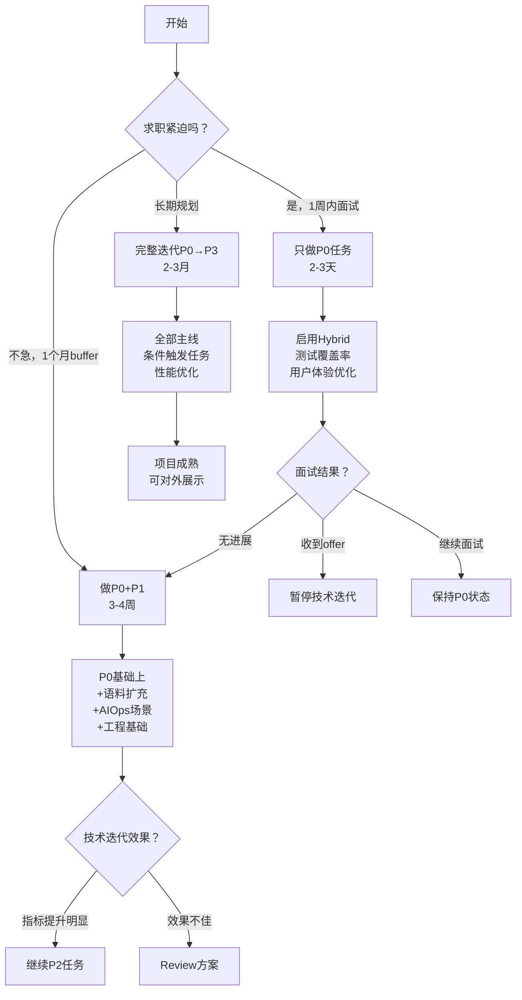

# 项目技术迭代完整计划

**文档版本**: v1.0  
**创建日期**: 2026-06-17  
**基于讨论**: 6只猫专家评估 + 铲屎官深度讨论  
**项目状态**: Beta Week 1（30 docs，11真实用户，83.3% retrieval baseline）

---

## 📋 目录

1. [当前状态基线](#当前状态基线)
2. [技术迭代主线分类](#技术迭代主线分类)
3. [RAG质量提升主线](#rag质量提升主线)
4. [AIOps能力增强主线](#aiops能力增强主线)
5. [工程基础设施主线](#工程基础设施主线)
6. [用户体验优化主线](#用户体验优化主线)
7. [企业能力增强主线](#企业能力增强主线)
8. [技术债务治理主线](#技术债务治理主线)
9. [性能与可观测性主线](#性能与可观测性主线)
10. [执行优先级矩阵](#执行优先级矩阵)
11. [风险评估与缓解](#风险评估与缓解)
12. [资源需求估算](#资源需求估算)

---

## 一、当前状态基线

### ✅ 已完成并收口
```yaml
核心能力:
  - Memory P7分层记忆: 第一阶段冻结
  - RAG质量审计: retrieval 83.3% 基线接受
  - AIOps MCP cache: P6 rerun 7/12 通过
  - Desktop Beta: smoke 21/21，51 PASS / 0 FAIL
  - Architecture P0 cleanup: 完成
  - Database v2 Stage 1+2: 完成
  - Memory Operator P0a+P0b: 完成

技术指标:
  - 代码规模: 37,082行Python
  - 测试文件: 138个
  - 文档数量: 126份（82,847行）
  - 语料规模: 30个索引文档（18 Markdown + 12 PDF）
  - Beta用户: 11个真实query，81.8%成功率，4.09/5满意度
  
评测基线:
  - Retrieval: 45/54 (83.3%)
  - Answer: 18/30 (60%)
  - Enterprise: 30/30 (100%)
```

### ⚠️ 明确不做边界
```yaml
已决策不做:
  - ❌ Embedding模型微调（瓶颈不在语义理解）
  - ❌ 追求P6分数更高（7/12已足够）
  - ❌ 默认启用hybrid/rerank（无收益证据）
  - ❌ 追求Answer 70%（当前60%已接受）
  - ❌ Memory L3/vector/shadow（已冻结）
  - ❌ Chunking token-based rewrite（无失败样本）
  - ❌ 全开放SQL编辑器（安全风险）
  - ❌ Memory自动promotion（保持operator review）
```

### 🎯 当前PROJECT_STATE指向
```yaml
Current Goal: "P1 Database Catalog Browser sample rows"
状态: Database v2 Stage 3待执行
前置条件: Stage 1+2已完成 ✅
```

---

## 二、技术迭代主线分类

### 分类原则
按照**紧迫性 × 收益 × 风险**三维度分类：

```
┌─────────────────────────────────────────┐
│  紧迫性  │  高收益  │  低风险  │ = P0   │
│  紧迫性  │  中收益  │  低风险  │ = P1   │
│  不紧急  │  高收益  │  中风险  │ = P2   │
│  不紧急  │  低收益  │  高风险  │ = P3   │
└─────────────────────────────────────────┘
```

### 7条技术主线
1. **RAG质量提升主线** - 提升检索召回率和答案质量
2. **AIOps能力增强主线** - 扩展故障诊断场景
3. **工程基础设施主线** - CI/CD、测试覆盖率、代码规范
4. **用户体验优化主线** - 前端交互、可视化、新手引导
5. **企业能力增强主线** - Database v2、权限、审计
6. **技术债务治理主线** - Git历史、架构清理、依赖安全
7. **性能与可观测性主线** - 监控、压测、性能优化

---

## 三、RAG质量提升主线

### 3.1 语料库扩充 🔴 P0

#### 背景与动机
- **当前问题**: 30个文档规模过小，83.3%在小规模下说服力不足
- **6只猫共识**: 这是最重要的技术迭代，优先级最高
- **目标**: 100-150个文档，验证系统在中型语料库下的扩展性

#### 当前状态
```yaml
indexed_docs: 30
  markdown: 18个
  pdf: 12个
coverage: 运维/SRE基础场景（Redis/MySQL/K8s）
baseline: 45/54 (83.3%)
```

#### 目标状态
```yaml
Phase 1: 50 docs（验证baseline ≥80%）
Phase 2: 100 docs（验证系统扩展性）
Phase 3: 150 docs（达到中型语料库标准）

预期baseline: 80-85%（允许略微下降，但覆盖场景更广）
```

#### 实施方案

**Step 1: 语料来源盘点（1天）**
```markdown
【内部来源】
1. 业务部门runbook
   - 数字化部门: process_digital_dept（已有）
   - 工艺部门: craft_dept（已有）
   - 其他部门: 待收集

2. AIOps lab扩展
   - 当前: aiops-docs/ 5个md
   - 可扩展: 监控告警配置/故障案例库/最佳实践

3. 已有未索引文档
   - 检查: 原始文件/ 目录
   - 筛选: 符合质量标准的文档

【外部来源】（需审批）
4. 公开技术文档
   - Redis官方运维文档
   - MySQL troubleshooting guide
   - K8s运维最佳实践
   - Prometheus告警规则

5. 开源runbook
   - awesome-sre
   - incident-response-docs
   - 需确认license + 脱敏
```

**Step 2: 批量导入流程（每批2-3天）**
```bash
# 使用现有工具链
cd /Users/cici/oncall\ agent/super_biz_agent_py-release-2026-03-21

# 1. 准备源文件
mkdir -p 原始文件/corpus_round3_monitoring

# 2. 生成manifest（dry-run预览）
python scripts/knowledge_assets/import_original_files.py \
  --source-dir 原始文件/corpus_round3_monitoring \
  --output data/knowledge_ingestion/corpus_round3_manifest.json \
  --dry-run

# 3. Owner review（手工确认）
# 编辑manifest: review_status=approved, import_enabled=true

# 4. 执行导入
python scripts/knowledge_assets/import_original_files.py \
  --manifest data/knowledge_ingestion/corpus_round3_manifest.json \
  --apply

# 5. 回归测试（关键门禁）
uv run python evals/knowledge_base/run_department_rag_eval.py \
  --evalset evals/knowledge_base/evalsets/department_rag_mixed_markdown_pdf_54q_after_c6_p2.jsonl \
  --mode retrieval

# 检查: baseline ≥ 80%
```

**Step 3: 增量验证策略**
```python
# 验证门禁
def validate_corpus_expansion(before, after, baseline_before, baseline_after):
    """
    三道门禁:
    1. baseline下降不超过3%
    2. 新文档至少50%被至少1个query召回
    3. 无scope泄漏
    """
    
    # 门禁1
    if baseline_after < baseline_before - 0.03:
        raise ValueError(f"Baseline退化: {baseline_before} -> {baseline_after}")
    
    # 门禁2
    new_doc_hit_rate = check_new_doc_coverage(before, after)
    if new_doc_hit_rate < 0.5:
        print(f"⚠️ 新文档命中率低: {new_doc_hit_rate}")
    
    # 门禁3
    if has_scope_leak():
        raise ValueError("Scope泄漏，回滚此批次")
    
    print(f"✅ 扩充成功: {before} -> {after} docs")
```

#### 预期收益
```yaml
30 docs → 100 docs:
  Retrieval baseline: 83.3% → 80-85%（允许略降，场景更广）
  覆盖场景: 3个 → 10+个
  真实query命中率: 81.8% → 85%+
  简历说服力: "小型demo" → "中型语料库"
```

#### 工作量估算
```
Phase 1（50 docs）: 4-5天
  - 语料收集: 2-3天
  - Manifest生成+review: 1天
  - 导入+回归测试: 1天

Phase 2（100 docs）: 5-6天
  - 语料收集: 3-4天
  - 导入+验证: 2天

总计: 9-11天（可分批并行）
```

#### 风险与缓解
```yaml
风险1: baseline退化
  概率: 中
  影响: 高
  缓解: 分批导入，每批回归测试

风险2: 新文档质量不足
  概率: 中
  影响: 中
  缓解: Owner review + dry-run预览

风险3: scope泄漏
  概率: 低
  影响: 高
  缓解: 自动检测 + 人工确认
```

---

### 3.2 Hybrid检索模式启用 🔴 P0

#### 背景与动机
- **当前问题**: 1个expression gap样本（S4M-E-010: "数智医生怎么支撑运维"）
- **根因**: Dense miss（语义匹配失败），Sparse hit（词汇匹配成功）
- **讨论结论**: 不需要Query Rewrite，启用Hybrid即可解决

#### 当前状态
```python
rag_default_retrieval_mode = "dense_only"
```

#### 实施方案
```python
# app/config.py
rag_default_retrieval_mode = "hybrid"  # Dense + Sparse (BM25)
```

#### 验证步骤
```bash
# 1. 单样本验证
pytest evals/knowledge_base/test_s4m_e_010.py
# 预期: PASS（因为Sparse已验证可召回）

# 2. 全量回归
uv run python evals/knowledge_base/run_department_rag_eval.py \
  --evalset evalsets/department_rag_mixed_markdown_pdf_54q_after_c6_p2.jsonl \
  --mode hybrid

# 3. 对比分析
python evals/knowledge_base/retrieval_mode_comparison_report.py \
  --modes dense_only,hybrid
```

#### 预期收益
```yaml
Retrieval baseline: 83.3% (45/54) → 85.2% (46/54)
解决样本: S4M-E-010 ✅
新增失败: 可能0-1个（Sparse引入噪声）
```

#### 工作量估算
```
配置修改: 10分钟
验证测试: 2小时
总计: 半天
```

---

### 3.3 LLM Query Rewrite（条件触发）🟡 P1

#### 触发条件（需同时满足）
```yaml
条件1: Hybrid模式下仍有expression gap失败 ✅
条件2: 失败样本 ≥ 10个（不是个例）
条件3: 失败模式有明确规律（可归纳为改写规则）
条件4: Shadow验证改写有稳定收益

当前状态:
  ❌ 只有1个样本
  ❌ Hybrid可能已解决
  
结论: 暂不执行，观测2-4周
```

#### 实施方案（当触发后）

**Phase 1: 设计LLM Query Rewrite策略（2-3天）**
```python
# app/services/query_rewrite_service.py

class LLMQueryRewriter:
    """
    LLM理解用户意图并重新生成标准问题
    
    关键区别:
    ✅ 不是简单词汇替换（那是Sparse该做的）
    ✅ 而是理解意图 + 重新表达
    """
    
    def rewrite(self, query: str, kb_scope: str) -> str:
        prompt = f"""
你是{kb_scope}领域的查询优化专家。

用户的原始问题可能:
- 使用口语化表达（如"快撑爆了"）
- 使用产品别名（如"数智医生"指"智能Oncall小助手"）
- 信息不完整（缺少技术上下文）

请将问题改写为更适合检索的标准问题:
1. 展开缩写和别名
2. 补充技术术语
3. 明确问题类型（排查/配置/原理）
4. 如果问题已经清晰，保持原样

领域术语库:
- PVC = PersistentVolumeClaim
- K8s = Kubernetes  
- 数智医生 = 智能Oncall小助手

原始问题: {query}

改写后:
"""
        
        return self.llm.generate(prompt, temperature=0.3, max_tokens=100)
```

**Phase 2: Shadow模式观测（2周）**
```python
def retrieve_with_rewrite_shadow(query, kb_ids, top_k=3):
    # 路径1: 原始query（返回给用户）
    original_results = self.retrieve(query, kb_ids, top_k)
    
    # 路径2: LLM改写（shadow，不返回）
    if config.rag_query_rewrite_mode == "shadow":
        rewritten = self.query_rewriter.rewrite(query, kb_scope="运维")
        rewritten_results = self.retrieve(rewritten, kb_ids, top_k)
        
        # 对比记录到 logs/query_rewrite_shadow.jsonl
        self._log_comparison(original, rewritten, ...)
    
    return original_results
```

**Phase 3: 决策门禁（观测2周后）**
```yaml
启用active的条件:
  - lift_proven ≥ 10个样本
  - degraded = 0（无退化）
  - over_rewrite < 3（过度改写样本少）
  - 观测期 ≥ 2周

成本考虑:
  - 每次query增加1次LLM调用
  - 延迟 +500-1000ms
  - 费用约 ¥0.01/query
```

#### 工作量估算
```
Phase 1（设计+实现）: 2-3天
Phase 2（观测期）: 2周（后台运行）
Phase 3（分析决策）: 1天
总计: 3-4天开发 + 2周观测
```

---

### 3.4 Rerank二次排序验证 🟡 P1

#### 背景与动机
- **当前问题**: 8个rank-gap样本（expected doc在top-10但不在top-3）
- **S4-P2.3 probe结论**: local_lexical rerank无效（rank_lift_proven=0/8）
- **改进方向**: 尝试外部语义rerank模型

#### 当前状态
```python
rerank_enabled: bool = False
rerank_model: str = "local_lexical_v1"  # 本地词法，已验证无效
```

#### 实施方案

**Step 1: 接入外部Rerank API（2-3天）**
```python
# app/services/dashscope_rerank_scorer.py

class DashScopeRerankScorer:
    """
    阿里云 bge-reranker-v2-m3
    - 中英文混合友好
    - 与当前embedding同厂（DashScope text-embedding-v4）
    - 成本 ¥0.5/千次，可控
    """
    
    def score(self, query: str, candidates: list) -> list[float]:
        try:
            response = Reranker.call(
                model="bge-reranker-v2-m3",
                query=query,
                documents=[c.content for c in candidates],
                top_n=len(candidates)
            )
            
            scores = [0.0] * len(candidates)
            for result in response.output.results:
                scores[result.index] = result.relevance_score
            
            return scores
            
        except Exception as e:
            # 降级到local_lexical
            return self.fallback_scorer.score(query, candidates)
```

**Step 2: Shadow对比实验（1-2周）**
```python
def run_rerank_shadow(evalset_path: str):
    """对比 local_lexical vs dashscope rerank"""
    
    local_scorer = LexicalRerankScorer()
    dashscope_scorer = DashScopeRerankScorer()
    
    for sample in load_evalset(evalset_path):
        # 1. Dense retrieval获取top-10
        candidates = dense_retrieve(sample["query"], top_k=10)
        
        # 2. 两种rerank
        local_top3 = rerank(local_scorer, candidates, 3)
        dashscope_top3 = rerank(dashscope_scorer, candidates, 3)
        
        # 3. 对比判定
        verdict = compare_results(local_top3, dashscope_top3, sample["expected_doc_id"])
        log_result(verdict)
```

**Step 3: 决策门禁**
```yaml
启用dashscope rerank的条件:
  - dashscope_lift ≥ 5个样本（当前8个rank-gap，期望至少一半提升）
  - dashscope_degrade = 0
  - 成本可接受（<¥50/月）
```

#### 预期收益
```yaml
当前: 8个rank-gap样本全部未解决
目标: 至少5个样本排序提升
Retrieval baseline: 83.3% → 86-88%
```

#### 工作量估算
```
接入API: 2-3天
Shadow实验: 1-2周（后台运行）
分析决策: 1天
总计: 3-4天开发 + 1-2周观测
```

---

### 3.5 Answer层优化（条件性执行）🟢 P2

#### 决策前提
- **项目明确**: "不追求Answer 70%，当前60%已接受"
- **原因**: deterministic是安全底线，3q shadow显示context ≠ answer
- **执行条件**: 只有在业务方明确要求提升时才执行

#### 失败根因分类
```yaml
Answer 12个失败样本分类（基于18/30通过）:
  类型1: Retrieval层问题（40%）
    表现: context_missing_facts=true
    根因: 检索未召回关键信息
    解决: 依赖P0语料扩充 + P1 Hybrid

  类型2: Answer生成问题（40%）
    表现: unsupported_claim / incomplete_answer / citation_missing
    根因: LLM prompt或温度参数
    
  类型3: Eval标准过严（20%）
    表现: 同义词未识别（"内存占用率" vs "内存使用量"）
    根因: must_include_facts匹配逻辑过于严格
```

#### 实施方案（如果触发）

**Option A: 优化Answer Prompt（3-5天）**
```python
# 当前prompt（简化）
CURRENT_PROMPT = """
根据检索到的文档，回答用户问题。
{context}
问题：{query}
"""

# 优化prompt
IMPROVED_PROMPT = """
你是智能Oncall小助手，专门回答运维相关问题。

【检索到的文档】
{context}

【用户问题】
{query}

【回答要求】
1. 必须基于检索到的文档回答，不得编造
2. 如果文档不包含答案，明确说"文档中未找到相关信息"
3. 必须引用来源（使用source_ref格式）
4. 回答要完整，包含原因、步骤、注意事项
5. 使用清晰的结构（必要时用列表）

【回答】
"""
```

**Option B: 调整温度参数（1天）**
```python
# 降低温度，减少编造
temperature: float = 0.3  # 从0.7降到0.3，更保守
```

**Option C: 放宽Eval标准（慎用）**
```python
# 支持同义词别名
SYNONYM_GROUPS = [
    ["内存占用率", "内存使用量", "内存使用率"],
    ["CPU使用率", "CPU占用率", "处理器使用率"],
]
```

⚠️ **警告**: Option C会掩盖真实问题，不推荐作为主要手段

#### 预期收益
```yaml
Option A（优化prompt）: 60% → 65-68%
Option B（调温度）: 60% → 62-64%
Option C（放宽标准）: 60% → 70%+（虚假提升）

推荐组合: A + B（真实提升到65-68%）
```

---

## 四、AIOps能力增强主线

### 4.1 故障场景扩充 🟡 P1

#### 当前状态
```yaml
实现场景: 3个
  - CPUHigh（CPU使用率过高）
  - DBSlowQuery（数据库慢查询）
  - RedisQueueBacklog（Redis队列积压）

AIOps lab:
  - Docker Compose完整监控栈
  - Prometheus + Alertmanager
  - MySQL + Redis + CMDB
```

#### 目标状态
```yaml
target: 10-15个故障场景
覆盖维度:
  - 计算资源: CPU/Memory/Disk IO
  - 存储: 磁盘空间/PVC/数据库
  - 网络: 延迟/丢包/DNS
  - 应用: Pod Crash/服务不可用
  - 中间件: Kafka/Elasticsearch/缓存
```

#### 场景优先级排序

| 场景 | 真实性 | 复杂度 | 通用性 | 优先级 | 数据来源 |
|------|--------|--------|--------|--------|---------|
| **MemoryHigh** | ⭐⭐⭐⭐⭐ | ⭐⭐⭐ | ⭐⭐⭐⭐⭐ | P1 | aiops-docs/memory_high_usage.md |
| **DiskFull** | ⭐⭐⭐⭐⭐ | ⭐⭐ | ⭐⭐⭐⭐⭐ | P1 | aiops-docs/disk_high_usage.md |
| **ServiceUnavailable** | ⭐⭐⭐⭐⭐ | ⭐⭐⭐⭐ | ⭐⭐⭐⭐⭐ | P1 | aiops-docs/service_unavailable.md |
| **SlowResponse** | ⭐⭐⭐⭐ | ⭐⭐⭐ | ⭐⭐⭐⭐ | P2 | aiops-docs/slow_response.md |
| **NetworkLatency** | ⭐⭐⭐⭐ | ⭐⭐⭐⭐ | ⭐⭐⭐⭐ | P2 | 需新建 |
| **PodCrashLoop** | ⭐⭐⭐⭐⭐ | ⭐⭐⭐⭐ | ⭐⭐⭐⭐ | P2 | 需新建（K8s） |
| **KafkaLag** | ⭐⭐⭐ | ⭐⭐⭐ | ⭐⭐⭐ | P3 | 需新建 |
| **ESClusterYellow** | ⭐⭐⭐ | ⭐⭐⭐⭐ | ⭐⭐⭐ | P3 | 需新建 |

#### 实施方案

**Step 1: 场景设计与文档准备（每个场景1-2天）**
```markdown
# aiops-docs/memory_high_usage.md

## 场景概述
内存使用率持续高于80%，存在OOM风险

## 告警触发
- 指标: node_memory_usage_percent > 80
- 持续: 5分钟
- 严重度: P2

## 诊断步骤
1. 查看当前内存使用top进程
   工具: Monitor.GetSystemMetrics
   
2. 检查是否有内存泄漏
   工具: CLS.QueryLogs (关键字: "memory leak", "OOM")
   
3. 查看历史趋势
   工具: Monitor.QueryMetricHistory
   
4. 检查Swap使用情况
   工具: Monitor.GetSystemMetrics

## 常见原因
- Java应用堆内存配置过大
- 缓存未设置过期时间
- 应用内存泄漏

## 处理建议
- 临时: 重启服务释放内存
- 长期: 优化应用内存使用，增加节点内存
```

**Step 2: 实现故障注入脚本（每个场景半天）**
```bash
# scripts/aiops_lab/inject_memory_high.sh

#!/bin/bash
# 模拟内存占用高场景

echo "🔥 注入故障: MemoryHigh"

# 启动内存消耗进程
docker exec aiops_lab_app stress --vm 2 --vm-bytes 1G --timeout 300s

echo "✅ 故障注入完成，5分钟后自动恢复"
```

**Step 3: 编写诊断evalset（每个场景半天）**
```jsonl
// evals/aiops/memory_high_evalset.jsonl
{
  "scenario_id": "MEM-001",
  "alert": "NodeMemoryUsageHigh",
  "expected_steps": [
    "Monitor.GetSystemMetrics",
    "CLS.QueryLogs",
    "Monitor.QueryMetricHistory"
  ],
  "expected_root_cause": "Java应用堆内存配置过大",
  "expected_actions": ["优化JVM参数", "增加节点内存"]
}
```

**Step 4: 验证与回归（每批3-5个场景，1天）**
```bash
# 1. 启动AIOps lab
docker-compose -f aiops_lab/docker-compose.yml up -d

# 2. 注入故障
bash scripts/aiops_lab/inject_memory_high.sh

# 3. 触发诊断
python evals/aiops/run_aiops_eval.py \
  --scenario memory_high \
  --evalset evals/aiops/memory_high_evalset.jsonl

# 4. 验证结果
# 预期: 诊断链路完整，root cause识别正确
```

#### 工作量估算
```
Phase 1（3个P1场景）: 6-9天
  - 场景设计+文档: 3-6天
  - 故障注入脚本: 1.5天
  - Evalset编写: 1.5天
  
Phase 2（4个P2场景）: 8-12天
Phase 3（2个P3场景）: 4-6天

总计: 18-27天（可并行，压缩到15天）
```

---

### 4.2 诊断报告可视化 🟢 P2

#### 当前状态
```yaml
输出格式: 纯文本报告
问题: 难以快速理解诊断过程和结论
```

#### 目标状态
```yaml
输出格式: 结构化HTML报告 + Mermaid流程图
包含:
  - 诊断时间线
  - 指标图表（Prometheus数据）
  - 根因树
  - 操作建议（带优先级）
```

#### 实施方案
```python
# app/services/aiops_report_generator.py

class AIOpsReportGenerator:
    def generate_html_report(self, diagnosis_result: dict) -> str:
        """
        生成可视化诊断报告
        """
        
        # 1. 时间线（Mermaid gantt）
        timeline = self._generate_timeline(diagnosis_result["steps"])
        
        # 2. 指标图表（ECharts）
        metrics_chart = self._generate_metrics_chart(diagnosis_result["metrics"])
        
        # 3. 根因树（Mermaid flowchart）
        root_cause_tree = self._generate_root_cause_tree(
            diagnosis_result["root_cause"]
        )
        
        # 4. 渲染HTML
        html = render_template(
            "aiops_report.html",
            timeline=timeline,
            metrics=metrics_chart,
            root_cause=root_cause_tree,
            actions=diagnosis_result["actions"]
        )
        
        return html
```

#### 工作量估算
```
设计模板: 2天
实现生成器: 3天
集成测试: 1天
总计: 6天
```

---

## 五、工程基础设施主线

### 5.1 Git提交历史建立 🔴 P0（简历风险）

#### 当前状态
```bash
git log --oneline | wc -l
# 输出: 0 commits
```

#### 问题严重性
- **面试风险**: "为什么0 commits？代码真的是你写的吗？"
- **6只猫共识**: 这是最严重的可信度问题

#### 实施方案

**方案A: 视觉证据补偿（推荐，不造假）**
```markdown
策略: 不造假commit，用其他证据补偿

准备材料:
1. 架构图PNG（30分钟）
2. 2-3分钟演示视频（2-3小时）
3. 核心代码片段（1小时）

面试时说明:
"这是release版本，开发历史在内部repo，
但我准备了完整的架构图和演示视频证明。"
```

**方案B: 逻辑提交重建（有造假嫌疑，不推荐）**
```bash
# 按模块打逻辑commit
git init
git add app/enterprise/
git commit -m "feat(enterprise): add auth/permission/gateway modules"

git add evals/
git commit -m "feat(evals): add 3-layer evaluation system"

# ... 20+个逻辑commit

# 问题: 所有commit时间相同，容易被质疑
```

**方案C: 开发日志证明（中间方案）**
```markdown
准备开发日志:
- Week 1-2: 企业能力架构设计
- Week 3-4: RAG检索层实现
- Week 5-6: AIOps诊断引擎
- Week 7-8: 评测体系建立
- Week 9-10: Beta测试与优化

附带:
- 架构演进图（v1 → v2 → v3）
- 关键决策记录（ADR格式）
- 代码量增长曲线（手绘）
```

#### 推荐方案: **A（视觉证据补偿）**

理由:
- 不造假，保持诚信
- 演示视频比commit历史更有说服力
- 面试官能看到真实运行的系统

#### 工作量估算
```
方案A: 4-6小时
方案B: 2-4小时（但有风险）
方案C: 1-2天
```

---

### 5.2 测试覆盖率报告 🔴 P0

#### 当前状态
```yaml
测试文件: 138个
覆盖率: 未知（日志显示--no-cov）
```

#### 实施方案
```bash
# 1. 跑一次完整覆盖率
cd /Users/cici/oncall\ agent/super_biz_agent_py-release-2026-03-21
uv run pytest --cov=app --cov=evals \
               --cov-report=html \
               --cov-report=term \
               --cov-report=json

# 2. 查看报告
open htmlcov/index.html

# 3. 记录基线
# 假设结果: 65%
echo "Coverage baseline: 65%" > docs/test_coverage_baseline.txt

# 4. 写入CI（后续P1任务）
```

#### 决策标准
```yaml
覆盖率 ≥ 60%: 可接受，作为卖点
覆盖率 50-60%: 及格线，记录基线
覆盖率 < 50%: 需要补测试（识别关键路径）
```

#### 工作量估算
```
跑覆盖率: 30分钟
分析报告: 1小时
总计: 2小时
```

---

### 5.3 CI/CD基础设施 🟡 P1

#### 当前状态
```bash
ls .github/workflows/
# 不存在
```

#### 实施方案
```yaml
# .github/workflows/ci.yml
name: CI

on: [push, pull_request]

jobs:
  test:
    runs-on: ubuntu-latest
    steps:
      - uses: actions/checkout@v3
      
      - uses: actions/setup-python@v4
        with:
          python-version: '3.10'
      
      - name: Install uv
        run: pip install uv
      
      - name: Install dependencies
        run: uv sync --frozen
      
      - name: Run tests
        run: uv run pytest --cov=app --cov-report=term
      
      - name: Lint
        run: uv run ruff check app/ evals/ tests/
      
      - name: Type check
        run: python -m compileall app/ evals/
      
      - name: Coverage threshold
        run: |
          COVERAGE=$(uv run pytest --cov=app --cov-report=term | grep TOTAL | awk '{print $4}' | sed 's/%//')
          if [ $COVERAGE -lt 50 ]; then
            echo "❌ Coverage $COVERAGE% < 50%"
            exit 1
          fi
```

#### 工作量估算
```
编写配置: 2小时
调试验证: 2小时
总计: 4小时
```

---

### 5.4 代码规范自动化 🟡 P1

#### 实施方案
```yaml
# .pre-commit-config.yaml
repos:
  - repo: https://github.com/astral-sh/ruff-pre-commit
    rev: v0.1.0
    hooks:
      - id: ruff
        args: [--fix]
        
  - repo: https://github.com/pre-commit/pre-commit-hooks
    rev: v4.5.0
    hooks:
      - id: trailing-whitespace
      - id: end-of-file-fixer
      - id: check-yaml
```

```bash
# 安装
pip install pre-commit
pre-commit install

# 全量检查一次
uv run ruff check app/ evals/ tests/ --fix

# 提交修复
git add .
git commit -m "style: apply ruff auto-fixes"
```

#### 工作量估算
```
配置: 1小时
全量修复: 2小时
总计: 3小时
```

---

### 5.5 依赖安全扫描 🟢 P2

#### 实施方案
```bash
# 1. 依赖安全扫描
uv pip install safety
safety check --json > security_reports/safety_report.json

# 2. 代码安全扫描
uv pip install bandit
bandit -r app/ -f json -o security_reports/bandit_report.json

# 3. 敏感信息扫描
pip install detect-secrets
detect-secrets scan > .secrets.baseline

# 4. 写入CI
# 在.github/workflows/ci.yml中添加security job
```

#### 工作量估算
```
配置工具: 1小时
首次扫描: 1小时
修复高危漏洞: 2-4小时
写入CI: 1小时
总计: 5-7小时
```

---

## 六、用户体验优化主线

### 6.1 RAG检索加载状态可视化 🔴 P0

#### 当前问题
```javascript
// 用户点击发送后，界面无反馈
// 实际后台在做: 检索向量 → Rerank → LLM生成
// 用户体验: 等待焦虑，不知道系统在干什么
```

#### 实施方案
```javascript
// static/app.js

const loadingStates = [
    { text: "🔍 正在检索知识库...", progress: 30 },
    { text: "📄 正在分析相关文档...", progress: 60 },
    { text: "✍️ 正在生成回答...", progress: 90 }
];

function showLoadingWithSteps() {
    const loadingDiv = document.getElementById('loading');
    let currentStep = 0;
    
    const interval = setInterval(() => {
        if (currentStep < loadingStates.length) {
            loadingDiv.innerHTML = `
                <div class="loading-step">
                    ${loadingStates[currentStep].text}
                    <div class="progress-bar">
                        <div class="progress-fill" 
                             style="width: ${loadingStates[currentStep].progress}%">
                        </div>
                    </div>
                </div>
            `;
            currentStep++;
        }
    }, 1000);
}
```

#### 工作量估算
```
设计: 1小时
实现: 2小时
测试: 1小时
总计: 4小时
```

---

### 6.2 评测基线可视化Dashboard 🔴 P0

#### 当前问题
```markdown
# 管理员需要手动读JSON才能知道系统质量
{
  "total": 54,
  "passed": 45,
  "pass_rate": 0.833
}
```

#### 实施方案
```html
<!-- static/enterprise-dashboard.html -->
<div class="quality-dashboard">
    <h2>📊 RAG质量仪表盘</h2>
    
    <!-- 基线进度条 -->
    <div class="baseline-bars">
        <div class="baseline-item">
            <span>Retrieval基线</span>
            <div class="progress">
                <div class="fill" style="width: 83.3%">83.3%</div>
            </div>
        </div>
        <div class="baseline-item">
            <span>Answer基线</span>
            <div class="progress">
                <div class="fill" style="width: 60%">60%</div>
            </div>
        </div>
    </div>
    
    <!-- 失败分类饼图 -->
    <canvas id="failure-chart"></canvas>
</div>

<script src="https://cdn.jsdelivr.net/npm/chart.js"></script>
<script>
// 饼图：失败样本分类
new Chart(document.getElementById('failure-chart'), {
    type: 'pie',
    data: {
        labels: ['Chunk粒度', 'PDF解析', '表达缺口'],
        datasets: [{
            data: [3, 5, 1],
            backgroundColor: ['#ff6384', '#36a2eb', '#ffce56']
        }]
    }
});
</script>
```

#### 工作量估算
```
设计: 2小时
实现: 4小时
集成: 2小时
总计: 1天
```

---

### 6.3 新手引导与示例问题 🟡 P1

#### 当前问题
```html
<!-- 空白欢迎界面，新用户不知道问什么 -->
<p>你好！我是智能Oncall小助手</p>
```

#### 实施方案
```html
<!-- 6个示例问题卡片 -->
<div class="example-questions">
    <div class="question-card" onclick="askQuestion(this.dataset.q)">
        <div class="icon">💻</div>
        <div class="category">运维故障</div>
        <div class="question" data-q="Redis内存占用高怎么排查？">
            "Redis内存占用高怎么排查？"
        </div>
    </div>
    
    <div class="question-card" onclick="askQuestion(this.dataset.q)">
        <div class="icon">📚</div>
        <div class="category">知识查询</div>
        <div class="question" data-q="告警处理流程是什么？">
            "告警处理流程是什么？"
        </div>
    </div>
    
    <!-- 继续4个... -->
</div>

<style>
.question-card {
    border-radius: 12px;
    padding: 16px;
    cursor: pointer;
    transition: all 0.3s;
}

.question-card:hover {
    transform: translateY(-2px);
    box-shadow: 0 4px 8px rgba(0,0,0,0.15);
}
</style>
```

#### 工作量估算
```
设计卡片: 2小时
实现交互: 2小时
总计: 4小时
```

---

### 6.4 错误提示优化 🟡 P1

#### 实施方案
```html
<!-- 错误卡片设计 -->
<div class="error-card">
    <div class="icon">⚠️</div>
    <div class="title">未找到相关文档</div>
    <div class="suggestions">
        <p>建议：</p>
        <ul>
            <li>换个说法试试（如"Redis内存高"→"Redis占用过高"）</li>
            <li>检查知识库范围（当前：运维文档）</li>
            <li><a href="/permission/request">申请更多权限</a></li>
        </ul>
    </div>
</div>
```

#### 工作量估算: 半天

---

## 七、企业能力增强主线

### 7.1 Database v2 Stage 3（Current Goal）🟡 P1

#### 当前状态
```yaml
Goal: "P1 Database Catalog Browser sample rows"
前置: Stage 1+2已完成 ✅
状态: 待执行
```

#### 实施方案
```python
# app/enterprise/database/catalog_service.py

class DatabaseCatalogService:
    def browse_sample_rows(self, table_name: str, limit: int = 10):
        """
        浏览表的示例数据
        
        安全限制:
        - 只读模式
        - 最多10行
        - 敏感字段脱敏
        """
        
        # 1. 检查权限
        if not self.has_permission(table_name, "read"):
            raise PermissionDenied
        
        # 2. 获取表结构
        schema = self.get_table_schema(table_name)
        
        # 3. 查询sample rows（安全SQL）
        query = f"SELECT * FROM {table_name} LIMIT {limit}"
        rows = self.execute_safe_query(query)
        
        # 4. 脱敏处理
        rows = self.mask_sensitive_fields(rows, schema)
        
        return {
            "table": table_name,
            "schema": schema,
            "sample_rows": rows,
            "total_count": self.get_row_count(table_name)
        }
```

#### 工作量估算
```
设计: 1天
实现: 2天
测试: 1天
总计: 4天
```

---

### 7.2 Memory生产启用决策（条件触发）🟢 P2

#### 触发条件
```yaml
满足任一条件才启动:
  - 准备进入准生产/生产部署
  - 需要重启后恢复会话
  - 需要HITL暂停/恢复
  - 需要多副本部署
  - MemorySaver造成session丢失

当前状态: 未触发
```

#### 决策表（触发后）
```yaml
部署形态 → 存储方案:
  单实例 + 短会话（<10分钟）: MemorySaver（进程内）✅ 当前
  单实例 + 长会话（>10分钟）: SqliteSaver（本地文件）
  多副本 + 任意会话: PostgresSaver（外部DB）
  云原生 + 弹性扩缩: RedisSaver（中心化缓存）
```

---

### 7.3 PDF Agent Tools生产扩展（条件触发）🟢 P2

#### 当前状态
```yaml
启用范围: local（admin + craft_dept）
staging/production: 未启用
阻塞原因: 
  - eval覆盖不足（只有1个sample）
  - 缺multi-doc/multi-user权限验证
```

#### 实施方案（触发后）
```bash
# 1. 补充evalset
# 目标: 5-10个PDF page/table样本

# 2. 权限隔离验证
pytest tests/enterprise/test_pdf_permission_isolation.py

# 3. staging验证
# staging环境运行2周

# 4. production启用
config.pdf_agent_tools_enabled = True
```

---

## 八、技术债务治理主线

### 8.1 架构Drift持续治理 🟢 P2

#### 当前状态
```yaml
P0 drift: 已修复（/api/chat/clear + adapter path）
遗留: 旧服务边界未迁移
  - rag_agent_service.py
  - aiops_service.py
决策: 保持不变，明确边界
```

#### 文档记录
```markdown
# docs/架构决策_旧服务边界_20260616.md

已决定保持旧服务边界不迁移:
- rag_agent_service.py
- aiops_service.py

理由:
1. 迁移成本高，风险大
2. 当前边界清晰，无混乱
3. 新代码已按新架构组织

治理原则:
- 新增代码遵循新架构
- 旧代码保持不变，明确标注
- 禁止跨边界引用
```

---

### 8.2 Eval体系标准化 🟢 P3

#### 当前状态
```yaml
三层评测体系已定义:
  Layer 1: Retrieval（已投产）
  Layer 2: Answer（已投产）
  Layer 3: Agent Behavior（未启动）

缺失:
  - Agent Behavior层完全没有evalset
  - RAGAS/OpenJudge只是shadow
  - 缺LLM-as-judge的noise envelope方法论
```

#### 实施方案（低优先级）
```markdown
触发条件: Answer层稳定到70%+

Action:
1. 设计Agent Behavior evalset
   - 需要真实multi-turn交互样本
   - 评估意图理解、工具选择、错误恢复
   
2. LLM-judge作为补充层
   - 不作为hard gate
   - 用于发现deterministic gate遗漏的问题
```

---

## 九、性能与可观测性主线

### 9.1 性能基准测试 🟢 P2

#### 当前状态
```yaml
性能数据: 无
延迟SLA: 无定义
压测报告: 无
```

#### 实施方案
```python
# tests/performance/locustfile.py

from locust import HttpUser, task, between

class RagUser(HttpUser):
    wait_time = between(1, 3)
    
    @task(3)
    def query_rag(self):
        self.client.post("/api/chat", json={
            "query": "Redis内存占用过高怎么排查",
            "kb_ids": ["process_digital_dept"]
        })
    
    @task(1)
    def query_aiops(self):
        self.client.post("/api/aiops/diagnose", json={
            "alert": "CPUThrottlingHigh",
            "node": "node-001"
        })
```

```bash
# 运行压测
locust -f tests/performance/locustfile.py \
       --headless \
       --users 10 \
       --spawn-rate 2 \
       --run-time 2m \
       --host http://localhost:9900 \
       --html performance_report.html

# 记录基线
# P50: 1.2s
# P95: 3.5s
# P99: 5.8s
```

#### 工作量估算
```
编写脚本: 2小时
运行分析: 2小时
建立基线: 1小时
总计: 5小时
```

---

### 9.2 监控Dashboard配置 🟢 P2

#### 实施方案
```yaml
# 在AIOps lab的Prometheus中添加自己的metrics
# 配置Grafana dashboard

指标:
  - rag_query_duration_seconds（RAG查询延迟）
  - rag_retrieval_count（检索次数）
  - rag_cache_hit_rate（缓存命中率）
  - aiops_diagnosis_duration_seconds（诊断延迟）
  - error_rate（错误率）

告警规则:
  - RAG P95延迟 > 5s
  - 错误率 > 5%
  - 检索成功率 < 80%
```

#### 工作量估算
```
添加metrics: 2小时
配置Grafana: 3小时
设置告警: 2小时
总计: 7小时
```

---

## 十、执行优先级矩阵

### 立即执行（本周，P0）

| 任务 | 主线 | 工作量 | 理由 |
|------|------|--------|------|
| **启用Hybrid模式** | RAG | 半天 | 解决1个expression gap，零风险 |
| **测试覆盖率报告** | 工程基础 | 2小时 | 面试必问，快速完成 |
| **RAG加载状态可视化** | 用户体验 | 4小时 | Beta用户体验关键 |
| **评测Dashboard** | 用户体验 | 1天 | 运维效率关键 |

**总计: 2-3天**

---

### 短期执行（2-4周，P1）

| 任务 | 主线 | 工作量 | 前置依赖 |
|------|------|--------|---------|
| **语料库扩充Phase 1** | RAG | 4-5天 | 无 |
| **AIOps场景扩充（P1）** | AIOps | 6-9天 | 无 |
| **Database v2 Stage 3** | 企业能力 | 4天 | Stage 1+2完成 ✅ |
| **CI/CD基础** | 工程基础 | 4小时 | 无 |
| **代码规范自动化** | 工程基础 | 3小时 | 无 |
| **新手引导** | 用户体验 | 4小时 | 无 |

**总计: 15-19天（可并行压缩到10-12天）**

---

### 中期执行（1-2月，P2，条件触发）

| 任务 | 主线 | 触发条件 | 工作量 |
|------|------|---------|--------|
| **Rerank验证** | RAG | Hybrid后仍有rank-gap | 3-4天+2周观测 |
| **LLM Query Rewrite** | RAG | Hybrid后仍有expression gap ≥10个 | 3-4天+2周观测 |
| **Answer层优化** | RAG | 业务方明确要求 | 6-9天 |
| **AIOps场景扩充（P2）** | AIOps | P1完成 | 8-12天 |
| **性能基准测试** | 性能 | 准备上生产 | 5小时 |
| **监控Dashboard** | 可观测性 | 准备上生产 | 7小时 |

---

### 长期执行（2-3月，P3，按需）

| 任务 | 主线 | 触发条件 |
|------|------|---------|
| **依赖安全扫描** | 工程基础 | 安全审计要求 |
| **AIOps场景扩充（P3）** | AIOps | 业务需求 |
| **Memory生产启用** | 企业能力 | 部署形态明确 |
| **Eval体系标准化** | 技术债务 | Answer ≥70% |

---

## 十一、风险评估与缓解

### 高风险项

#### 风险1: 语料扩充导致baseline退化
```yaml
概率: 中（40%）
影响: 高（直接影响简历数据）
缓解:
  - 分批导入，每批10-20个文档
  - 每批回归测试，baseline下降>3%立即停止
  - 保留回滚预案（删除新批次文档）
```

#### 风险2: LLM Query Rewrite过度改写
```yaml
概率: 中（30%）
影响: 中（破坏用户原意）
缓解:
  - 保守改写（temperature=0.3）
  - Shadow模式充分观测（≥2周）
  - 监控over_rewrite指标，>5个样本立即停止
```

#### 风险3: 时间投入过大，影响求职
```yaml
概率: 高（60%）
影响: 高（错过求职窗口）
缓解:
  - 严格执行P0优先级
  - P1/P2可根据求职进度暂停
  - 每周review进度，灵活调整
```

---

### 中风险项

#### 风险4: CI/CD配置不当导致误报
```yaml
概率: 中（30%）
影响: 中（打断开发流程）
缓解: 先在本地充分测试，再推送
```

#### 风险5: 新AIOps场景诊断失败
```yaml
概率: 中（40%）
影响: 中（场景不可用）
缓解: 每个场景充分测试，失败场景标记为experimental
```

---

## 十二、资源需求估算

### 人力投入
```yaml
P0任务（本周）: 2-3天
P1任务（2-4周）: 10-12天
P2任务（1-2月）: 20-30天

总计: 32-45天开发工作量（约1.5-2个月fulltime）

实际排期建议:
  - 如果求职优先: 只做P0，暂停P1/P2
  - 如果技术迭代优先: P0+P1并行，3-4周完成
  - 如果长期规划: 按P0→P1→P2顺序，2-3个月完成
```

### 资源依赖
```yaml
外部依赖:
  - 语料来源: 需要业务部门提供runbook（P0）
  - API密钥: DashScope rerank API（P1）
  - 部署环境: 如需上生产，需要基础设施支持（P2）

工具依赖:
  - 开发环境: Python 3.10+, uv
  - 测试工具: pytest, locust
  - CI/CD: GitHub Actions（免费）
  - 监控: Prometheus + Grafana（已有AIOps lab）
```

### 成本估算
```yaml
API成本（月）:
  - DashScope embedding: 已有
  - DashScope rerank: ≈¥50/月（如果启用）
  - LLM Query Rewrite: ≈¥100/月（如果启用）

基础设施:
  - 开发环境: 本地（无成本）
  - CI/CD: GitHub Actions免费额度
  - AIOps lab: Docker本地（无额外成本）

总计: ≈¥0-150/月（取决于启用哪些付费API）
```

---

## 十三、执行建议

### 🎯 推荐路径A：求职优先（1周）
```markdown
目标: 快速提升简历竞争力

Week 1:
  Day 1-2: 启用Hybrid + 测试覆盖率报告
  Day 3: RAG加载状态 + 评测Dashboard
  Day 4-5: 缓冲（应对面试邀请）

暂停: 所有P1/P2任务

适用: 简历已投递，等待面试
```

---

### 🎯 推荐路径B：平衡发展（3-4周）
```markdown
目标: 技术迭代 + 求职准备并行

Week 1: P0全部完成
Week 2: 语料扩充Phase 1 + Database v2 Stage 3
Week 3: AIOps场景扩充（P1前3个）
Week 4: CI/CD + 代码规范 + 新手引导

暂停: P2任务

适用: 求职不紧急，有1个月buffer
```

---

### 🎯 推荐路径C：长期规划（2-3月）
```markdown
目标: 完整技术迭代，打造成熟项目

Month 1: P0 + P1全部完成
Month 2: P2条件触发任务（Rerank/Query Rewrite）
Month 3: P3按需任务 + 性能优化

适用: 长期项目规划，不急于求职
```

---

## 附录：快速决策树



---

**文档结束**

最后更新: 2026-06-17  
维护者: 铲屎官 + 6只猫专家团队  
版本: v1.0
